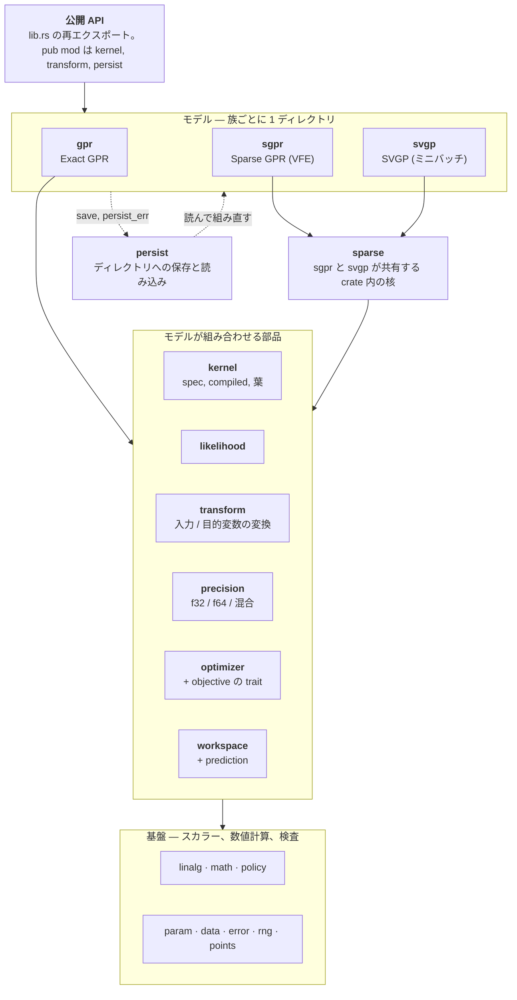

[English](README.md) | 日本語

# gprx

Rust の Exact ガウス過程回帰。`Gpr` は未学習のトレーナー。`Gpr::fit` はそれを消費し、負の対数周辺尤度を argmin の L-BFGS で最小化して `FittedGpr` を返す。このクレートは crates.io に**公開しない**（`Cargo.toml` の `publish = false`）。

## 状態

手元の **0.1.0** 品質: `Gpr` / `FittedGpr`、カーネル、`fit` / `predict` / `predict_into` / leave-one-out、英語の rustdoc、`examples/`。依存は git か path。crates.io ではない。

設計: [`docs/design.ja.md`](docs/design.ja.md)。アーキテクチャ: [`docs/architecture.ja.md`](docs/architecture.ja.md)。保存フォーマット: [`docs/persist-format.ja.md`](docs/persist-format.ja.md)。タスク: [`docs/roadmap.md`](docs/roadmap.md)。エージェント向け: [`AGENTS.md`](AGENTS.md)。他ライブラリとの壁時計とピーク RSS: [`compare/perf/`](compare/perf/)（P2B-16 Exact は `just perf`。P4-12 Sparse は `just perf-sparse`。P4-14 Sparse オンラインは `just perf-sparse-online`。criterion ではない）。

## 例

`X` は列優先（`n` 点 × `d` 特徴: 特徴 0 の全行、次に特徴 1、…）。

```rust
use gprx::kernel::{KernelSpec, RbfKernel};
use gprx::{GaussianLikelihood, Gpr};

fn main() -> Result<(), gprx::GprError> {
    let kernel = KernelSpec::from(RbfKernel::new(1.0)?);
    let likelihood = GaussianLikelihood::new(0.1)?;
    let gpr = Gpr::new(kernel, likelihood);
    let fitted = gpr.fit(&[0.0, 1.0], 2, 1, &[0.0, 1.0])?;
    let pred = fitted.predict(&[0.5], 1, 1)?;
    println!("mean = {}, variance = {}", pred.mean[0], pred.variance[0]);
    Ok(())
}
```

同じプログラム: `cargo run --example fit_predict`。`fit` の `?` はトレーナーを落とす（`From<(Gpr, GprError)> for GprError`）。エラーだけ欲しいときは `.map_err(|(_, e)| e)`。同じトレーナーでやり直すときは `Err((gpr, err))` を照合する。

既定の `predict` の分散は観測（`latent + σn²`）。潜在関数は `predict_with` と `VarianceKind::Latent`。学習後の `loo_predict` は、全学習点での GPML leave-one-out。`predict` はクエリバッファを確保する。`predict_into` はウォームアップのあとそれを再利用する。`FittedGpr::refit` は保存した学習データで因子を作り直すか、最適化し直す。

変換の既定は恒等。平均関数が零のときは `fit` の前に `with_target_transform(StandardizeTarget::new())`。特徴は `MinMaxInput`（既定 `[0, 1]`）。観測ノイズは `GaussianLikelihood`。`WhiteKernel` はオプトインの合成。両方を大きい値で足すとノイズを二重に数える。

`Gpr<Fixed>::factor`（`with_optimizer(Fixed)` のあと）は、トレーナーに既にあるカーネルと尤度の `θ` で因子を作る。L-BFGS のノブは `Lbfgs`（`with_max_iterations`、`with_tolerance`、`with_history_size`、`with_restarts`）。Nonlinear CG と Nelder–Mead は `history_size` 以外の最初の 3 つを共有する（`NonlinearCg`、`NelderMead`）。Hessian を使うソルバは `TrustRegion`（`with_max_iterations`、`with_tolerance`、`with_restarts`、`with_radii`）。自作の Fast Simulated Annealing は `FastSimulatedAnnealing`（`with_max_iterations`、`with_restarts`、`with_initial_temperature`、`with_cooling_rate`、`with_seed`、`with_boundary`）。

## アーキテクチャと保存フォーマット

3 つのモデル族（`Gpr`、`Sgpr`、`Svgp`）は、同じ部品から作られ、互いを import しない。下の図がクレート全体の地図で、各箱は `src/` のモジュール。



- [`docs/architecture.ja.md`](docs/architecture.ja.md): 全モジュールの責務、import の向き、族ごとの公開型、何を変えるときどこを見るか。
- [`docs/persist-format.ja.md`](docs/persist-format.ja.md): `save` が書くもの。`config.json` のキー、`model.safetensors` のテンソル（名前、形、dtype、列優先の並び）、カーネルと変換の JSON の形、`Custom` の復元、版、エラー。

## 他ライブラリとの比較

GPR の論文で使われる回帰ベンチマークで、gprx を scikit-learn、GPyTorch、GPy、libgp、friedrich と比べる（行 B1-1、[#298](https://github.com/YUKIKEDA/gprx/issues/298)）。順序は、正しさ、精度、規模。これは報告であってゲートではない。他のライブラリが勝つ cell もそのまま表に残す。

| 段 | データ | 見るもの | gprx のモデル |
| --- | --- | --- | --- |
| T0 | Snelson 1 次元（200 点）、Mauna Loa CO₂ | 当てはまりを目で見る | `Gpr` |
| T1 | UCI。Hernández-Lobato & Adams の split（各 20。Boston は除く）: yacht、energy、concrete、wine (red)、power plant、kin8nm、naval | 精度と、較正された不確実性 | `Gpr` |
| T2 | Kin40k、Protein（5 split） | 中規模のスケール | `K` がメモリに入る範囲は `Gpr`、それ以外と比較用に `Sgpr` / `Svgp` |
| T3 | 3DRoad、Song、Buzz、HouseElectric（`treforevans/uci_datasets`。90 / 10 の 10 split） | 大規模のスケール | `Sgpr` / `Svgp` |

どのモデルも、ARD RBF カーネルと Gaussian 尤度で、入力と目的変数は学習データの統計で標準化し、初期値も同じ（ℓ = 1、信号分散 1、ノイズ分散 0.1）。指標は RMSE、NLPD、95% 区間のカバレッジ。`y` の元の単位で、split にわたる平均 ± 標準誤差。比較の前に `just perf-real-check` が、学習せずに固定した 1 つの θ で全ライブラリを評価する。NLML、RMSE、NLPD が 1e-6 で一致するので、学習後の結果の差は、目的関数ではなく最適化器の差になる。疎なモデルの同じ確認（`just perf-real-check yacht 0 sgpr`）では、周辺尤度の下界は gprx、GPyTorch、GPy で一致する。GPyTorch は自前の低ランクのテスト共分散で予測するので、同じ θ と Z でも RMSE と NLPD が他の 2 つと 1% 未満ずれる。

### 最適化器が効く

実行時間はライブラリと同じくらい最適化器に左右される。そのため、どの cell も、どの最適化器が走ったかと、尤度と勾配を一緒に評価した回数（joint 評価）を書く。プロトコルは 2 つ。

- **native**: 各ライブラリの標準の最適化器を、出荷時の設定のまま使う。
- **matched**: 各ライブラリ自身の目的関数と勾配のまわりに、同じ scipy L-BFGS-B の設定（100 反復、勾配の許容値 √ε、履歴 10）を置く。gprx の argmin L-BFGS は、この設定が既に既定値。同じ**アルゴリズム**であって、同じ**実装**ではない（gprx は argmin の L-BFGS と More–Thuente の線探索）。libgp は Rprop しか持たないので、matched は N/A。SVGP は、n が数十万でも通る Adam の標準設定が無いので、全ライブラリで 1 つの設定（Adam、学習率 0.01、バッチ 1024、3 エポック）を使う。

評価回数が違う cell の壁時計の差は、速度の差ではない。ピーク RSS はプロセスツリーのピーク。常駐メモリの時系列は下の図にある。

### インターフェース

同じ回帰を各ライブラリで書く。ARD RBF、ハイパーパラメータの学習、平均と観測分散の予測、NLPD の計算。実行できるファイル: [`compare/perf/real/snippets/`](compare/perf/real/snippets/)。

<!-- snippets:begin -->
<details><summary>gprx</summary>

```rust
let kernel = KernelSpec::from(ConstantKernel::new(1.0)?)
    * KernelSpec::from(RbfArdKernel::new(&vec![1.0; d])?);
let fitted = Gpr::new(kernel, GaussianLikelihood::new(0.1)?)
    .fit(&x, n, d, &y) // L-BFGS on the negative log marginal likelihood
    .map_err(|(_, e)| e)?;
let pred = fitted.predict(&xs, m, d)?; // variance includes the noise
let nlpd = (0..m)
    .map(|i| {
        let (v, e) = (pred.variance[i], ys[i] - pred.mean[i]);
        0.5 * (2.0 * std::f64::consts::PI * v).ln() + 0.5 * e * e / v
    })
    .sum::<f64>()
    / m as f64;
```

</details>

<details><summary>scikit-learn</summary>

```python
kernel = ConstantKernel(1.0) * RBF([1.0] * d) + WhiteKernel(0.1)
gp = GaussianProcessRegressor(kernel).fit(x, y)
mean, std = gp.predict(xs, return_std=True)  # std includes the noise
nlpd = np.mean(0.5 * np.log(2 * np.pi * std**2) + 0.5 * (ys - mean) ** 2 / std**2)
```

</details>

<details><summary>GPyTorch</summary>

```python
class ExactGP(gpytorch.models.ExactGP):
    def __init__(self, x, y, likelihood):
        super().__init__(x, y, likelihood)
        self.mean_module = gpytorch.means.ZeroMean()
        self.covar_module = gpytorch.kernels.ScaleKernel(gpytorch.kernels.RBFKernel(ard_num_dims=d))

    def forward(self, x):
        return gpytorch.distributions.MultivariateNormal(self.mean_module(x), self.covar_module(x))


likelihood = gpytorch.likelihoods.GaussianLikelihood().double()
model = ExactGP(x, y, likelihood).double()
model.train(); likelihood.train()
mll = gpytorch.mlls.ExactMarginalLogLikelihood(likelihood, model)
optimizer = torch.optim.Adam(model.parameters(), lr=0.1)  # there is no default optimizer
for _ in range(50):
    optimizer.zero_grad()
    loss = -mll(model(x), y)
    loss.backward()
    optimizer.step()
model.eval(); likelihood.eval()
with torch.no_grad():
    pred = likelihood(model(xs))  # the observation distribution
    mean, var = pred.mean, pred.variance
nlpd = torch.mean(0.5 * torch.log(2 * torch.pi * var) + 0.5 * (ys - mean) ** 2 / var)
```

</details>

<details><summary>GPy</summary>

```python
kernel = GPy.kern.RBF(d, variance=1.0, lengthscale=[1.0] * d, ARD=True)
model = GPy.models.GPRegression(x, y[:, None], kernel)
model.Gaussian_noise.variance = 0.1
model.optimize()
mean, var = model.predict(xs)  # includes the noise
nlpd = np.mean(0.5 * np.log(2 * np.pi * var) + 0.5 * (ys[:, None] - mean) ** 2 / var)
```

</details>

<details><summary>libgp</summary>

```cpp
libgp::GaussianProcess gp(d, "CovSum ( CovSEard, CovNoise)");
Eigen::VectorXd loghyper(d + 2);  // log ell (d of them), log sf, log sn
loghyper << 0.0, 0.0, 0.0, 0.0, std::log(std::sqrt(0.1));
gp.covf().set_loghyper(loghyper);
for (int i = 0; i < n; ++i) {  // add_patterns(x, y) would read strided rows
    std::vector<double> row(d);
    for (int j = 0; j < d; ++j) row[j] = x(i, j);
    gp.add_pattern(row.data(), y(i));
}
libgp::RProp rprop;  // libgp's optimizer: resilient backpropagation
rprop.init();
rprop.maximize(&gp, 100, false);
const Eigen::MatrixXd pred = gp.predict(xs, true);  // mean, latent variance
const double noise = std::exp(2.0 * gp.covf().get_loghyper()(d + 1));
double nlpd = 0.0;
for (int i = 0; i < m; ++i) {
    const double v = pred(i, 1) + noise, e = ys(i) - pred(i, 0);
    nlpd += 0.5 * std::log(2.0 * M_PI * v) + 0.5 * e * e / v;
}
nlpd /= m;
```

</details>
<!-- snippets:end -->

ハーネスが回避した libgp の 2 点: `predict` の分散はノイズを含まない。一括の `add_patterns(x, y)` は、列優先の行列の行をストライドつきで読むので、d = 1 のときだけ正しい。

### 機能

`✓` は、その版のソースか文書に見つかったもの。`—` は、そこに見つからなかったもの（拡張については何も言わない）。版: scikit-learn 1.6.1、GPyTorch 1.15.2、GPy 1.14.2、libgp `f4a2fb7`、friedrich 0.6.0。

| | gprx | scikit-learn | GPyTorch | GPy | libgp | friedrich |
| --- | --- | --- | --- | --- | --- | --- |
| 言語 | Rust | Python | Python (PyTorch) | Python | C++ (Eigen) | Rust |
| ARD RBF カーネル | ✓ | ✓ | ✓ | ✓ | ✓ | — |
| カーネルの和・積 | ✓ | ✓ | ✓ | ✓ | ✓ | ✓ |
| 誘導点つきの疎 GP | ✓ `Sgpr` | — | ✓ `InducingPointKernel` | ✓ `SparseGPRegression` | — | — |
| ミニバッチの SVGP | ✓ `Svgp`（Adam） | — | ✓ | クラスのみ。ミニバッチのループは無い | — | — |
| 全部を学習し直さずに学習点を足す | ✓ `OnlineGpr` | — | ✓ `get_fantasy_model` | — | ✓ `add_pattern` | ✓ `add_samples` |
| 学習点を消す | ✓ `OnlineGpr` | — | — | — | — | — |
| 事後サンプル | ✓ `sample` | ✓ `sample_y` | ✓ | ✓ `posterior_samples` | — | ✓ `sample_at` |
| f32 / 混合精度 | ✓ | — | ✓ | — | — | — |
| 学習済みモデルの保存と読み込み | ✓ | ✓ pickle / joblib | ✓ `state_dict` | ✓ `save_model` | ✓ `write` | ✓ serde |
| 最適化器の差し替え | ✓ `Optimizer` | ✓ callable | ✓ 任意の torch 最適化器 | ✓ `optimizer=` | ✓ `RProp` / `CG` | — |

### 結果

<!-- bench:begin -->
基準の測定機ではまだ測っていない。下の表と図は、1 回の測定から `just perf-real-report` が生成し、この印のあいだに書き込む。
<!-- bench:end -->

### 再現

```text
just perf-real-data                                            # データを取得し、チェックサムを固定する
just perf-real-check                                           # 全ライブラリの固定 θ での一致
just perf-real --datasets yacht,energy,concrete --protocol native
just perf-real --datasets yacht,energy,concrete --protocol matched
just perf-real --datasets kin40k --model sgpr --protocol matched
just perf-real-report                                          # summary.json、図、この節
```

`--timeline` をつけると、プロセスツリーの常駐メモリを 10 ms ごとに記録する。生の出力は `compare/perf/out/real/` に残る（commit しない）。`docs/bench/summary.json` は、cell ごとの統計、測定機、ライブラリの版、最適化器の設定を持つ。詳細: [`compare/perf/README.md`](compare/perf/README.md)。

## ライセンス

次のいずれか。

- Apache License, Version 2.0 ([LICENSE-APACHE](LICENSE-APACHE))
- MIT license ([LICENSE-MIT](LICENSE-MIT))
