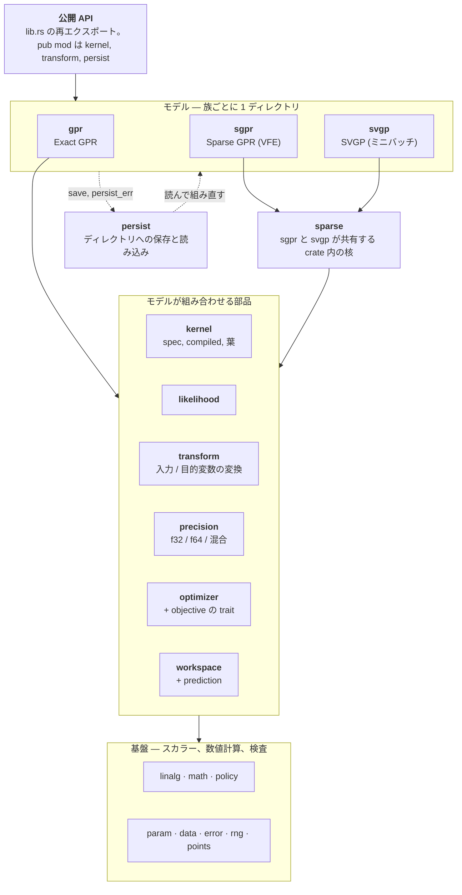

[English](README.md) | 日本語

# gprx

Rust の Exact ガウス過程回帰。`Gpr` は未学習のトレーナー。`Gpr::fit` はそれを消費し、負の対数周辺尤度を argmin の L-BFGS で最小化して `FittedGpr` を返す。同じ部品で `Sgpr` と `Svgp` を組み、オンライン更新とディレクトリへの保存も行う。

`X` は列優先である。点は `n` 個、特徴は `d` 個で、特徴 0 の全行のあとに特徴 1 が続く。`fit` はトレーナーを消費する。観測ノイズは `GaussianLikelihood` に置く。**0.1.0** は既定フィーチャの公開 API である。MSRV は 1.85。0.x はマイナー番号で、公開 API を壊してよい。`internals`（`bench-internals` と `insert-stages`）は、その契約の外である。

```toml
[dependencies]
gprx = "0.1"
```

## 例

```rust
use gprx::kernel::{KernelSpec, RbfKernel};
use gprx::{GaussianLikelihood, Gpr};

fn main() -> Result<(), gprx::GprError> {
    let kernel = KernelSpec::from(RbfKernel::new(1.0)?);
    let likelihood = GaussianLikelihood::new(0.1)?;
    let gpr = Gpr::new(kernel, likelihood);
    let fitted = gpr.fit(&[0.0, 1.0], 2, 1, &[0.0, 1.0])?;
    let pred = fitted.predict(&[0.5], 1, 1)?;
    println!("mean = {}, variance = {}", pred.mean[0], pred.variance[0]);
    Ok(())
}
```

同じプログラム: `cargo run --example fit_predict`。

## 使用方法

`fit` と `factor` は `Result<Fitted, (Trainer, GprError)>` を返す。`?` はトレーナーを落とす（`From<(Trainer, GprError)> for GprError`）。`.map_err(|(_, e)| e)` はエラーだけ残す。`Err((trainer, err))` を照合すると、同じトレーナーでやり直せる。

`X` と誘導点 `Z` は列優先の `f64` である。特徴 0 の全行、次に特徴 1。`n_rows` が点数、`n_cols` が特徴数。`y` の長さは `n_rows`。空、長さが `n_rows * n_cols` でない、`NaN` か `Inf` は `GprError`。

`n_jobs` はない。距離の計算はプロセス全体の Rayon プールを使う。プロセス開始前に `RAYON_NUM_THREADS` を置くか、最初の `fit` か `predict` の前に `rayon::ThreadPoolBuilder::new().num_threads(n).build_global()` を呼ぶ。プールの初期化は一度だけ。ワーカー 1 つは逐次。

`gprx::internals`（`bench-internals`、`insert-stages`）はセマンティックバージョニングの対象外である。依存しない。

### 全学習点: `Gpr`、`FittedGpr`、`OnlineGpr`

`Gpr::new(kernel, likelihood)` は `Gpr<Lbfgs, DoublePrecision>`。`fit(x, n_rows, n_cols, y)` はそれを消費し、負の対数周辺尤度を最適化して `FittedGpr` を返す。

```rust
use gprx::kernel::{KernelSpec, RbfKernel};
use gprx::{Fixed, GaussianLikelihood, Gpr, PredictOptions, Prediction, VarianceKind};

fn main() -> Result<(), gprx::GprError> {
    let fitted = Gpr::new(
        KernelSpec::from(RbfKernel::new(1.0)?),
        GaussianLikelihood::new(0.1)?,
    )
    .fit(&[0.0, 1.0], 2, 1, &[0.0, 1.0])?;

    let pred = fitted.predict(&[0.5], 1, 1)?;
    let latent = fitted.predict_with(
        &[0.5],
        1,
        1,
        PredictOptions {
            variance_kind: VarianceKind::Latent,
        },
    )?;
    let _ = (pred.mean[0], pred.variance[0], latent.variance_kind);

    let mut fitted = fitted;
    let mut reused = Prediction::default();
    fitted.predict_into(&[0.5], 1, 1, &mut reused)?;

    let frozen = fitted
        .into_trainer()
        .with_optimizer(Fixed)
        .factor(&[0.0, 1.0], 2, 1, &[0.0, 1.0])?;
    let _ = frozen.n();
    Ok(())
}
```

`predict` の分散は、元の `y` の尺度での観測分散（`latent + σn²`）。`predict_with` は `PredictOptions` を取る。`predict` はバッファを確保する。`predict_into` と `predict_with_into` は `Prediction` に書き、クエリ長が同じなら `mean` と `variance` を再利用する。

`predict_covariance` は `PredictiveCovariance` を返す。`covariance` は列優先の `m × m`（`col * m + row`）。対角は、同じクエリとオプションの `predict` と一致する。`predict_covariance_with` は `PredictOptions` を取る。

`sample(xs, n_rows, n_cols, n_draws, seed)` は、その共分散から `μ + Lz` を引く。結果は列優先の `m × n_draws`。`seed` は gprx の Xoshiro256++ の開始状態で、どの環境でも同じ列になる。`sample_with` は `PredictOptions` を取る。

`loo_predict` は、新しい `x` への予測ではなく、全学習点での GPML leave-one-out の平均と分散である。`loo_predict_with` は `PredictOptions` を取る。

`neg_log_marginal_likelihood` は、今の `θ` での目的関数。`num_params`、`get_params`、`set_params` は、カーネルのパラメータのあとに尤度のパラメータが続く log-`θ` のベクトル。`value_and_gradient_into` と `hessian_into` はその目的関数を評価する。`set_params` は `θ` と因子を更新する。

`n`、`d`、`kernel`、`likelihood`、`x`、`y`、`alpha` は学習済みモデルを読む。`distance_cache_policy`、`cholesky_buffer`、`math`、`jitter_policy` は方針を読む。

`into_trainer` は、今の `θ` を持った未学習の `Gpr` を返す。学習済みモデルの `with_optimizer` が変えるのは、その後の `refit` だけである。`FittedGpr<O: Optimizer>` の `refit` は、保存したデータ上で今の `θ` から探索し直す。`FittedGpr<Fixed>` の `refit` は `L` と `α` を作り直し、探索しない。変換は再学習しない。

`into_online` は `OnlineGpr` を返す。`insert(x_new, y_new)` は 1 点を足して `PointId` を返す。`delete(id)` はその点を消す。最後の 1 点は消せない（`GprError::InsufficientData`、`min` は 2）。`PointId` に公開コンストラクタはない。`into_online` は `0 .. n-1` を割り当てる。その後の挿入は増え、再利用されない。`point_ids` が現在の一覧。`InvalidPointId` は、その id がモデルに無い。オンラインモデルの `into_trainer` は `Gpr` を返す。`OnlineGpr` の `refit` も同じ分かれ方で、`Optimizer` は探索し、`Fixed` は因子を作り直す。

`save(dir)` は因子なしで `config.json` と `model.safetensors` を書く。`save_with_factor` は列優先の `L` と `α` も書く。

`fit` の前に、`Gpr` で次を呼ぶ。

| メソッド | 効果 |
| --- | --- |
| `with_optimizer(solver)` | `Lbfgs` を置き換える。`Fixed` は `fit` を消し、`factor` を足す。 |
| `with_precision::<P>()` | `DoublePrecision`（既定）、`SinglePrecision`、`MixedPrecision`。 |
| `with_math(KernelExp::FastApprox)` | カーネルの `exp` を多項式にする。既定は `KernelExp::Accurate`。 |
| `with_input_transform(map)` | 既定は恒等。 |
| `with_target_transform(map)` | 既定は恒等。平均が零なら `StandardizeTarget::new()`。 |
| `with_jitter_policy(policy)` | 既定は `JitterPolicy::fixed(0.0)`。 |
| `with_distance_cache_policy` | `DistanceCachePolicy::Cached`（既定）か `Uncached`。 |
| `with_cholesky_buffer` | `CholeskyBuffer::Retain`（既定）か `Reuse`。 |
| `with_prefer_speed` | `Cached` と `Retain`。 |
| `with_prefer_memory` | `Uncached` と `Reuse`。 |

`with_prefer_speed` と `with_prefer_memory` は `Gpr` にある。`Sgpr` と `Svgp` は `with_math` と `with_jitter_policy` を取る。距離キャッシュとコレスキーバッファのセッターは取らない。

### 誘導点: `Sgpr`、`FittedSgpr`、`OnlineSgpr`

`Sgpr::new` は `Sgpr<Lbfgs, FixedInducing, DoublePrecision>`。誘導点は渡した位置のまま。`with_inducing(FreeInducing)` は `Z` も探索する。

```rust
use gprx::kernel::{KernelSpec, RbfKernel};
use gprx::{Fixed, FreeInducing, GaussianLikelihood, Sgpr};

fn main() -> Result<(), gprx::GprError> {
    let x = &[0.0, 1.0, 2.0, 3.0];
    let y = &[0.0, 1.0, 0.5, 0.25];
    let z = &[0.5, 2.5];
    let kernel = KernelSpec::from(RbfKernel::new(1.0)?);
    let likelihood = GaussianLikelihood::new(0.1)?;

    let fitted = Sgpr::new(kernel.clone(), likelihood.clone()).fit(x, 4, 1, y, z, 2)?;
    let _moved = Sgpr::new(kernel.clone(), likelihood.clone())
        .with_inducing(FreeInducing)
        .fit(x, 4, 1, y, z, 2)?;
    let frozen = Sgpr::new(kernel, likelihood)
        .with_optimizer(Fixed)
        .factor(x, 4, 1, y, z, 2)?;
    assert_eq!(fitted.neg_log_marginal_likelihood()?.is_finite(), true);
    let _ = frozen.m();
    Ok(())
}
```

`fit` と `factor` は `(x, n_rows, n_cols, y, z, n_inducing)` を取る。`z` は `n_inducing` 点、特徴数は `n_cols` と同じ列優先。`factor` は `θ` も `Z` も動かさない。自由な誘導点では、カーネルの `θ` と尤度の `θ` のあとに列優先の `Z` が続く。各座標の範囲は学習データの箱で、各特徴の幅の 10%、少なくとも `0.1` だけ広げる。Matérn の `ν = 1/2` には、自由な `Z` の座標微分がない（`GprError::CoordGradientUnsupported`）。

`FittedSgpr` は `FittedGpr` と同じ予測、共分散、サンプル、leave-one-out を持ち、誘導点数の `m` がある。`into_online` は `OnlineSgpr` を返す。`insert` / `delete` は `PointId`。`insert_inducing` / `delete_inducing` は `InducingId`（公開コンストラクタはなく、再利用しない）。`inducing_ids` が一覧。`InvalidInducingId` は、その id が無い。`into_fitted` は `FittedSgpr<_, FixedInducing, _>` を返す。`save` はディレクトリを書く。疎なモデルに `save_with_factor` はない。

### ミニバッチ: `Svgp`、`FittedSvgp`

`Svgp::new` は `Svgp<Fixed>`。`factor` は今の `θ` で白色化した変分事後 `q` を作り、探索しない。`with_optimizer(Adam::new()).fit(...)` は `θ` と `q` をミニバッチの Adam で動かす。`Adam` は `Optimizer` を実装しない。`Gpr` と `Sgpr` は受け取れない。

```rust
use gprx::kernel::{KernelSpec, RbfKernel};
use gprx::{Adam, GaussianLikelihood, Svgp};

fn main() -> Result<(), gprx::GprError> {
    let kernel = KernelSpec::from(RbfKernel::new(1.0)?);
    let likelihood = GaussianLikelihood::new(0.1)?;
    let x = &[0.0, 1.0, 2.0, 3.0];
    let y = &[0.0, 1.0, 0.5, 0.25];
    let z = &[0.5, 2.5];
    let factored = Svgp::new(kernel.clone(), likelihood.clone()).factor(x, 4, 1, y, z, 2)?;
    let trained = Svgp::new(kernel, likelihood)
        .with_optimizer(Adam::new())
        .fit(x, 4, 1, y, z, 2)?;
    let _ = (factored.neg_elbo()?, trained.n());
    Ok(())
}
```

`FittedSvgp::neg_elbo` は証拠下界。`value_and_gradient_into` は全データの和。Adam のループはデータ項を `n / batch` 倍し、KL はそのまま。予測、共分散、サンプル、`predict_into` は他の族と同じ。leave-one-out もオンライン型もない。`save` はディレクトリを書く。

`Adam::new` は学習率 `1e-3`、`β1 = 0.9`、`β2 = 0.999`、`ε = 1e-8`、バッチ 32、100 エポック、シード 0。セッターは `with_learning_rate`、`with_beta1`、`with_beta2`、`with_epsilon`、`with_batch_size`（`NonZeroUsize`）、`with_epochs`（`NonZeroU64`）、`with_seed`。学習率、ベータ、イプシロンは `Result` を返す。

### カーネル

`KernelSpec` は `KernelSpec::from(leaf)` か `KernelSpec::custom(term)` で作る。`+` は和、`*` は積。`*` は `+` より先に束縛するので、`c * k + k2` は定数倍したカーネルと別のカーネルの和になる。`num_params`、`get_params`、`set_params` は、葉を深さ優先で並べた log-`θ`。`parameter_bindings` は、各平坦添字を `(index, leaf_id, local_index)` に対応させる。`compile` は `CompiledKernel<f64>` を作る。`compile_as::<T>()` は保存のスカラーを選ぶ（`KernelScalar`。`f32` と `f64`）。

```rust
use gprx::kernel::{ConstantKernel, KernelSpec, RbfKernel};

fn main() -> Result<(), gprx::GprError> {
    let scaled = KernelSpec::from(ConstantKernel::new(1.5)?)
        * KernelSpec::from(RbfKernel::new(1.0)?);
    let kernel = scaled + KernelSpec::from(RbfKernel::new(2.0)?);
    assert_eq!(kernel.num_params(), 3);
    Ok(())
}
```

組み込みの葉は正のパラメータを `log` で持つ。`new` は利用者の単位（`ℓ`、分散、周期、`α`）。`from_log_*` は最適化の座標。`bounds` / `with_bounds` は開区間 `Interval`（既定 `(1e-5, 1e5)`、`Interval::DEFAULT_POSITIVE`）。今の値が外なら `with_bounds` は `IntervalError`。

| 葉 | 構築 | パラメータ |
| --- | --- | --- |
| `RbfKernel` | `new(ℓ)` | 等方の長さ尺度 |
| `RbfArdKernel` | `new(&[ℓ_d])` | 特徴ごとの長さ尺度（`ArdLengthscales`） |
| `MaternKernel` | `new(ℓ, MaternNu)` | `MaternNu::Half`、`ThreeHalves`、`FiveHalves`（`value` は 0.5、1.5、2.5）。`ν` は最適化しない |
| `MaternArdKernel` | `new(&[ℓ_d], nu)` | ARD の長さ尺度と、固定の `ν` |
| `PeriodicKernel` | `new(ℓ, period)` | 長さ尺度と周期 |
| `RationalQuadraticKernel` | `new(ℓ, alpha)` | 長さ尺度と `α` |
| `RationalQuadraticArdKernel` | `new(&[ℓ_d], alpha)` | ARD の長さ尺度、その次が `α` |
| `ConstantKernel` | `new(c)` | 信号分散。RBF との積が `c * k` |
| `LinearKernel` | `new(variance)` | `σ² xᵀ x'` |
| `WhiteKernel` | `new(variance)` | 対角のナゲット |

観測ノイズは `GaussianLikelihood` に置く。`WhiteKernel` は追加のカーネル項である。尤度とホワイト項をどちらも大きくすると、ノイズを二度数える。

ARD の葉の `lengthscale(dim)` は 1 つの `ℓ_d`。`log_lengthscales` は保存されたベクトル。

葉と `CompiledKernel` は `apply`、`apply_cross`、`fill_diag`、`grad`、`hess` で評価する。葉によっては `apply_points`、`grad_points`、`hess_points`、`grad_wrt_coord_dim` もある。`Triangle::Lower`（コレスキー）、`Upper`、`Full` が、書く要素を選ぶ。`apply` は `KernelMath` を取る。`Accurate` は libm / SIMD の `exp`、`FastApprox` は 7 次の多項式。`f64` の `FastApprox` は `f64::exp` との相対差が `2^{-23}` 以内。ハイパーパラメータの `exp(θ)` はこの選択を使わない。

`KernelTerm` は距離の葉のトレイト。`num_params`、`get_params`、`set_params`、`bounds_into`、`apply` と、疎なモデルが要る微分（`grad_cross` / `hess_cross`、自由な誘導点には `grad_wrt_sq_dist*` / `hess_wrt_sq_dist`）。`CustomKernel::new(term)` が箱に入れ、`KernelSpec::custom` が木に入れる。疎なモデルが要る微分の無い葉は `CoordGradientUnsupported`。

### 尤度

`GaussianLikelihood::new(noise_variance)` は `σn²` を log パラメータで持つ。`from_log_noise_variance`、`noise_variance`、`log_noise_variance`、`bounds`、`with_bounds`、`num_params`、`get_params`、`set_params`。`add_noise_diag` はカーネル対角に `σn²` を足す。`noise_grad_diag` は、その対角の 1 パラメータについての微分。`InvalidNoiseVariance` は、定義域の外のノイズ。

### 変換（`gprx::transform`）

未学習の写像を、`fit` の前に `with_input_transform` か `with_target_transform` へ渡す。モデルが学習データで写像を合わせる。既定は `IdentityInput` と `IdentityTarget`。

| 型 | 役割 |
| --- | --- |
| `IdentityInput`、`IdentityTarget` | 変えない。`fit` は同じ写像を返す |
| `StandardizeInput` | 特徴ごとの平均と標準偏差。`FittedStandardizeInput::mean` と `std` |
| `StandardizeTarget` | `y` の平均と標準偏差が 1 組。`FittedStandardizeTarget::mean` と `std` |
| `MinMaxInput` | 特徴ごとに区間へ写す。`new` は `[0, 1]`。`with_feature_range(lo, hi)`。学習後は `min`、`max`、`feature_range` |
| `MinMaxTarget` | `y` について同じ |
| `Pipeline` | `Pipeline::new().then(step)`。`len`、`is_empty`。`FittedPipeline` に学習する |
| `TargetPipeline` | `y` について同じ。`FittedTargetPipeline` に学習する |
| `ColumnwiseInput` | `new().then(map)` が次の特徴を割り当てる。`FittedColumnwiseInput` に学習する |

`UnfittedTransform::fit` と `UnfittedTarget::fit` は写像を消費する。`Transform` と `TargetTransform` は学習後のトレイト（適用と逆変換）。自作の写像は未学習トレイト、`clone_box`、`as_any` を実装する。保存するなら `persist_id` も。

### 最適化

最適化は型パラメータが 1 つ。`Gpr::new` は `Lbfgs`。`with_optimizer` が置き換える。

| 型 | 探索 | セッター |
| --- | --- | --- |
| `Lbfgs` | argmin の L-BFGS、More–Thuente 直線探索。`Differentiable` が要る | `new` は 100 反復、許容 `sqrt(ε)`、履歴 10。`with_max_iterations`、`with_tolerance`、`with_history_size`（`NonZeroUsize`）、`with_restarts(n, seed)` |
| `NelderMead` | 微分を使わない。`Objective` が要る | `with_max_iterations`、`with_tolerance`、`with_restarts` |
| `TrustRegion` | Hessian を使う。`TwiceDifferentiable` が要る | `with_max_iterations`、`with_tolerance`、`with_restarts`、`with_radii(initial, max)` |
| `FastSimulatedAnnealing` | Cauchy 提案、Metropolis、Ingber の冷却。`Objective` が要る | `with_max_iterations`、`with_restarts`、`with_initial_temperature`、`with_cooling_rate`、`with_seed`、`with_boundary` |
| `Fixed` | 探索しない。`factor` だけ。`Optimizer` は実装しない | ユニット構造体 |
| `Adam` | ミニバッチ。`Svgp` だけ | 上を参照 |

`with_restarts(n, seed)` は log 一様な追加開始を `n` 個足し（`NonZeroU32`）、最小の値を残す。最初の開始はモデルの `θ`。`BoundaryPolicy::Clamp`（既定）は提案を開区間のすぐ内側へ寄せる。`BoundaryPolicy::Periodic` は反対側へ折り返す。

`Optimizer::minimize` は `OptResult { params, value, iterations }` を返す。`USES_CHANGE_INDICES` が `true` のソルバは、変わった座標を報告する。`CholeskyBuffer::Retain` なら、学習はその葉だけを組み直す。自作のソルバは `Optimizer<P>` を実装する。`P` は `Objective`、`Differentiable`、`TwiceDifferentiable`。`IncrementalObjective::value_with_changes` は、その添字が触る葉だけを組み直す。空、重複、範囲外の添字は `GprError`。

`Objective::value` がスカラー。`value_at_changes` は、その目的関数の直前の評価から変わった座標をすべて列挙する。`fill_intervals` は各パラメータの開区間を利用者の単位で書く。組み込みのソルバはその区間の中を探す。`Differentiable::value_and_gradient_into` と `TwiceDifferentiable`（Hessian）がそれを拡張する。

### 精度、数学、ジッタ

`DoublePrecision` は保存も求解も `f64`（`PrecisionPolicy::Storage` と `Refine`）。`SinglePrecision` は `f32` で、その因子を保つ。`MixedPrecision` の既定は `MixedPrecision<PromoteStorage>`。`f32` で因子を作り、予測の重みを `f64` で精緻化する。`MixedPrecision<ReevaluateKernel>` がもう一方の `ResidualFormula`。`GpScalar` はモデルの型パラメータが使うスカラー境界。選ぶには `with_precision::<SinglePrecision>()`。

`KernelExp::Accurate` と `FastApprox` は実行時の切り替え（`with_math`）。クレート直下の `Accurate` と `FastApprox` は、直接 `apply` するときの `KernelMath`。

`JitterPolicy::fixed(j)` は、失敗したコレスキーを対角の `j ≥ 0` で一度やり直す（`FixedJitter`）。`adaptive(initial, multiplier, max_retries, max_jitter)` は、正則化なしの因子が失敗したあとオフセットを増やす（`AdaptiveJitter`）。`initial > 0`、`multiplier > 1`、`max_retries ≥ 1`、`max_jitter ≥ initial`。全学習点の既定は `fixed(0.0)`。保存された数は `jitter`、または `initial`、`multiplier`、`max_retries`、`max_jitter` で読む。

### パラメータ

`Interval::new(lo, hi)` は有限の開区間で、`lo < hi`。`lo`、`hi`、`contains`。`IntervalError::InvalidBounds` と `OutOfRange`。`GprError::InvalidInterval` がそれを包む。`BoundedParam::new(value, interval)` は、区間の厳密な内側にある利用者単位の値を持つ。`value` が読む。葉と `GaussianLikelihood` は内部で `BoundedParam` を持つ。呼び出す側は通常 `with_bounds` を使う。

### 保存と読み込み（`gprx::persist`）

`FORMAT_VERSION` は `1`。`RESERVED_PREFIX` は `"gprx."`。呼び出し側の `persist_id` はこの接頭辞を使わない。

`LoadedGpr::load(dir, registry)`、`LoadedSgpr::load`、`LoadedSvgp::load` がディレクトリを読む。`PersistRegistry::new` は空。組み込みの登録は不要。読み込む前に、自作のカーネルか変換を登録する。

- `register_kernel`
- `register_unfitted_input`、`register_fitted_input`
- `register_unfitted_target`、`register_fitted_target`

復元関数の型は `KernelRestore`、`UnfittedInputRestore`、`FittedInputRestore`、`UnfittedTargetRestore`、`FittedTargetRestore`。

読み込んだモデルの `predict` と `predict_with` は、ファイルが `f32` でも `f64` を返す。`n`、`d`、疎なら `m`。`is_online` は、全学習点か SGPR の `ldlt` ファイルで真。型の付いたモデルはバリアントを照合する。

| 列挙 | バリアント |
| --- | --- |
| `LoadedGpr` | `Double`、`Single`、`Mixed`、`Reevaluate`、`OnlineDouble`、`OnlineSingle`、`OnlineMixed`、`OnlineReevaluate` |
| `LoadedSgpr` | 同じ 8 つ。`Double` は `FittedSgpr<Fixed>`。オンラインは `OnlineSgpr<Fixed, _>` |
| `LoadedSvgp` | `Double`、`Single`、`Mixed`、`Reevaluate`。オンラインはない |

読み込んだ全学習点モデルは `Fixed` かつ `CholeskyBuffer::Retain`。ファイルにソルバは無い。照合したモデルで `with_optimizer` を呼び、`refit` すると、もう一度探索する。`save` で因子なしに書いたファイルは、読み込み時に因子を作る。`save_with_factor` は `L` をメモリマップのまま使う。

### エラー

`GprError` は non-exhaustive。表示文字列は英語。

| バリアント | いつ |
| --- | --- |
| `DimensionMismatch { x_dim, expected_dim }` | クエリの特徴数が学習と違う |
| `InsufficientData { n, min }` | 点が足りない |
| `EmptyInput` | 次元が 0 |
| `NonFiniteInput` | 呼び出し側のデータに `NaN` か `Inf` |
| `NonFiniteKernelValue` | カーネル評価が有限でない |
| `CholeskyFailed { jitter, matrix_size, stage }` | ジッタのあと因子分解が失敗 |
| `NonPositiveDefiniteMatrix` | 共分散であるべき行列がそうでない |
| `CoordGradientUnsupported` | 疎なモデルが要る微分がカーネルに無い |
| `OptimizationNotConverged { iterations }` | ソルバが判定の前に止まった |
| `InvalidHyperparameter { reason }` | カーネルパラメータが定義域の外 |
| `ShapeMismatch { reason }` | 行列の形が違う |
| `LengthMismatch { reason }` | スライスの長さが違う |
| `IndexOutOfRange { reason }` | パラメータ、葉、次元の添字 |
| `InvalidConfig { reason }` | 最適化、ジッタ、変換の設定 |
| `SizeOverflow` | `n_rows * n_cols` が `usize` に収まらない |
| `InvalidInterval` | `Interval` か `BoundedParam` を作れない |
| `InvalidNoiseVariance { reason }` | 観測ノイズが定義域の外 |
| `UnsupportedKernelOperation { reason }` | その葉がその操作を実装しない |
| `WorkspaceTooSmall` | バッファが問題より短い |
| `InvalidPointId` | `PointId` がモデルに無い |
| `InvalidInducingId` | `InducingId` がモデルに無い |
| `PersistFailed { kind, reason }` | 保存か読み込みが失敗 |
| `UnsupportedPersistVersion { found, supported }` | `format_version` が `FORMAT_VERSION` でない |

`CholeskyStage` は `Fit`、`Predict`、`OnlineInsert`、`OnlineDelete`。`PersistErrorKind` は `Io`、`Config`、`Tensor`、`InvalidPersistId`、`NotPersistable`、`UnregisteredId`、`WrongModel`。分岐は `kind`。`reason` は人が読む文。

## アーキテクチャと保存フォーマット

3 つのモデル族（`Gpr`、`Sgpr`、`Svgp`）は、同じ部品から作られ、互いを import しない。下の図がクレート全体の地図で、各箱は `src/` のモジュール。



- [`docs/architecture.ja.md`](https://github.com/YUKIKEDA/gprx/blob/main/docs/architecture.ja.md): 全モジュールの責務、import の向き、族ごとの公開型、何を変えるときどこを見るか。
- [`docs/persist-format.ja.md`](https://github.com/YUKIKEDA/gprx/blob/main/docs/persist-format.ja.md): `save` が書くもの。`config.json` のキー、`model.safetensors` のテンソル（名前、形、dtype、列優先の並び）、カーネルと変換の JSON の形、`Custom` の復元、版、エラー。

## 比較

精度、学習時間、メモリを他のライブラリと比べた結果は、[比較](https://github.com/YUKIKEDA/gprx/blob/main/docs/comparison.ja.md)にある。

## ライセンス

次のいずれか。

- Apache License, Version 2.0 ([LICENSE-APACHE](LICENSE-APACHE))
- MIT license ([LICENSE-MIT](LICENSE-MIT))
