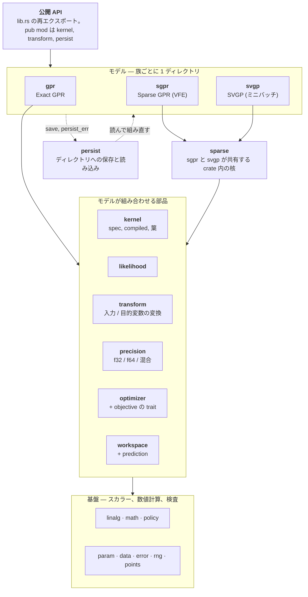

[English](README.md) | 日本語

# gprx

Rust の Exact ガウス過程回帰。`Gpr` は未学習のトレーナー。`Gpr::fit` はそれを消費し、負の対数周辺尤度を argmin の L-BFGS で最小化して `FittedGpr` を返す。同じ部品で `Sgpr` と `Svgp` を組み、オンライン更新とディレクトリへの保存も行う。

## 状態

**0.1.0** は、既定フィーチャの公開 API である。次の節に、外部クレートが呼べる型と、その呼び出し方を書いた。MSRV は 1.85（`Cargo.toml` の `rust-version`）。0.x はマイナー番号で公開 API を壊してよい。`internals`（`bench-internals` と `insert-stages`）はセマンティックバージョニングの対象外であり、その節には入れない。crates.io の `gprx = "0.1"` で依存できる。

設計: [`docs/design.ja.md`](https://github.com/YUKIKEDA/gprx/blob/main/docs/design.ja.md)。アーキテクチャ: [`docs/architecture.ja.md`](https://github.com/YUKIKEDA/gprx/blob/main/docs/architecture.ja.md)。保存フォーマット: [`docs/persist-format.ja.md`](https://github.com/YUKIKEDA/gprx/blob/main/docs/persist-format.ja.md)。タスク: [`docs/roadmap.md`](https://github.com/YUKIKEDA/gprx/blob/main/docs/roadmap.md)。エージェント向け: [`AGENTS.md`](https://github.com/YUKIKEDA/gprx/blob/main/AGENTS.md)。他ライブラリとの壁時計とピーク RSS: [`compare/perf/`](https://github.com/YUKIKEDA/gprx/blob/main/compare/perf/)（P2B-16 Exact は `just perf`。P4-12 Sparse は `just perf-sparse`。P4-14 Sparse オンラインは `just perf-sparse-online`。criterion ではない）。

## 例

`X` は列優先（`n` 点 × `d` 特徴: 特徴 0 の全行、次に特徴 1、…）。

```rust
use gprx::kernel::{KernelSpec, RbfKernel};
use gprx::{GaussianLikelihood, Gpr};

fn main() -> Result<(), gprx::GprError> {
    let kernel = KernelSpec::from(RbfKernel::new(1.0)?);
    let likelihood = GaussianLikelihood::new(0.1)?;
    let gpr = Gpr::new(kernel, likelihood);
    let fitted = gpr.fit(&[0.0, 1.0], 2, 1, &[0.0, 1.0])?;
    let pred = fitted.predict(&[0.5], 1, 1)?;
    println!("mean = {}, variance = {}", pred.mean[0], pred.variance[0]);
    Ok(())
}
```

同じプログラム: `cargo run --example fit_predict`。

## 使用方法

`fit` と `factor` は `Result<Fitted, (Trainer, GprError)>` を返す。`?` はトレーナーを落とす（`From<(Trainer, GprError)> for GprError`）。`.map_err(|(_, e)| e)` はエラーだけ残す。`Err((trainer, err))` を照合すると、同じトレーナーでやり直せる。

`X` と誘導点 `Z` は列優先の `f64` である。特徴 0 の全行、次に特徴 1。`n_rows` が点数、`n_cols` が特徴数。`y` の長さは `n_rows`。空、長さが `n_rows * n_cols` でない、`NaN` か `Inf` は `GprError`。

`n_jobs` はない。距離の計算はプロセス全体の Rayon プールを使う。プロセス開始前に `RAYON_NUM_THREADS` を置くか、最初の `fit` か `predict` の前に `rayon::ThreadPoolBuilder::new().num_threads(n).build_global()` を呼ぶ。プールの初期化は一度だけ。ワーカー 1 つは逐次。

`gprx::internals`（`bench-internals`、`insert-stages`）はセマンティックバージョニングの対象外である。依存しない。

### 全学習点: `Gpr`、`FittedGpr`、`OnlineGpr`

`Gpr::new(kernel, likelihood)` は `Gpr<Lbfgs, DoublePrecision>`。`fit(x, n_rows, n_cols, y)` はそれを消費し、負の対数周辺尤度を最適化して `FittedGpr` を返す。

```rust
use gprx::kernel::{KernelSpec, RbfKernel};
use gprx::{Fixed, GaussianLikelihood, Gpr, PredictOptions, Prediction, VarianceKind};

fn main() -> Result<(), gprx::GprError> {
    let fitted = Gpr::new(
        KernelSpec::from(RbfKernel::new(1.0)?),
        GaussianLikelihood::new(0.1)?,
    )
    .fit(&[0.0, 1.0], 2, 1, &[0.0, 1.0])?;

    let pred = fitted.predict(&[0.5], 1, 1)?;
    let latent = fitted.predict_with(
        &[0.5],
        1,
        1,
        PredictOptions {
            variance_kind: VarianceKind::Latent,
        },
    )?;
    let _ = (pred.mean[0], pred.variance[0], latent.variance_kind);

    let mut fitted = fitted;
    let mut reused = Prediction::default();
    fitted.predict_into(&[0.5], 1, 1, &mut reused)?;

    let frozen = fitted
        .into_trainer()
        .with_optimizer(Fixed)
        .factor(&[0.0, 1.0], 2, 1, &[0.0, 1.0])?;
    let _ = frozen.n();
    Ok(())
}
```

`predict` の分散は、元の `y` の尺度での観測分散（`latent + σn²`）。`predict_with` は `PredictOptions` を取る。`predict` はバッファを確保する。`predict_into` と `predict_with_into` は `Prediction` に書き、クエリ長が同じなら `mean` と `variance` を再利用する。

`predict_covariance` は `PredictiveCovariance` を返す。`covariance` は列優先の `m × m`（`col * m + row`）。対角は、同じクエリとオプションの `predict` と一致する。`predict_covariance_with` は `PredictOptions` を取る。

`sample(xs, n_rows, n_cols, n_draws, seed)` は、その共分散から `μ + Lz` を引く。結果は列優先の `m × n_draws`。`seed` は gprx の Xoshiro256++ の開始状態で、どの環境でも同じ列になる。`sample_with` は `PredictOptions` を取る。

`loo_predict` は、新しい `x` への予測ではなく、全学習点での GPML leave-one-out の平均と分散である。`loo_predict_with` は `PredictOptions` を取る。

`neg_log_marginal_likelihood` は、今の `θ` での目的関数。`num_params`、`get_params`、`set_params` は、カーネルのパラメータのあとに尤度のパラメータが続く log-`θ` のベクトル。`value_and_gradient_into` と `hessian_into` はその目的関数を評価する。`set_params` は `θ` と因子を更新する。

`n`、`d`、`kernel`、`likelihood`、`x`、`y`、`alpha` は学習済みモデルを読む。`distance_cache_policy`、`cholesky_buffer`、`math`、`jitter_policy` は方針を読む。

`into_trainer` は、今の `θ` を持った未学習の `Gpr` を返す。学習済みモデルの `with_optimizer` が変えるのは、その後の `refit` だけである。`FittedGpr<O: Optimizer>` の `refit` は、保存したデータ上で今の `θ` から探索し直す。`FittedGpr<Fixed>` の `refit` は `L` と `α` を作り直し、探索しない。変換は再学習しない。

`into_online` は `OnlineGpr` を返す。`insert(x_new, y_new)` は 1 点を足して `PointId` を返す。`delete(id)` はその点を消す。最後の 1 点は消せない（`GprError::InsufficientData`、`min` は 2）。`PointId` に公開コンストラクタはない。`into_online` は `0 .. n-1` を割り当てる。その後の挿入は増え、再利用されない。`point_ids` が現在の一覧。`InvalidPointId` は、その id がモデルに無い。オンラインモデルの `into_trainer` は `Gpr` を返す。`OnlineGpr` の `refit` も同じ分かれ方で、`Optimizer` は探索し、`Fixed` は因子を作り直す。

`save(dir)` は因子なしで `config.json` と `model.safetensors` を書く。`save_with_factor` は列優先の `L` と `α` も書く。

`fit` の前に、`Gpr` で次を呼ぶ。

| メソッド | 効果 |
| --- | --- |
| `with_optimizer(solver)` | `Lbfgs` を置き換える。`Fixed` は `fit` を消し、`factor` を足す。 |
| `with_precision::<P>()` | `DoublePrecision`（既定）、`SinglePrecision`、`MixedPrecision`。 |
| `with_math(KernelExp::FastApprox)` | カーネルの `exp` を多項式にする。既定は `KernelExp::Accurate`。 |
| `with_input_transform(map)` | 既定は恒等。 |
| `with_target_transform(map)` | 既定は恒等。平均が零なら `StandardizeTarget::new()`。 |
| `with_jitter_policy(policy)` | 既定は `JitterPolicy::fixed(0.0)`。 |
| `with_distance_cache_policy` | `DistanceCachePolicy::Cached`（既定）か `Uncached`。 |
| `with_cholesky_buffer` | `CholeskyBuffer::Retain`（既定）か `Reuse`。 |
| `with_prefer_speed` | `Cached` と `Retain`。 |
| `with_prefer_memory` | `Uncached` と `Reuse`。 |

`with_prefer_speed` と `with_prefer_memory` は `Gpr` にある。`Sgpr` と `Svgp` は `with_math` と `with_jitter_policy` を取る。距離キャッシュとコレスキーバッファのセッターは取らない。

### 誘導点: `Sgpr`、`FittedSgpr`、`OnlineSgpr`

`Sgpr::new` は `Sgpr<Lbfgs, FixedInducing, DoublePrecision>`。誘導点は渡した位置のまま。`with_inducing(FreeInducing)` は `Z` も探索する。

```rust
use gprx::kernel::{KernelSpec, RbfKernel};
use gprx::{Fixed, FreeInducing, GaussianLikelihood, Sgpr};

fn main() -> Result<(), gprx::GprError> {
    let x = &[0.0, 1.0, 2.0, 3.0];
    let y = &[0.0, 1.0, 0.5, 0.25];
    let z = &[0.5, 2.5];
    let kernel = KernelSpec::from(RbfKernel::new(1.0)?);
    let likelihood = GaussianLikelihood::new(0.1)?;

    let fitted = Sgpr::new(kernel.clone(), likelihood.clone()).fit(x, 4, 1, y, z, 2)?;
    let _moved = Sgpr::new(kernel.clone(), likelihood.clone())
        .with_inducing(FreeInducing)
        .fit(x, 4, 1, y, z, 2)?;
    let frozen = Sgpr::new(kernel, likelihood)
        .with_optimizer(Fixed)
        .factor(x, 4, 1, y, z, 2)?;
    assert_eq!(fitted.neg_log_marginal_likelihood()?.is_finite(), true);
    let _ = frozen.m();
    Ok(())
}
```

`fit` と `factor` は `(x, n_rows, n_cols, y, z, n_inducing)` を取る。`z` は `n_inducing` 点、特徴数は `n_cols` と同じ列優先。`factor` は `θ` も `Z` も動かさない。自由な誘導点では、カーネルの `θ` と尤度の `θ` のあとに列優先の `Z` が続く。各座標の範囲は学習データの箱で、各特徴の幅の 10%、少なくとも `0.1` だけ広げる。Matérn の `ν = 1/2` には、自由な `Z` の座標微分がない（`GprError::CoordGradientUnsupported`）。

`FittedSgpr` は `FittedGpr` と同じ予測、共分散、サンプル、leave-one-out を持ち、誘導点数の `m` がある。`into_online` は `OnlineSgpr` を返す。`insert` / `delete` は `PointId`。`insert_inducing` / `delete_inducing` は `InducingId`（公開コンストラクタはなく、再利用しない）。`inducing_ids` が一覧。`InvalidInducingId` は、その id が無い。`into_fitted` は `FittedSgpr<_, FixedInducing, _>` を返す。`save` はディレクトリを書く。疎なモデルに `save_with_factor` はない。

### ミニバッチ: `Svgp`、`FittedSvgp`

`Svgp::new` は `Svgp<Fixed>`。`factor` は今の `θ` で白色化した変分事後 `q` を作り、探索しない。`with_optimizer(Adam::new()).fit(...)` は `θ` と `q` をミニバッチの Adam で動かす。`Adam` は `Optimizer` を実装しない。`Gpr` と `Sgpr` は受け取れない。

```rust
use gprx::kernel::{KernelSpec, RbfKernel};
use gprx::{Adam, GaussianLikelihood, Svgp};

fn main() -> Result<(), gprx::GprError> {
    let kernel = KernelSpec::from(RbfKernel::new(1.0)?);
    let likelihood = GaussianLikelihood::new(0.1)?;
    let x = &[0.0, 1.0, 2.0, 3.0];
    let y = &[0.0, 1.0, 0.5, 0.25];
    let z = &[0.5, 2.5];
    let factored = Svgp::new(kernel.clone(), likelihood.clone()).factor(x, 4, 1, y, z, 2)?;
    let trained = Svgp::new(kernel, likelihood)
        .with_optimizer(Adam::new())
        .fit(x, 4, 1, y, z, 2)?;
    let _ = (factored.neg_elbo()?, trained.n());
    Ok(())
}
```

`FittedSvgp::neg_elbo` は証拠下界。`value_and_gradient_into` は全データの和。Adam のループはデータ項を `n / batch` 倍し、KL はそのまま。予測、共分散、サンプル、`predict_into` は他の族と同じ。leave-one-out もオンライン型もない。`save` はディレクトリを書く。

`Adam::new` は学習率 `1e-3`、`β1 = 0.9`、`β2 = 0.999`、`ε = 1e-8`、バッチ 32、100 エポック、シード 0。セッターは `with_learning_rate`、`with_beta1`、`with_beta2`、`with_epsilon`、`with_batch_size`（`NonZeroUsize`）、`with_epochs`（`NonZeroU64`）、`with_seed`。学習率、ベータ、イプシロンは `Result` を返す。

### カーネル

`KernelSpec` は `KernelSpec::from(leaf)` か `KernelSpec::custom(term)` で作る。`+` は和、`*` は積。`*` は `+` より先に束縛するので、`c * k + k2` は定数倍したカーネルと別のカーネルの和になる。`num_params`、`get_params`、`set_params` は、葉を深さ優先で並べた log-`θ`。`parameter_bindings` は、各平坦添字を `(index, leaf_id, local_index)` に対応させる。`compile` は `CompiledKernel<f64>` を作る。`compile_as::<T>()` は保存のスカラーを選ぶ（`KernelScalar`。`f32` と `f64`）。

```rust
use gprx::kernel::{ConstantKernel, KernelSpec, RbfKernel};

fn main() -> Result<(), gprx::GprError> {
    let scaled = KernelSpec::from(ConstantKernel::new(1.5)?)
        * KernelSpec::from(RbfKernel::new(1.0)?);
    let kernel = scaled + KernelSpec::from(RbfKernel::new(2.0)?);
    assert_eq!(kernel.num_params(), 3);
    Ok(())
}
```

組み込みの葉は正のパラメータを `log` で持つ。`new` は利用者の単位（`ℓ`、分散、周期、`α`）。`from_log_*` は最適化の座標。`bounds` / `with_bounds` は開区間 `Interval`（既定 `(1e-5, 1e5)`、`Interval::DEFAULT_POSITIVE`）。今の値が外なら `with_bounds` は `IntervalError`。

| 葉 | 構築 | パラメータ |
| --- | --- | --- |
| `RbfKernel` | `new(ℓ)` | 等方の長さ尺度 |
| `RbfArdKernel` | `new(&[ℓ_d])` | 特徴ごとの長さ尺度（`ArdLengthscales`） |
| `MaternKernel` | `new(ℓ, MaternNu)` | `MaternNu::Half`、`ThreeHalves`、`FiveHalves`（`value` は 0.5、1.5、2.5）。`ν` は最適化しない |
| `MaternArdKernel` | `new(&[ℓ_d], nu)` | ARD の長さ尺度と、固定の `ν` |
| `PeriodicKernel` | `new(ℓ, period)` | 長さ尺度と周期 |
| `RationalQuadraticKernel` | `new(ℓ, alpha)` | 長さ尺度と `α` |
| `RationalQuadraticArdKernel` | `new(&[ℓ_d], alpha)` | ARD の長さ尺度、その次が `α` |
| `ConstantKernel` | `new(c)` | 信号分散。RBF との積が `c * k` |
| `LinearKernel` | `new(variance)` | `σ² xᵀ x'` |
| `WhiteKernel` | `new(variance)` | 対角のナゲット |

観測ノイズは `GaussianLikelihood` に置く。`WhiteKernel` は追加のカーネル項である。尤度とホワイト項をどちらも大きくすると、ノイズを二度数える。

ARD の葉の `lengthscale(dim)` は 1 つの `ℓ_d`。`log_lengthscales` は保存されたベクトル。

葉と `CompiledKernel` は `apply`、`apply_cross`、`fill_diag`、`grad`、`hess` で評価する。葉によっては `apply_points`、`grad_points`、`hess_points`、`grad_wrt_coord_dim` もある。`Triangle::Lower`（コレスキー）、`Upper`、`Full` が、書く要素を選ぶ。`apply` は `KernelMath` を取る。`Accurate` は libm / SIMD の `exp`、`FastApprox` は 7 次の多項式。`f64` の `FastApprox` は `f64::exp` との相対差が `2^{-23}` 以内。ハイパーパラメータの `exp(θ)` はこの選択を使わない。

`KernelTerm` は距離の葉のトレイト。`num_params`、`get_params`、`set_params`、`bounds_into`、`apply` と、疎なモデルが要る微分（`grad_cross` / `hess_cross`、自由な誘導点には `grad_wrt_sq_dist*` / `hess_wrt_sq_dist`）。`CustomKernel::new(term)` が箱に入れ、`KernelSpec::custom` が木に入れる。疎なモデルが要る微分の無い葉は `CoordGradientUnsupported`。

### 尤度

`GaussianLikelihood::new(noise_variance)` は `σn²` を log パラメータで持つ。`from_log_noise_variance`、`noise_variance`、`log_noise_variance`、`bounds`、`with_bounds`、`num_params`、`get_params`、`set_params`。`add_noise_diag` はカーネル対角に `σn²` を足す。`noise_grad_diag` は、その対角の 1 パラメータについての微分。`InvalidNoiseVariance` は、定義域の外のノイズ。

### 変換（`gprx::transform`）

未学習の写像を、`fit` の前に `with_input_transform` か `with_target_transform` へ渡す。モデルが学習データで写像を合わせる。既定は `IdentityInput` と `IdentityTarget`。

| 型 | 役割 |
| --- | --- |
| `IdentityInput`、`IdentityTarget` | 変えない。`fit` は同じ写像を返す |
| `StandardizeInput` | 特徴ごとの平均と標準偏差。`FittedStandardizeInput::mean` と `std` |
| `StandardizeTarget` | `y` の平均と標準偏差が 1 組。`FittedStandardizeTarget::mean` と `std` |
| `MinMaxInput` | 特徴ごとに区間へ写す。`new` は `[0, 1]`。`with_feature_range(lo, hi)`。学習後は `min`、`max`、`feature_range` |
| `MinMaxTarget` | `y` について同じ |
| `Pipeline` | `Pipeline::new().then(step)`。`len`、`is_empty`。`FittedPipeline` に学習する |
| `TargetPipeline` | `y` について同じ。`FittedTargetPipeline` に学習する |
| `ColumnwiseInput` | `new().then(map)` が次の特徴を割り当てる。`FittedColumnwiseInput` に学習する |

`UnfittedTransform::fit` と `UnfittedTarget::fit` は写像を消費する。`Transform` と `TargetTransform` は学習後のトレイト（適用と逆変換）。自作の写像は未学習トレイト、`clone_box`、`as_any` を実装する。保存するなら `persist_id` も。

### 最適化

最適化は型パラメータが 1 つ。`Gpr::new` は `Lbfgs`。`with_optimizer` が置き換える。

| 型 | 探索 | セッター |
| --- | --- | --- |
| `Lbfgs` | argmin の L-BFGS、More–Thuente 直線探索。`Differentiable` が要る | `new` は 100 反復、許容 `sqrt(ε)`、履歴 10。`with_max_iterations`、`with_tolerance`、`with_history_size`（`NonZeroUsize`）、`with_restarts(n, seed)` |
| `NelderMead` | 微分を使わない。`Objective` が要る | `with_max_iterations`、`with_tolerance`、`with_restarts` |
| `TrustRegion` | Hessian を使う。`TwiceDifferentiable` が要る | `with_max_iterations`、`with_tolerance`、`with_restarts`、`with_radii(initial, max)` |
| `FastSimulatedAnnealing` | Cauchy 提案、Metropolis、Ingber の冷却。`Objective` が要る | `with_max_iterations`、`with_restarts`、`with_initial_temperature`、`with_cooling_rate`、`with_seed`、`with_boundary` |
| `Fixed` | 探索しない。`factor` だけ。`Optimizer` は実装しない | ユニット構造体 |
| `Adam` | ミニバッチ。`Svgp` だけ | 上を参照 |

`with_restarts(n, seed)` は log 一様な追加開始を `n` 個足し（`NonZeroU32`）、最小の値を残す。最初の開始はモデルの `θ`。`BoundaryPolicy::Clamp`（既定）は提案を開区間のすぐ内側へ寄せる。`BoundaryPolicy::Periodic` は反対側へ折り返す。

`Optimizer::minimize` は `OptResult { params, value, iterations }` を返す。`USES_CHANGE_INDICES` が `true` のソルバは、変わった座標を報告する。`CholeskyBuffer::Retain` なら、学習はその葉だけを組み直す。自作のソルバは `Optimizer<P>` を実装する。`P` は `Objective`、`Differentiable`、`TwiceDifferentiable`。`IncrementalObjective::value_with_changes` は、その添字が触る葉だけを組み直す。空、重複、範囲外の添字は `GprError`。

`Objective::value` がスカラー。`value_at_changes` は、その目的関数の直前の評価から変わった座標をすべて列挙する。`fill_intervals` は各パラメータの開区間を利用者の単位で書く。組み込みのソルバはその区間の中を探す。`Differentiable::value_and_gradient_into` と `TwiceDifferentiable`（Hessian）がそれを拡張する。

### 精度、数学、ジッタ

`DoublePrecision` は保存も求解も `f64`（`PrecisionPolicy::Storage` と `Refine`）。`SinglePrecision` は `f32` で、その因子を保つ。`MixedPrecision` の既定は `MixedPrecision<PromoteStorage>`。`f32` で因子を作り、予測の重みを `f64` で精緻化する。`MixedPrecision<ReevaluateKernel>` がもう一方の `ResidualFormula`。`GpScalar` はモデルの型パラメータが使うスカラー境界。選ぶには `with_precision::<SinglePrecision>()`。

`KernelExp::Accurate` と `FastApprox` は実行時の切り替え（`with_math`）。クレート直下の `Accurate` と `FastApprox` は、直接 `apply` するときの `KernelMath`。

`JitterPolicy::fixed(j)` は、失敗したコレスキーを対角の `j ≥ 0` で一度やり直す（`FixedJitter`）。`adaptive(initial, multiplier, max_retries, max_jitter)` は、正則化なしの因子が失敗したあとオフセットを増やす（`AdaptiveJitter`）。`initial > 0`、`multiplier > 1`、`max_retries ≥ 1`、`max_jitter ≥ initial`。全学習点の既定は `fixed(0.0)`。保存された数は `jitter`、または `initial`、`multiplier`、`max_retries`、`max_jitter` で読む。

### パラメータ

`Interval::new(lo, hi)` は有限の開区間で、`lo < hi`。`lo`、`hi`、`contains`。`IntervalError::InvalidBounds` と `OutOfRange`。`GprError::InvalidInterval` がそれを包む。`BoundedParam::new(value, interval)` は、区間の厳密な内側にある利用者単位の値を持つ。`value` が読む。葉と `GaussianLikelihood` は内部で `BoundedParam` を持つ。呼び出す側は通常 `with_bounds` を使う。

### 保存と読み込み（`gprx::persist`）

`FORMAT_VERSION` は `1`。`RESERVED_PREFIX` は `"gprx."`。呼び出し側の `persist_id` はこの接頭辞を使わない。

`LoadedGpr::load(dir, registry)`、`LoadedSgpr::load`、`LoadedSvgp::load` がディレクトリを読む。`PersistRegistry::new` は空。組み込みの登録は不要。読み込む前に、自作のカーネルか変換を登録する。

- `register_kernel`
- `register_unfitted_input`、`register_fitted_input`
- `register_unfitted_target`、`register_fitted_target`

復元関数の型は `KernelRestore`、`UnfittedInputRestore`、`FittedInputRestore`、`UnfittedTargetRestore`、`FittedTargetRestore`。

読み込んだモデルの `predict` と `predict_with` は、ファイルが `f32` でも `f64` を返す。`n`、`d`、疎なら `m`。`is_online` は、全学習点か SGPR の `ldlt` ファイルで真。型の付いたモデルはバリアントを照合する。

| 列挙 | バリアント |
| --- | --- |
| `LoadedGpr` | `Double`、`Single`、`Mixed`、`Reevaluate`、`OnlineDouble`、`OnlineSingle`、`OnlineMixed`、`OnlineReevaluate` |
| `LoadedSgpr` | 同じ 8 つ。`Double` は `FittedSgpr<Fixed>`。オンラインは `OnlineSgpr<Fixed, _>` |
| `LoadedSvgp` | `Double`、`Single`、`Mixed`、`Reevaluate`。オンラインはない |

読み込んだ全学習点モデルは `Fixed` かつ `CholeskyBuffer::Retain`。ファイルにソルバは無い。照合したモデルで `with_optimizer` を呼び、`refit` すると、もう一度探索する。`save` で因子なしに書いたファイルは、読み込み時に因子を作る。`save_with_factor` は `L` をメモリマップのまま使う。

### エラー

`GprError` は non-exhaustive。表示文字列は英語。

| バリアント | いつ |
| --- | --- |
| `DimensionMismatch { x_dim, expected_dim }` | クエリの特徴数が学習と違う |
| `InsufficientData { n, min }` | 点が足りない |
| `EmptyInput` | 次元が 0 |
| `NonFiniteInput` | 呼び出し側のデータに `NaN` か `Inf` |
| `NonFiniteKernelValue` | カーネル評価が有限でない |
| `CholeskyFailed { jitter, matrix_size, stage }` | ジッタのあと因子分解が失敗 |
| `NonPositiveDefiniteMatrix` | 共分散であるべき行列がそうでない |
| `CoordGradientUnsupported` | 疎なモデルが要る微分がカーネルに無い |
| `OptimizationNotConverged { iterations }` | ソルバが判定の前に止まった |
| `InvalidHyperparameter { reason }` | カーネルパラメータが定義域の外 |
| `ShapeMismatch { reason }` | 行列の形が違う |
| `LengthMismatch { reason }` | スライスの長さが違う |
| `IndexOutOfRange { reason }` | パラメータ、葉、次元の添字 |
| `InvalidConfig { reason }` | 最適化、ジッタ、変換の設定 |
| `SizeOverflow` | `n_rows * n_cols` が `usize` に収まらない |
| `InvalidInterval` | `Interval` か `BoundedParam` を作れない |
| `InvalidNoiseVariance { reason }` | 観測ノイズが定義域の外 |
| `UnsupportedKernelOperation { reason }` | その葉がその操作を実装しない |
| `WorkspaceTooSmall` | バッファが問題より短い |
| `InvalidPointId` | `PointId` がモデルに無い |
| `InvalidInducingId` | `InducingId` がモデルに無い |
| `PersistFailed { kind, reason }` | 保存か読み込みが失敗 |
| `UnsupportedPersistVersion { found, supported }` | `format_version` が `FORMAT_VERSION` でない |

`CholeskyStage` は `Fit`、`Predict`、`OnlineInsert`、`OnlineDelete`。`PersistErrorKind` は `Io`、`Config`、`Tensor`、`InvalidPersistId`、`NotPersistable`、`UnregisteredId`、`WrongModel`。分岐は `kind`。`reason` は人が読む文。

## アーキテクチャと保存フォーマット

3 つのモデル族（`Gpr`、`Sgpr`、`Svgp`）は、同じ部品から作られ、互いを import しない。下の図がクレート全体の地図で、各箱は `src/` のモジュール。



- [`docs/architecture.ja.md`](https://github.com/YUKIKEDA/gprx/blob/main/docs/architecture.ja.md): 全モジュールの責務、import の向き、族ごとの公開型、何を変えるときどこを見るか。
- [`docs/persist-format.ja.md`](https://github.com/YUKIKEDA/gprx/blob/main/docs/persist-format.ja.md): `save` が書くもの。`config.json` のキー、`model.safetensors` のテンソル（名前、形、dtype、列優先の並び）、カーネルと変換の JSON の形、`Custom` の復元、版、エラー。

## 他ライブラリとの比較

GPR の論文で使われる回帰で、gprx を scikit-learn、GPyTorch、GPy、libgp、friedrich と比べる（[#298](https://github.com/YUKIKEDA/gprx/issues/298)）。見る順は、計算が合っているか、予測が良いか、大きいデータで回るか。これは報告であり、テストの合否ではない。他のライブラリの方が良い行も、表から消さない。

| 段 | データ | 見るもの | gprx のモデル |
| --- | --- | --- | --- |
| T0 | Snelson 1 次元（200 点）、Mauna Loa CO₂ | 当てはまりを目で見る | `Gpr` |
| T1 | UCI。Hernández-Lobato & Adams の split（各 20。Boston は除く）: yacht、energy、concrete、wine (red)、power plant、kin8nm、naval | 精度と、較正された不確実性 | `Gpr` |
| T2 | Kin40k、Protein（5 split） | 中規模のスケール | `K` がメモリに入る範囲は `Gpr`、それ以外と比較用に `Sgpr` / `Svgp` |
| T3 | 3DRoad、Song、Buzz、HouseElectric（`treforevans/uci_datasets`。90 / 10 の 10 split） | 大規模のスケール | `Sgpr` / `Svgp` |

どのモデルも、入力の次元ごとに長さを持つ RBF カーネルと、ガウス分布のノイズを使う。入力と目的変数は学習データの平均と分散で揃え、初期値も同じ（長さ 1、信号の分散 1、ノイズの分散 0.1）。

指標は 3 つ。予測のずれ（RMSE）、予測分布の対数損失（NLPD）、95% の予測区間がテスト点を覆った割合。単位は `y` のもとの単位で、データの分割ごとの平均と標準誤差を書く。

比較の前に、学習せず、ハイパーパラメータを 1 組に固定して全ライブラリを評価する（`just perf-real-check`）。負の対数周辺尤度、RMSE、NLPD が 1e-6 で一致する。学習したあとの差は、目的関数の違いではなく、最適化の違いである。誘導点を使うモデルでも、周辺尤度の下界は gprx、GPyTorch、GPy で一致する（`just perf-real-check yacht 0 sgpr`）。GPyTorch だけは、テスト点の分散を自分の低ランクの式で出すので、同じパラメータと誘導点でも RMSE と NLPD が他の 2 つと 1% 未満ずれる。

### 最適化器が効く

学習にかかる時間は、行列の計算と同じくらい、最適化のやり方で変わる。各行には、どのやり方で学習したかと、尤度と勾配をまとめて計算した回数を書いてある。

やり方は 2 つ。

- ライブラリの既定。そのライブラリが学習するときの設定のまま。
- 条件を揃える。目的関数と勾配は各ライブラリ自身のものを使い、反復は最大 100 回、勾配の止まり具合は √ε、履歴は 10 で共通にする。プログラムまで同じではない。gprx は argmin の L-BFGS と More–Thuente の線探索で、この値が最初から既定になっている。scikit-learn、GPyTorch、GPy は scipy の L-BFGS-B に同じ上限を渡す。libgp は Rprop しかなく、勾配の止まり具合を指定できない。SVGP には、数十万点でも通る Adam の既定が無いので、学習率 0.01、バッチ 1024、データを 3 周、で固定した。

評価の回数が違う行どうしで、かかった時間の差を速さとはみない。メモリのピークは、プロセス全体の常駐量の最大。時間に沿ったメモリは、結果の図にある。

### インターフェース

同じ回帰を各ライブラリで書く。ARD RBF、ハイパーパラメータの学習、平均と観測分散の予測、NLPD の計算。実行できるファイル: [`compare/perf/real/snippets/`](https://github.com/YUKIKEDA/gprx/blob/main/compare/perf/real/snippets/)。

<!-- snippets:begin -->
<details><summary>gprx</summary>

```rust
let kernel = KernelSpec::from(ConstantKernel::new(1.0)?)
    * KernelSpec::from(RbfArdKernel::new(&vec![1.0; d])?);
let fitted = Gpr::new(kernel, GaussianLikelihood::new(0.1)?)
    .fit(&x, n, d, &y) // L-BFGS on the negative log marginal likelihood
    .map_err(|(_, e)| e)?;
let pred = fitted.predict(&xs, m, d)?; // variance includes the noise
let nlpd = (0..m)
    .map(|i| {
        let (v, e) = (pred.variance[i], ys[i] - pred.mean[i]);
        0.5 * (2.0 * std::f64::consts::PI * v).ln() + 0.5 * e * e / v
    })
    .sum::<f64>()
    / m as f64;
```

</details>

<details><summary>scikit-learn</summary>

```python
kernel = ConstantKernel(1.0) * RBF([1.0] * d) + WhiteKernel(0.1)
gp = GaussianProcessRegressor(kernel).fit(x, y)
mean, std = gp.predict(xs, return_std=True)  # std includes the noise
nlpd = np.mean(0.5 * np.log(2 * np.pi * std**2) + 0.5 * (ys - mean) ** 2 / std**2)
```

</details>

<details><summary>GPyTorch</summary>

```python
class ExactGP(gpytorch.models.ExactGP):
    def __init__(self, x, y, likelihood):
        super().__init__(x, y, likelihood)
        self.mean_module = gpytorch.means.ZeroMean()
        self.covar_module = gpytorch.kernels.ScaleKernel(gpytorch.kernels.RBFKernel(ard_num_dims=d))

    def forward(self, x):
        return gpytorch.distributions.MultivariateNormal(self.mean_module(x), self.covar_module(x))


likelihood = gpytorch.likelihoods.GaussianLikelihood().double()
model = ExactGP(x, y, likelihood).double()
model.train(); likelihood.train()
mll = gpytorch.mlls.ExactMarginalLogLikelihood(likelihood, model)
optimizer = torch.optim.Adam(model.parameters(), lr=0.1)  # there is no default optimizer
for _ in range(50):
    optimizer.zero_grad()
    loss = -mll(model(x), y)
    loss.backward()
    optimizer.step()
model.eval(); likelihood.eval()
with torch.no_grad():
    pred = likelihood(model(xs))  # the observation distribution
    mean, var = pred.mean, pred.variance
nlpd = torch.mean(0.5 * torch.log(2 * torch.pi * var) + 0.5 * (ys - mean) ** 2 / var)
```

</details>

<details><summary>GPy</summary>

```python
kernel = GPy.kern.RBF(d, variance=1.0, lengthscale=[1.0] * d, ARD=True)
model = GPy.models.GPRegression(x, y[:, None], kernel)
model.Gaussian_noise.variance = 0.1
model.optimize()
mean, var = model.predict(xs)  # includes the noise
nlpd = np.mean(0.5 * np.log(2 * np.pi * var) + 0.5 * (ys[:, None] - mean) ** 2 / var)
```

</details>

<details><summary>libgp</summary>

```cpp
libgp::GaussianProcess gp(d, "CovSum ( CovSEard, CovNoise)");
Eigen::VectorXd loghyper(d + 2);  // log ell (d of them), log sf, log sn
loghyper << 0.0, 0.0, 0.0, 0.0, std::log(std::sqrt(0.1));
gp.covf().set_loghyper(loghyper);
for (int i = 0; i < n; ++i) {  // add_patterns(x, y) would read strided rows
    std::vector<double> row(d);
    for (int j = 0; j < d; ++j) row[j] = x(i, j);
    gp.add_pattern(row.data(), y(i));
}
libgp::RProp rprop;  // libgp's optimizer: resilient backpropagation
rprop.init();
rprop.maximize(&gp, 100, false);
const Eigen::MatrixXd pred = gp.predict(xs, true);  // mean, latent variance
const double noise = std::exp(2.0 * gp.covf().get_loghyper()(d + 1));
double nlpd = 0.0;
for (int i = 0; i < m; ++i) {
    const double v = pred(i, 1) + noise, e = ys(i) - pred(i, 0);
    nlpd += 0.5 * std::log(2.0 * M_PI * v) + 0.5 * e * e / v;
}
nlpd /= m;
```

</details>
<!-- snippets:end -->

libgp には、比較のプログラムが避けている仕様が 2 つある。`predict` の分散はノイズを含まない。一括の `add_patterns(x, y)` は、列優先の行列を行として読むので、次元が 1 のときだけ正しい。

### 機能

`✓` は、その版のソースか文書に見つかったもの。`—` は、そこに見つからなかったもの（拡張については何も言わない）。版: scikit-learn 1.6.1、GPyTorch 1.15.2、GPy 1.14.2、libgp `f4a2fb7`、friedrich 0.6.0。

| | gprx | scikit-learn | GPyTorch | GPy | libgp | friedrich |
| --- | --- | --- | --- | --- | --- | --- |
| 言語 | Rust | Python | Python (PyTorch) | Python | C++ (Eigen) | Rust |
| ARD RBF カーネル | ✓ | ✓ | ✓ | ✓ | ✓ | — |
| カーネルの和・積 | ✓ | ✓ | ✓ | ✓ | ✓ | ✓ |
| 誘導点つきの疎 GP | ✓ `Sgpr` | — | ✓ `InducingPointKernel` | ✓ `SparseGPRegression` | — | — |
| ミニバッチの SVGP | ✓ `Svgp`（Adam） | — | ✓ | クラスのみ。ミニバッチのループは無い | — | — |
| 全部を学習し直さずに学習点を足す | ✓ `OnlineGpr` | — | ✓ `get_fantasy_model` | — | ✓ `add_pattern` | ✓ `add_samples` |
| 学習点を消す | ✓ `OnlineGpr` | — | — | — | — | — |
| 事後サンプル | ✓ `sample` | ✓ `sample_y` | ✓ | ✓ `posterior_samples` | — | ✓ `sample_at` |
| f32 / 混合精度 | ✓ | — | ✓ | — | — | — |
| 学習済みモデルの保存と読み込み | ✓ | ✓ pickle / joblib | ✓ `state_dict` | ✓ `save_model` | ✓ `write` | ✓ serde |
| 最適化器の差し替え | ✓ `Optimizer` | ✓ callable | ✓ 任意の torch 最適化器 | ✓ `optimizer=` | ✓ `RProp` / `CG` | — |

### 結果

この節の数値は、1 台の PC で、ライブラリを同じ学習条件にして比べた結果である。

全学習点を使うモデルと、誘導点を 512 個に固定したモデルは、L-BFGS で最大 100 回まで反復する。ミニバッチのモデルは Adam で、学習率 0.01、一度に 1024 点、データを 3 周する。どのライブラリも、その製品が最初から使う最適化の設定では比べていない。

全学習点を使うのは Snelson、Mauna Loa、yacht、energy。誘導点 512 個は、wine、power plant、naval が 20 分割、kin40k が 5 分割、3droad と song が 1 分割。ミニバッチは kin40k、3droad、song、HouseElectric が 1 分割ずつ。

RMSE は予測のずれ、NLPD は予測分布の対数損失で、どちらも小さいほど良い。95% 区間の列は、テスト点がその区間に入った割合。学習の秒は時間を計った学習、評価回数は尤度と勾配をまとめて計算した回数である。反復の列は最適化器が数えた回数で、gprx は空欄。1 回あたりのミリ秒は、学習の秒を評価回数で割った中央値。負の対数周辺尤度は学習が終わったときの値、メモリはプロセス全体の常駐量の最大。

学習の秒を速さとして比べてよいのは、評価回数が同じ行だけ。

song の誘導点モデルでは、gprx の NLPD が GPyTorch と GPy と違う。power plant では GPy の予測が一部の分割で壊れていて、その RMSE と NLPD の平均は当てはまりの良さにならない。

図は表のあとにある。各図の直前に、その図が何を描いているかを書いた。

<!-- bench:begin -->
測定した機械は Intel64 Family 6 Model 191 Stepping 2, GenuineIntel（論理 CPU 16、メモリ 47.8 GiB、Windows-11-10.0.26200-SP0）。scikit-learn 1.6.1, gpytorch 1.15.2, GPy 1.14.2, torch 2.14.0, scipy 1.18.1, argmin 0.11.0。libgp f4a2fb7d。

各マスは、その版のソースから書き写した設定。

| ライブラリ | 既定の最適化 | 条件を揃えた最適化 | 探索する量 | 範囲 |
| --- | --- | --- | --- | --- |
| gprx | argmin 0.11 LBFGS + MoreThuente line search; history 10, max 100 iterations, gradient-norm tolerance sqrt(eps) | same call: the gprx default already equals the shared setting | logit of log θ inside each interval, so the search is unconstrained | (1e-5, 1e5) on ℓ, signal variance and noise variance |
| sklearn | scipy minimize L-BFGS-B via optimizer='fmin_l_bfgs_b' with scipy defaults (maxiter 15000, ftol 2.2e-9, gtol 1e-5, maxcor 10, maxls 20) | scipy L-BFGS-B, maxiter 100, gtol sqrt(eps), ftol 0, maxcor 10; the library's own objective and gradient | log θ | (1e-5, 1e5) on ℓ, constant value and noise level (kernel defaults) |
| gpytorch | torch.optim.Adam, lr 0.1, 50 steps (the exact-GP tutorial setting; GPyTorch has no default optimizer) | scipy L-BFGS-B, maxiter 100, gtol sqrt(eps), ftol 0, maxcor 10; the library's own objective and gradient; gradient by autograd on -mll × n | raw parameters behind softplus | noise ≥ 1e-5 (set here; GPyTorch's default is 1e-4); ℓ and outputscale positive only |
| gpy | model.optimize(): paramz opt_lbfgsb = scipy fmin_l_bfgs_b with maxfun = maxiter = 1000, factr 1e7, pgtol 1e-5 | scipy L-BFGS-B, maxiter 100, gtol sqrt(eps), ftol 0, maxcor 10; the library's own objective and gradient | softplus (Logexp) of each parameter | positive only, no upper bound |
| libgp | RProp (resilient backpropagation), 100 iterations, eps_stop 0, Delta0 0.1, Deltamin 1e-6, Deltamax 50, eta- 0.5, eta+ 1.2; keeps the best likelihood seen | N/A: libgp offers RProp and CG only, and RProp has no gradient tolerance | log ℓ, log sf, log sn (amplitude and std, not variances) | none |
| friedrich | N/A: no ARD kernel | N/A: no ARD kernel | - | - |

#### 全学習点を使うモデル

| データセット | ライブラリ | 測れた分割 | RMSE | NLPD | 95%区間 | 学習 [秒] | 評価回数 | 反復 | 1回あたり [ms] | 負の対数周辺尤度 | メモリ [MiB] |
| --- | --- | --- | --- | --- | --- | --- | --- | --- | --- | --- | --- |
| energy | gprx | 20/20 | 0.4796 ± 0.014 | 0.6993 ± 0.033 | 0.923 ± 0.0067 | 1.283 ± 0.013 | 116 ± 0.58 | N/A | 10.94 | -1013 ± 2.5 | 47.3 |
| energy | sklearn | 20/20 | 0.4773 ± 0.013 | 0.692 ± 0.029 | 0.924 ± 0.0077 | 10.26 ± 0.79 | 94.3 ± 7.1 | 53 ± 5.6 | 108.1 | -973.3 ± 6.1 | 225.1 |
| energy | gpytorch | 20/20 | 0.4773 ± 0.012 | 0.6894 ± 0.031 | 0.921 ± 0.0082 | 1.614 ± 0.036 | 111 ± 1.8 | 96.8 ± 1.6 | 14.2 | -968.5 ± 7.4 | 316.2 |
| energy | gpy | 20/20 | 0.4756 ± 0.013 | 0.6859 ± 0.031 | 0.923 ± 0.0075 | 10.24 ± 0.23 | 119 ± 2.7 | 99.2 ± 0.8 | 85.45 | -972 ± 7.6 | 245.9 |
| maunaloa | gprx | 1/1 | 8.749 | 4.838 | 0.358 | 1.484 | 130 | N/A | 11.41 | -1479 | 70.6 |
| maunaloa | sklearn | 1/1 | 8.495 | 4.856 | 0.369 | 16.54 | 120 | 100 | 137.8 | -1479 | 176.5 |
| maunaloa | gpytorch | 1/1 | 8.649 | 4.98 | 0.339 | 2.733 | 118 | 100 | 23.16 | -1479 | 522.9 |
| maunaloa | gpy | 1/1 | 8.717 | 5.072 | 0.332 | 17.98 | 116 | 100 | 155 | -1479 | 408.0 |
| snelson | gprx | 1/1 | N/A | N/A | N/A | 0.02802 | 23 | N/A | 1.218 | 89.81 | 11.5 |
| snelson | sklearn | 1/1 | N/A | N/A | N/A | 0.3259 | 126 | 18 | 2.587 | 89.81 | 109.8 |
| snelson | gpytorch | 1/1 | N/A | N/A | N/A | 0.1444 | 55 | 20 | 2.626 | 89.81 | 282.3 |
| snelson | gpy | 1/1 | N/A | N/A | N/A | 0.3382 | 50 | 19 | 6.765 | 89.81 | 142.4 |
| yacht | gprx | 20/20 | 0.7522 ± 0.081 | 1.01 ± 0.14 | 0.927 ± 0.009 | 0.8274 ± 0.11 | 327 ± 51 | N/A | 2.655 | -338.2 ± 20 | 13.9 |
| yacht | sklearn | 20/20 | 0.936 ± 0.074 | 1.411 ± 0.059 | 0.945 ± 0.0094 | 1.093 ± 0.079 | 89 ± 5.3 | 44.5 ± 1.6 | 11.58 | -270.2 ± 1.7 | 124.4 |
| yacht | gpytorch | 20/20 | 0.4157 ± 0.056 | 0.2 ± 0.099 | 0.916 ± 0.013 | 0.4499 ± 0.03 | 108 ± 6.5 | 68 ± 5.9 | 3.835 | -451.2 ± 27 | 287.3 |
| yacht | gpy | 20/20 | 0.3931 ± 0.055 | 0.1971 ± 0.1 | 0.91 ± 0.014 | 2.575 ± 0.14 | 120 ± 6 | 78.1 ± 4.7 | 21.12 | -460.6 ± 27 | 151.4 |

#### 誘導点 512 個のモデル

| データセット | ライブラリ | 測れた分割 | RMSE | NLPD | 95%区間 | 学習 [秒] | 評価回数 | 反復 | 1回あたり [ms] | 負の対数周辺尤度 | メモリ [MiB] |
| --- | --- | --- | --- | --- | --- | --- | --- | --- | --- | --- | --- |
| 3droad | gprx | 1/1 | 8.823 | 3.597 | N/A | 5230 | 788 | N/A | 6637 | N/A | N/A |
| 3droad | gpytorch | 1/1 | 8.823 | 3.597 | N/A | 1694 | 129 | N/A | 1.314e+04 | N/A | N/A |
| 3droad | gpy | 1/1 | 8.823 | 3.597 | N/A | 3970 | 135 | N/A | 2.941e+04 | N/A | N/A |
| kin40k | gprx | 5/5 | 0.2863 ± 0.0029 | 0.1634 ± 0.0083 | 0.964 ± 0.0028 | 273.4 ± 96 | 394 ± 1.3e+02 | N/A | 681.8 | 1.039e+04 ± 59 | 890.7 |
| kin40k | gpytorch | 5/5 | 0.2865 ± 0.0028 | 0.1634 ± 0.0079 | 0.964 ± 0.0028 | 73.99 ± 4.9 | 86.4 ± 5.6 | 43 ± 2.3 | 854.9 | 1.039e+04 ± 59 | 1746.8 |
| kin40k | gpy | 5/5 | 0.2863 ± 0.0029 | 0.1634 ± 0.0083 | 0.964 ± 0.0028 | 231.8 ± 42 | 88 ± 16 | 42.4 ± 2.8 | 2643 | 1.039e+04 ± 59 | 1820.1 |
| naval | gprx | 20/20 | 1.582e-05 ± 1.1e-07 | -8.994 ± 0.00076 | 1 | 56.39 ± 8.8 | 252 ± 38 | N/A | 220.7 | -5.084e+04 ± 1.4 | 288.1 |
| naval | gpytorch | 20/20 | 1.707e-05 ± 4.4e-07 | 3784 ± 5.9e+02 | 0.419 ± 0.052 | 22.54 ± 1.3 | 82.8 ± 5 | 37.9 ± 3.8 | 272.7 | -5.075e+04 ± 20 | 745.1 |
| naval | gpy | 20/20 | 1.571e-05 ± 6e-07 | -9.681 ± 0.0095 | 0.94 ± 0.0036 | 72.17 ± 5.3 | 71.5 ± 5.3 | 7.65 ± 0.99 | 1021 | -5.624e+04 ± 63 | 675.9 |
| power_plant | gprx | 20/20 | 3.775 ± 0.039 | 2.752 ± 0.01 | 0.957 ± 0.0016 | 55.88 ± 8.6 | 309 ± 46 | N/A | 178 | -377 ± 11 | 232.3 |
| power_plant | gpytorch | 20/20 | 3.777 ± 0.04 | 2.753 ± 0.011 | 0.957 ± 0.0016 | 18.94 ± 1.4 | 82.8 ± 5 | 33.5 ± 0.87 | 222.3 | -377 ± 11 | 652.0 |
| power_plant | gpy | 20/20 | 3.097e+13 ± 3.1e+13 | 3.312e+40 ± 3.3e+40 | 0.958 ± 0.0026 | 54.58 ± 2.5 | 79.8 ± 3.5 | 33.6 ± 1.3 | 666.6 | -7.044e+45 ± 7e+45 | 570.0 |
| song | gprx | 1/1 | 0.5741 | 6.122 | N/A | 31.96 | 26 | N/A | 1229 | N/A | N/A |
| song | gpytorch | 1/1 | 0.5741 | 0.8639 | N/A | 579.9 | 47 | N/A | 1.234e+04 | N/A | N/A |
| song | gpy | 1/1 | 0.5741 | 0.8639 | N/A | 6355 | 47 | N/A | 1.352e+05 | N/A | N/A |
| wine_red | gprx | 20/20 | 0.6279 ± 0.0082 | 0.951 ± 0.014 | 0.939 ± 0.0048 | 10.78 ± 2.9 | 226 ± 56 | N/A | 45.09 | 1687 ± 2 | 63.5 |
| wine_red | gpytorch | 20/20 | 0.6276 ± 0.0082 | 0.9506 ± 0.014 | 0.939 ± 0.0047 | 6.03 ± 0.13 | 114 ± 0.82 | 100 | 51.29 | 1688 ± 2 | 376.5 |
| wine_red | gpy | 20/20 | 0.6275 ± 0.0082 | 0.9504 ± 0.014 | 0.94 ± 0.0048 | 22.8 ± 1 | 112 ± 3.1 | 97.3 ± 2.7 | 196.3 | 1688 ± 2 | 299.8 |

#### ミニバッチのモデル

| データセット | ライブラリ | 測れた分割 | RMSE | NLPD | 95%区間 | 学習 [秒] | 評価回数 | 反復 | 1回あたり [ms] | 負の対数周辺尤度 | メモリ [MiB] |
| --- | --- | --- | --- | --- | --- | --- | --- | --- | --- | --- | --- |
| 3droad | gprx | 1/1 | 11.18 | 3.834 | 0.948 | 34.49 | 1.15e+03 | N/A | 30.02 | N/A | 6236.7 |
| 3droad | gpytorch | 1/1 | 11.16 | 3.832 | 0.944 | 42.93 | 1.15e+03 | 1.15e+03 | 37.36 | N/A | 1284.3 |
| houseelectric | gprx | 1/1 | 0.05622 | -1.457 | 0.946 | 176.5 | 5.41e+03 | N/A | 32.65 | N/A | 29590.8 |
| houseelectric | gpytorch | 1/1 | 0.05872 | -1.419 | 0.945 | 203 | 5.41e+03 | 5.41e+03 | 37.55 | N/A | 5508.9 |
| kin40k | gprx | 1/1 | 0.6087 | 0.9093 | 0.921 | 3.181 | 108 | N/A | 29.45 | N/A | 638.8 |
| kin40k | gpytorch | 1/1 | 0.5975 | 0.8712 | 0.939 | 4.912 | 108 | 108 | 45.48 | N/A | 457.7 |
| song | gprx | 1/1 | 0.4669 | 0.6575 | 0.947 | 57.79 | 1.36e+03 | N/A | 42.53 | N/A | 8650.4 |
| song | gpytorch | 1/1 | 0.4709 | 0.666 | 0.954 | 55.96 | 1.36e+03 | 1.36e+03 | 41.17 | N/A | 3769.8 |

点の色と形はどの図でも同じ。青丸が gprx、橙の四角が scikit-learn、緑の三角が GPyTorch、黄の菱形が GPy。

**予測の誤差（全学習点）**

列がデータセット。上は RMSE、下は NLPD で、どちらも小さいほど良い。点はライブラリ、縦棒は分割ごとのばらつき。Snelson にはテスト点が無いので、その列は空。


**学習の時間（全学習点）**

上は学習にかかった秒、下は尤度と勾配を一緒に計算した回数。どちらも対数軸。秒を比べるときは、下の回数が揃っているかを見る。


**予測の誤差（誘導点 512 個）**

読み方は、全学習点の予測誤差の図と同じ。上は RMSE、下は NLPD。


**学習の時間（誘導点 512 個）**

上は秒、下は尤度と勾配の計算回数。どちらも対数軸。


**予測の誤差（ミニバッチ）**

Adam で学習し、学習率 0.01、バッチ 1024、データ 3 周。gprx と GPyTorch で同じ設定。GPy にはこの学習が無い。上は RMSE、下は NLPD。


**学習の時間（ミニバッチ）**

上は秒、下は Adam の更新回数。回数は揃っているので、秒の差が速さの差になる。


**メモリの推移（energy、全学習点）**

線はプロセス全体の常駐メモリ。横軸はプロセスが始まってからの秒。点線は、その色のライブラリが学習または予測を始めた時刻。分割は 0 番。


**メモリの推移（kin40k、誘導点 512 個）**

読み方は energy のメモリの図と同じ。分割は 0 番。


**Mauna Loa の予測**

1 枚が 1 ライブラリ。線が予測の平均、帯が 95% 区間。塗った点は学習データ、抜き点はテストデータ。


**Snelson の予測**

1 枚が 1 ライブラリ。線が予測の平均、帯が 95% 区間。点は学習データ。テスト用の点は無い。


<!-- bench:end -->

### 再現

```text
just perf-real-full                                            # 上の比較を取り、この節を作り直す
```

`--timeline` をつけると、プロセス全体の常駐メモリを 10 ms ごとに記録する。生の出力は `compare/perf/out/real/` に残り、commit しない。`docs/bench/summary.json` には、表の数値、測定した機械、ライブラリの版、最適化の設定が入る。詳細: [`compare/perf/README.md`](https://github.com/YUKIKEDA/gprx/blob/main/compare/perf/README.md)。

## ライセンス

次のいずれか。

- Apache License, Version 2.0 ([LICENSE-APACHE](LICENSE-APACHE))
- MIT license ([LICENSE-MIT](LICENSE-MIT))
