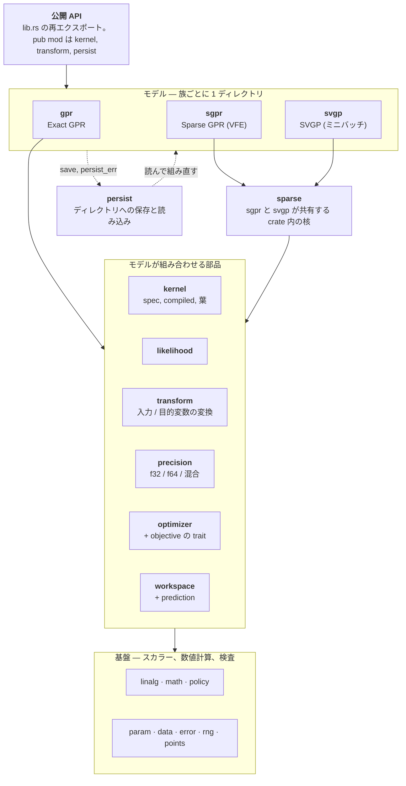

[English](README.md) | 日本語

# gprx

Rust の Exact ガウス過程回帰。`Gpr` は未学習のトレーナー。`Gpr::fit` はそれを消費し、負の対数周辺尤度を argmin の L-BFGS で最小化して `FittedGpr` を返す。このクレートは crates.io に**公開しない**（`Cargo.toml` の `publish = false`）。

## 状態

手元の **0.1.0** 品質: `Gpr` / `FittedGpr`、カーネル、`fit` / `predict` / `predict_into` / leave-one-out、英語の rustdoc、`examples/`。依存は git か path。crates.io ではない。

設計: [`docs/design.ja.md`](docs/design.ja.md)。アーキテクチャ: [`docs/architecture.ja.md`](docs/architecture.ja.md)。保存フォーマット: [`docs/persist-format.ja.md`](docs/persist-format.ja.md)。タスク: [`docs/roadmap.md`](docs/roadmap.md)。エージェント向け: [`AGENTS.md`](AGENTS.md)。他ライブラリとの壁時計とピーク RSS: [`compare/perf/`](compare/perf/)（P2B-16 Exact は `just perf`。P4-12 Sparse は `just perf-sparse`。P4-14 Sparse オンラインは `just perf-sparse-online`。criterion ではない）。

## 例

`X` は列優先（`n` 点 × `d` 特徴: 特徴 0 の全行、次に特徴 1、…）。

```rust
use gprx::kernel::{KernelSpec, RbfKernel};
use gprx::{GaussianLikelihood, Gpr};

fn main() -> Result<(), gprx::GprError> {
    let kernel = KernelSpec::from(RbfKernel::new(1.0)?);
    let likelihood = GaussianLikelihood::new(0.1)?;
    let gpr = Gpr::new(kernel, likelihood);
    let fitted = gpr.fit(&[0.0, 1.0], 2, 1, &[0.0, 1.0])?;
    let pred = fitted.predict(&[0.5], 1, 1)?;
    println!("mean = {}, variance = {}", pred.mean[0], pred.variance[0]);
    Ok(())
}
```

同じプログラム: `cargo run --example fit_predict`。`fit` の `?` はトレーナーを落とす（`From<(Gpr, GprError)> for GprError`）。エラーだけ欲しいときは `.map_err(|(_, e)| e)`。同じトレーナーでやり直すときは `Err((gpr, err))` を照合する。

既定の `predict` の分散は観測（`latent + σn²`）。潜在関数は `predict_with` と `VarianceKind::Latent`。学習後の `loo_predict` は、全学習点での GPML leave-one-out。`predict` はクエリバッファを確保する。`predict_into` はウォームアップのあとそれを再利用する。`FittedGpr::refit` は保存した学習データで因子を作り直すか、最適化し直す。

変換の既定は恒等。平均関数が零のときは `fit` の前に `with_target_transform(StandardizeTarget::new())`。特徴は `MinMaxInput`（既定 `[0, 1]`）。観測ノイズは `GaussianLikelihood`。`WhiteKernel` はオプトインの合成。両方を大きい値で足すとノイズを二重に数える。

`Gpr<Fixed>::factor`（`with_optimizer(Fixed)` のあと）は、トレーナーに既にあるカーネルと尤度の `θ` で因子を作る。L-BFGS のノブは `Lbfgs`（`with_max_iterations`、`with_tolerance`、`with_history_size`、`with_restarts`）。Nelder–Mead は `with_max_iterations`、`with_tolerance`、`with_restarts` を持つ（`NelderMead`）。Hessian を使うソルバは `TrustRegion`（`with_max_iterations`、`with_tolerance`、`with_restarts`、`with_radii`）。自作の Fast Simulated Annealing は `FastSimulatedAnnealing`（`with_max_iterations`、`with_restarts`、`with_initial_temperature`、`with_cooling_rate`、`with_seed`、`with_boundary`）。

## アーキテクチャと保存フォーマット

3 つのモデル族（`Gpr`、`Sgpr`、`Svgp`）は、同じ部品から作られ、互いを import しない。下の図がクレート全体の地図で、各箱は `src/` のモジュール。



- [`docs/architecture.ja.md`](docs/architecture.ja.md): 全モジュールの責務、import の向き、族ごとの公開型、何を変えるときどこを見るか。
- [`docs/persist-format.ja.md`](docs/persist-format.ja.md): `save` が書くもの。`config.json` のキー、`model.safetensors` のテンソル（名前、形、dtype、列優先の並び）、カーネルと変換の JSON の形、`Custom` の復元、版、エラー。

## 他ライブラリとの比較

GPR の論文で使われる回帰ベンチマークで、gprx を scikit-learn、GPyTorch、GPy、libgp、friedrich と比べる（行 B1-1、[#298](https://github.com/YUKIKEDA/gprx/issues/298)）。順序は、正しさ、精度、規模。これは報告であってゲートではない。他のライブラリが勝つ cell もそのまま表に残す。

| 段 | データ | 見るもの | gprx のモデル |
| --- | --- | --- | --- |
| T0 | Snelson 1 次元（200 点）、Mauna Loa CO₂ | 当てはまりを目で見る | `Gpr` |
| T1 | UCI。Hernández-Lobato & Adams の split（各 20。Boston は除く）: yacht、energy、concrete、wine (red)、power plant、kin8nm、naval | 精度と、較正された不確実性 | `Gpr` |
| T2 | Kin40k、Protein（5 split） | 中規模のスケール | `K` がメモリに入る範囲は `Gpr`、それ以外と比較用に `Sgpr` / `Svgp` |
| T3 | 3DRoad、Song、Buzz、HouseElectric（`treforevans/uci_datasets`。90 / 10 の 10 split） | 大規模のスケール | `Sgpr` / `Svgp` |

どのモデルも、ARD RBF カーネルと Gaussian 尤度で、入力と目的変数は学習データの統計で標準化し、初期値も同じ（ℓ = 1、信号分散 1、ノイズ分散 0.1）。指標は RMSE、NLPD、95% 区間のカバレッジ。`y` の元の単位で、split にわたる平均 ± 標準誤差。比較の前に `just perf-real-check` が、学習せずに固定した 1 つの θ で全ライブラリを評価する。NLML、RMSE、NLPD が 1e-6 で一致するので、学習後の結果の差は、目的関数ではなく最適化器の差になる。疎なモデルの同じ確認（`just perf-real-check yacht 0 sgpr`）では、周辺尤度の下界は gprx、GPyTorch、GPy で一致する。GPyTorch は自前の低ランクのテスト共分散で予測するので、同じ θ と Z でも RMSE と NLPD が他の 2 つと 1% 未満ずれる。

### 最適化器が効く

実行時間はライブラリと同じくらい最適化器に左右される。そのため、どの cell も、どの最適化器が走ったかと、尤度と勾配を一緒に評価した回数（joint 評価）を書く。プロトコルは 2 つ。

- **native**: 各ライブラリの標準の最適化器を、出荷時の設定のまま使う。
- **matched**: 各ライブラリ自身の目的関数と勾配のまわりに、同じ scipy L-BFGS-B の設定（100 反復、勾配の許容値 √ε、履歴 10）を置く。gprx の argmin L-BFGS は、この設定が既に既定値。同じ**アルゴリズム**であって、同じ**実装**ではない（gprx は argmin の L-BFGS と More–Thuente の線探索）。libgp は Rprop しか持たないので、matched は N/A。SVGP は、n が数十万でも通る Adam の標準設定が無いので、全ライブラリで 1 つの設定（Adam、学習率 0.01、バッチ 1024、3 エポック）を使う。

評価回数が違う cell の壁時計の差は、速度の差ではない。ピーク RSS はプロセスツリーのピーク。常駐メモリの時系列は下の図にある。

### インターフェース

同じ回帰を各ライブラリで書く。ARD RBF、ハイパーパラメータの学習、平均と観測分散の予測、NLPD の計算。実行できるファイル: [`compare/perf/real/snippets/`](compare/perf/real/snippets/)。

<!-- snippets:begin -->
<details><summary>gprx</summary>

```rust
let kernel = KernelSpec::from(ConstantKernel::new(1.0)?)
    * KernelSpec::from(RbfArdKernel::new(&vec![1.0; d])?);
let fitted = Gpr::new(kernel, GaussianLikelihood::new(0.1)?)
    .fit(&x, n, d, &y) // L-BFGS on the negative log marginal likelihood
    .map_err(|(_, e)| e)?;
let pred = fitted.predict(&xs, m, d)?; // variance includes the noise
let nlpd = (0..m)
    .map(|i| {
        let (v, e) = (pred.variance[i], ys[i] - pred.mean[i]);
        0.5 * (2.0 * std::f64::consts::PI * v).ln() + 0.5 * e * e / v
    })
    .sum::<f64>()
    / m as f64;
```

</details>

<details><summary>scikit-learn</summary>

```python
kernel = ConstantKernel(1.0) * RBF([1.0] * d) + WhiteKernel(0.1)
gp = GaussianProcessRegressor(kernel).fit(x, y)
mean, std = gp.predict(xs, return_std=True)  # std includes the noise
nlpd = np.mean(0.5 * np.log(2 * np.pi * std**2) + 0.5 * (ys - mean) ** 2 / std**2)
```

</details>

<details><summary>GPyTorch</summary>

```python
class ExactGP(gpytorch.models.ExactGP):
    def __init__(self, x, y, likelihood):
        super().__init__(x, y, likelihood)
        self.mean_module = gpytorch.means.ZeroMean()
        self.covar_module = gpytorch.kernels.ScaleKernel(gpytorch.kernels.RBFKernel(ard_num_dims=d))

    def forward(self, x):
        return gpytorch.distributions.MultivariateNormal(self.mean_module(x), self.covar_module(x))


likelihood = gpytorch.likelihoods.GaussianLikelihood().double()
model = ExactGP(x, y, likelihood).double()
model.train(); likelihood.train()
mll = gpytorch.mlls.ExactMarginalLogLikelihood(likelihood, model)
optimizer = torch.optim.Adam(model.parameters(), lr=0.1)  # there is no default optimizer
for _ in range(50):
    optimizer.zero_grad()
    loss = -mll(model(x), y)
    loss.backward()
    optimizer.step()
model.eval(); likelihood.eval()
with torch.no_grad():
    pred = likelihood(model(xs))  # the observation distribution
    mean, var = pred.mean, pred.variance
nlpd = torch.mean(0.5 * torch.log(2 * torch.pi * var) + 0.5 * (ys - mean) ** 2 / var)
```

</details>

<details><summary>GPy</summary>

```python
kernel = GPy.kern.RBF(d, variance=1.0, lengthscale=[1.0] * d, ARD=True)
model = GPy.models.GPRegression(x, y[:, None], kernel)
model.Gaussian_noise.variance = 0.1
model.optimize()
mean, var = model.predict(xs)  # includes the noise
nlpd = np.mean(0.5 * np.log(2 * np.pi * var) + 0.5 * (ys[:, None] - mean) ** 2 / var)
```

</details>

<details><summary>libgp</summary>

```cpp
libgp::GaussianProcess gp(d, "CovSum ( CovSEard, CovNoise)");
Eigen::VectorXd loghyper(d + 2);  // log ell (d of them), log sf, log sn
loghyper << 0.0, 0.0, 0.0, 0.0, std::log(std::sqrt(0.1));
gp.covf().set_loghyper(loghyper);
for (int i = 0; i < n; ++i) {  // add_patterns(x, y) would read strided rows
    std::vector<double> row(d);
    for (int j = 0; j < d; ++j) row[j] = x(i, j);
    gp.add_pattern(row.data(), y(i));
}
libgp::RProp rprop;  // libgp's optimizer: resilient backpropagation
rprop.init();
rprop.maximize(&gp, 100, false);
const Eigen::MatrixXd pred = gp.predict(xs, true);  // mean, latent variance
const double noise = std::exp(2.0 * gp.covf().get_loghyper()(d + 1));
double nlpd = 0.0;
for (int i = 0; i < m; ++i) {
    const double v = pred(i, 1) + noise, e = ys(i) - pred(i, 0);
    nlpd += 0.5 * std::log(2.0 * M_PI * v) + 0.5 * e * e / v;
}
nlpd /= m;
```

</details>
<!-- snippets:end -->

ハーネスが回避した libgp の 2 点: `predict` の分散はノイズを含まない。一括の `add_patterns(x, y)` は、列優先の行列の行をストライドつきで読むので、d = 1 のときだけ正しい。

### 機能

`✓` は、その版のソースか文書に見つかったもの。`—` は、そこに見つからなかったもの（拡張については何も言わない）。版: scikit-learn 1.6.1、GPyTorch 1.15.2、GPy 1.14.2、libgp `f4a2fb7`、friedrich 0.6.0。

| | gprx | scikit-learn | GPyTorch | GPy | libgp | friedrich |
| --- | --- | --- | --- | --- | --- | --- |
| 言語 | Rust | Python | Python (PyTorch) | Python | C++ (Eigen) | Rust |
| ARD RBF カーネル | ✓ | ✓ | ✓ | ✓ | ✓ | — |
| カーネルの和・積 | ✓ | ✓ | ✓ | ✓ | ✓ | ✓ |
| 誘導点つきの疎 GP | ✓ `Sgpr` | — | ✓ `InducingPointKernel` | ✓ `SparseGPRegression` | — | — |
| ミニバッチの SVGP | ✓ `Svgp`（Adam） | — | ✓ | クラスのみ。ミニバッチのループは無い | — | — |
| 全部を学習し直さずに学習点を足す | ✓ `OnlineGpr` | — | ✓ `get_fantasy_model` | — | ✓ `add_pattern` | ✓ `add_samples` |
| 学習点を消す | ✓ `OnlineGpr` | — | — | — | — | — |
| 事後サンプル | ✓ `sample` | ✓ `sample_y` | ✓ | ✓ `posterior_samples` | — | ✓ `sample_at` |
| f32 / 混合精度 | ✓ | — | ✓ | — | — | — |
| 学習済みモデルの保存と読み込み | ✓ | ✓ pickle / joblib | ✓ `state_dict` | ✓ `save_model` | ✓ `write` | ✓ serde |
| 最適化器の差し替え | ✓ `Optimizer` | ✓ callable | ✓ 任意の torch 最適化器 | ✓ `optimizer=` | ✓ `RProp` / `CG` | — |

### 結果

matched を 1 回だけ測った。

Exact は Snelson、Mauna Loa、yacht、energy。SGPR は wine と power plant と naval を 20 split、kin40k を 5 split、3droad と song を 1 split。SVGP は kin40k、3droad、song、houseelectric を 1 split ずつ。

測り直していない。concrete は energy と、kin8nm と protein は kin40k と、buzz は song と、入力の次元も学習点数も近い別データだからである。

HouseElectric の SGPR は入らない。`K(X, Z)` が 1 枚 7.0 GiB で、勾配が同じ大きさの行列を何枚も持つと 47.8 GiB の物理メモリを超えてページファイルに落ち、デスクトップが止まった。表では 3 ライブラリとも N/A。

3droad と song の SGPR は、結果ファイルを書く前にプロセスが止まった。ログに残っていた学習時間と joint 評価回数と RMSE と NLPD だけを載せた。カバレッジも NLML もピーク RSS も N/A。

song の gprx は 26 回で止まった。NLPD が他の 2 つと一致しない。power plant の GPy は一部の split で予測が発散した。その RMSE と NLPD の平均は当てはまりの良さではない。

反復回数は無い。gprx の runner が返さない。速度は joint 評価回数で見る。`ms / eval` は学習時間をその回数で割った中央値で、回数が揃っているときだけ壁時計の差を速度の差とみなす。

<!-- bench:begin -->
Measured on Intel64 Family 6 Model 191 Stepping 2, GenuineIntel (16 logical CPUs, 47.8 GiB, Windows-11-10.0.26200-SP0). scikit-learn 1.6.1, gpytorch 1.15.2, GPy 1.14.2, torch 2.14.0, scipy 1.18.1, argmin 0.11.0; libgp f4a2fb7d.

| library | native optimizer | matched optimizer | search space | bounds |
| --- | --- | --- | --- | --- |
| gprx | argmin 0.11 LBFGS + MoreThuente line search; history 10, max 100 iterations, gradient-norm tolerance sqrt(eps) | same call: the gprx default already equals the shared setting | logit of log θ inside each interval, so the search is unconstrained | (1e-5, 1e5) on ℓ, signal variance and noise variance |
| sklearn | scipy minimize L-BFGS-B via optimizer='fmin_l_bfgs_b' with scipy defaults (maxiter 15000, ftol 2.2e-9, gtol 1e-5, maxcor 10, maxls 20) | scipy L-BFGS-B, maxiter 100, gtol sqrt(eps), ftol 0, maxcor 10; the library's own objective and gradient | log θ | (1e-5, 1e5) on ℓ, constant value and noise level (kernel defaults) |
| gpytorch | torch.optim.Adam, lr 0.1, 50 steps (the exact-GP tutorial setting; GPyTorch has no default optimizer) | scipy L-BFGS-B, maxiter 100, gtol sqrt(eps), ftol 0, maxcor 10; the library's own objective and gradient; gradient by autograd on -mll × n | raw parameters behind softplus | noise ≥ 1e-5 (set here; GPyTorch's default is 1e-4); ℓ and outputscale positive only |
| gpy | model.optimize(): paramz opt_lbfgsb = scipy fmin_l_bfgs_b with maxfun = maxiter = 1000, factr 1e7, pgtol 1e-5 | scipy L-BFGS-B, maxiter 100, gtol sqrt(eps), ftol 0, maxcor 10; the library's own objective and gradient | softplus (Logexp) of each parameter | positive only, no upper bound |
| libgp | RProp (resilient backpropagation), 100 iterations, eps_stop 0, Delta0 0.1, Deltamin 1e-6, Deltamax 50, eta- 0.5, eta+ 1.2; keeps the best likelihood seen | N/A: libgp offers RProp and CG only, and RProp has no gradient tolerance | log ℓ, log sf, log sn (amplitude and std, not variances) | none |
| friedrich | N/A: no ARD kernel | N/A: no ARD kernel | - | - |

#### exact · matched

| dataset | library | ok | RMSE | NLPD | 95% cover | fit [s] | joint evals | iterations | ms / eval | NLML | peak RSS [MiB] |
| --- | --- | --- | --- | --- | --- | --- | --- | --- | --- | --- | --- |
| energy | gprx | 20/20 | 0.4796 ± 0.014 | 0.6993 ± 0.033 | 0.923 ± 0.0067 | 1.283 ± 0.013 | 116 ± 0.58 | N/A | 10.94 | -1013 ± 2.5 | 47.3 |
| energy | sklearn | 20/20 | 0.4773 ± 0.013 | 0.692 ± 0.029 | 0.924 ± 0.0077 | 10.26 ± 0.79 | 94.3 ± 7.1 | 53 ± 5.6 | 108.1 | -973.3 ± 6.1 | 225.1 |
| energy | gpytorch | 20/20 | 0.4773 ± 0.012 | 0.6894 ± 0.031 | 0.921 ± 0.0082 | 1.614 ± 0.036 | 111 ± 1.8 | 96.8 ± 1.6 | 14.2 | -968.5 ± 7.4 | 316.2 |
| energy | gpy | 20/20 | 0.4756 ± 0.013 | 0.6859 ± 0.031 | 0.923 ± 0.0075 | 10.24 ± 0.23 | 119 ± 2.7 | 99.2 ± 0.8 | 85.45 | -972 ± 7.6 | 245.9 |
| maunaloa | gprx | 1/1 | 8.749 | 4.838 | 0.358 | 1.484 | 130 | N/A | 11.41 | -1479 | 70.6 |
| maunaloa | sklearn | 1/1 | 8.495 | 4.856 | 0.369 | 16.54 | 120 | 100 | 137.8 | -1479 | 176.5 |
| maunaloa | gpytorch | 1/1 | 8.649 | 4.98 | 0.339 | 2.733 | 118 | 100 | 23.16 | -1479 | 522.9 |
| maunaloa | gpy | 1/1 | 8.717 | 5.072 | 0.332 | 17.98 | 116 | 100 | 155 | -1479 | 408.0 |
| snelson | gprx | 1/1 | N/A | N/A | N/A | 0.02802 | 23 | N/A | 1.218 | 89.81 | 11.5 |
| snelson | sklearn | 1/1 | N/A | N/A | N/A | 0.3259 | 126 | 18 | 2.587 | 89.81 | 109.8 |
| snelson | gpytorch | 1/1 | N/A | N/A | N/A | 0.1444 | 55 | 20 | 2.626 | 89.81 | 282.3 |
| snelson | gpy | 1/1 | N/A | N/A | N/A | 0.3382 | 50 | 19 | 6.765 | 89.81 | 142.4 |
| yacht | gprx | 20/20 | 0.7522 ± 0.081 | 1.01 ± 0.14 | 0.927 ± 0.009 | 0.8274 ± 0.11 | 327 ± 51 | N/A | 2.655 | -338.2 ± 20 | 13.9 |
| yacht | sklearn | 20/20 | 0.936 ± 0.074 | 1.411 ± 0.059 | 0.945 ± 0.0094 | 1.093 ± 0.079 | 89 ± 5.3 | 44.5 ± 1.6 | 11.58 | -270.2 ± 1.7 | 124.4 |
| yacht | gpytorch | 20/20 | 0.4157 ± 0.056 | 0.2 ± 0.099 | 0.916 ± 0.013 | 0.4499 ± 0.03 | 108 ± 6.5 | 68 ± 5.9 | 3.835 | -451.2 ± 27 | 287.3 |
| yacht | gpy | 20/20 | 0.3931 ± 0.055 | 0.1971 ± 0.1 | 0.91 ± 0.014 | 2.575 ± 0.14 | 120 ± 6 | 78.1 ± 4.7 | 21.12 | -460.6 ± 27 | 151.4 |

#### sgpr · matched

| dataset | library | ok | RMSE | NLPD | 95% cover | fit [s] | joint evals | iterations | ms / eval | NLML | peak RSS [MiB] |
| --- | --- | --- | --- | --- | --- | --- | --- | --- | --- | --- | --- |
| 3droad | gprx | 1/1 | 8.823 | 3.597 | N/A | 5230 | 788 | N/A | 6637 | N/A | N/A |
| 3droad | gpytorch | 1/1 | 8.823 | 3.597 | N/A | 1694 | 129 | N/A | 1.314e+04 | N/A | N/A |
| 3droad | gpy | 1/1 | 8.823 | 3.597 | N/A | 3970 | 135 | N/A | 2.941e+04 | N/A | N/A |
| houseelectric | gprx | 0/1 | N/A | N/A | N/A | N/A | N/A | N/A | N/A | N/A | N/A |
| houseelectric | gpytorch | 0/1 | N/A | N/A | N/A | N/A | N/A | N/A | N/A | N/A | N/A |
| houseelectric | gpy | 0/1 | N/A | N/A | N/A | N/A | N/A | N/A | N/A | N/A | N/A |
| kin40k | gprx | 5/5 | 0.2863 ± 0.0029 | 0.1634 ± 0.0083 | 0.964 ± 0.0028 | 273.4 ± 96 | 394 ± 1.3e+02 | N/A | 681.8 | 1.039e+04 ± 59 | 890.7 |
| kin40k | gpytorch | 5/5 | 0.2865 ± 0.0028 | 0.1634 ± 0.0079 | 0.964 ± 0.0028 | 73.99 ± 4.9 | 86.4 ± 5.6 | 43 ± 2.3 | 854.9 | 1.039e+04 ± 59 | 1746.8 |
| kin40k | gpy | 5/5 | 0.2863 ± 0.0029 | 0.1634 ± 0.0083 | 0.964 ± 0.0028 | 231.8 ± 42 | 88 ± 16 | 42.4 ± 2.8 | 2643 | 1.039e+04 ± 59 | 1820.1 |
| naval | gprx | 20/20 | 1.582e-05 ± 1.1e-07 | -8.994 ± 0.00076 | 1 | 56.39 ± 8.8 | 252 ± 38 | N/A | 220.7 | -5.084e+04 ± 1.4 | 288.1 |
| naval | gpytorch | 20/20 | 1.707e-05 ± 4.4e-07 | 3784 ± 5.9e+02 | 0.419 ± 0.052 | 22.54 ± 1.3 | 82.8 ± 5 | 37.9 ± 3.8 | 272.7 | -5.075e+04 ± 20 | 745.1 |
| naval | gpy | 20/20 | 1.571e-05 ± 6e-07 | -9.681 ± 0.0095 | 0.94 ± 0.0036 | 72.17 ± 5.3 | 71.5 ± 5.3 | 7.65 ± 0.99 | 1021 | -5.624e+04 ± 63 | 675.9 |
| power_plant | gprx | 20/20 | 3.775 ± 0.039 | 2.752 ± 0.01 | 0.957 ± 0.0016 | 55.88 ± 8.6 | 309 ± 46 | N/A | 178 | -377 ± 11 | 232.3 |
| power_plant | gpytorch | 20/20 | 3.777 ± 0.04 | 2.753 ± 0.011 | 0.957 ± 0.0016 | 18.94 ± 1.4 | 82.8 ± 5 | 33.5 ± 0.87 | 222.3 | -377 ± 11 | 652.0 |
| power_plant | gpy | 20/20 | 3.097e+13 ± 3.1e+13 | 3.312e+40 ± 3.3e+40 | 0.958 ± 0.0026 | 54.58 ± 2.5 | 79.8 ± 3.5 | 33.6 ± 1.3 | 666.6 | -7.044e+45 ± 7e+45 | 570.0 |
| song | gprx | 1/1 | 0.5741 | 6.122 | N/A | 31.96 | 26 | N/A | 1229 | N/A | N/A |
| song | gpytorch | 1/1 | 0.5741 | 0.8639 | N/A | 579.9 | 47 | N/A | 1.234e+04 | N/A | N/A |
| song | gpy | 1/1 | 0.5741 | 0.8639 | N/A | 6355 | 47 | N/A | 1.352e+05 | N/A | N/A |
| wine_red | gprx | 20/20 | 0.6279 ± 0.0082 | 0.951 ± 0.014 | 0.939 ± 0.0048 | 10.78 ± 2.9 | 226 ± 56 | N/A | 45.09 | 1687 ± 2 | 63.5 |
| wine_red | gpytorch | 20/20 | 0.6276 ± 0.0082 | 0.9506 ± 0.014 | 0.939 ± 0.0047 | 6.03 ± 0.13 | 114 ± 0.82 | 100 | 51.29 | 1688 ± 2 | 376.5 |
| wine_red | gpy | 20/20 | 0.6275 ± 0.0082 | 0.9504 ± 0.014 | 0.94 ± 0.0048 | 22.8 ± 1 | 112 ± 3.1 | 97.3 ± 2.7 | 196.3 | 1688 ± 2 | 299.8 |

- N/A `gprx`: K(X, Z) is 7.0 GiB; 6 copies (42.2 GiB) do not fit in 47.8 GiB
- N/A `gpy`: K(X, Z) is 7.0 GiB; 6 copies (42.2 GiB) do not fit in 47.8 GiB
- N/A `gpytorch`: K(X, Z) is 7.0 GiB; 6 copies (42.2 GiB) do not fit in 47.8 GiB

#### svgp · matched

| dataset | library | ok | RMSE | NLPD | 95% cover | fit [s] | joint evals | iterations | ms / eval | NLML | peak RSS [MiB] |
| --- | --- | --- | --- | --- | --- | --- | --- | --- | --- | --- | --- |
| 3droad | gprx | 1/1 | 11.18 | 3.834 | 0.948 | 34.49 | 1.15e+03 | N/A | 30.02 | N/A | 6236.7 |
| 3droad | gpytorch | 1/1 | 11.16 | 3.832 | 0.944 | 42.93 | 1.15e+03 | 1.15e+03 | 37.36 | N/A | 1284.3 |
| houseelectric | gprx | 1/1 | 0.05622 | -1.457 | 0.946 | 176.5 | 5.41e+03 | N/A | 32.65 | N/A | 29590.8 |
| houseelectric | gpytorch | 1/1 | 0.05872 | -1.419 | 0.945 | 203 | 5.41e+03 | 5.41e+03 | 37.55 | N/A | 5508.9 |
| kin40k | gprx | 1/1 | 0.6087 | 0.9093 | 0.921 | 3.181 | 108 | N/A | 29.45 | N/A | 638.8 |
| kin40k | gpytorch | 1/1 | 0.5975 | 0.8712 | 0.939 | 4.912 | 108 | 108 | 45.48 | N/A | 457.7 |
| song | gprx | 1/1 | 0.4669 | 0.6575 | 0.947 | 57.79 | 1.36e+03 | N/A | 42.53 | N/A | 8650.4 |
| song | gpytorch | 1/1 | 0.4709 | 0.666 | 0.954 | 55.96 | 1.36e+03 | 1.36e+03 | 41.17 | N/A | 3769.8 |


<!-- bench:end -->

### 再現

```text
just perf-real-full                                            # 上の matched の測定と、この節の生成
```

`--timeline` をつけると、プロセスツリーの常駐メモリを 10 ms ごとに記録する。生の出力は `compare/perf/out/real/` に残る（commit しない）。`docs/bench/summary.json` は、cell ごとの統計、測定機、ライブラリの版、最適化器の設定を持つ。詳細: [`compare/perf/README.md`](compare/perf/README.md)。

## ライセンス

次のいずれか。

- Apache License, Version 2.0 ([LICENSE-APACHE](LICENSE-APACHE))
- MIT license ([LICENSE-MIT](LICENSE-MIT))
