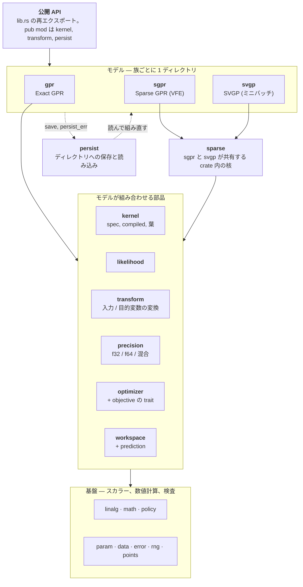

[English](README.md) | 日本語

# gprx

Rust のガウス過程回帰。Exact、スパース（VFE）、SVGP を含む。`Gpr` は未学習のトレーナー。`Gpr::fit` はそれを消費し、負の対数周辺尤度を既定の `Lbfgs` で最小化して `FittedGpr` を返す。同じ部品で `Sgpr` と `Svgp` を組み、オンライン更新とディレクトリへの保存も行う。

`X` は列優先である。点は `n` 個、特徴は `d` 個で、特徴 0 の全行のあとに特徴 1 が続く。`fit` はトレーナーを消費する。観測ノイズは `GaussianLikelihood` に置く。**0.1.0** は既定フィーチャの公開 API である。MSRV は 1.85。0.x はマイナー番号で、公開 API を壊してよい。`internals`（`bench-internals` と `insert-stages`）は、その契約の外である。

```toml
[dependencies]
gprx = "0.1"
```

## 例

```rust
use gprx::kernel::{KernelSpec, RbfKernel};
use gprx::{GaussianLikelihood, Gpr};

fn main() -> Result<(), gprx::GprError> {
    let kernel = KernelSpec::from(RbfKernel::new(1.0)?);
    let likelihood = GaussianLikelihood::new(0.1)?;
    let gpr = Gpr::new(kernel, likelihood);
    let fitted = gpr.fit(&[0.0, 1.0], 2, 1, &[0.0, 1.0])?;
    let pred = fitted.predict(&[0.5], 1, 1)?;
    println!("mean = {}, variance = {}", pred.mean[0], pred.variance[0]);
    Ok(())
}
```

同じプログラム: `cargo run --example fit_predict`。

## 使用方法

`fit` と `factor` の戻り値は `Result<Fitted, (Trainer, GprError)>`。`?` を使うとトレーナーは捨てられ、`GprError` だけが残る（`From<(Trainer, GprError)> for GprError`）。トレーナーも残すなら、`.map_err(|(_, e)| e)` でエラーだけ取り出す。同じトレーナーでやり直すなら、`Err((trainer, err))` を照合する。

`X` と誘導点 `Z` は列優先の `f64` である。特徴 0 の全行、次に特徴 1。`n_rows` が点数、`n_cols` が特徴数。`y` の長さは `n_rows`。空、長さが `n_rows * n_cols` でない、`NaN` か `Inf` は `GprError`。

`n_jobs` はない。距離の計算は、プロセス全体の Rayon プールを使う。スレッド数は、プロセス開始前の `RAYON_NUM_THREADS` か、最初の `fit` か `predict` の前に呼ぶ `rayon::ThreadPoolBuilder::new().num_threads(n).build_global()` で決まる。プールの初期化は一度だけ。ワーカーが 1 つなら、計算は逐次になる。

学習のコレスキーと、`W` の複数右辺は、線形代数側の並列度を `min(プール, n / 64)` で頭打ちにする。予測と共分散の三角解は、さらに `n · m / 16384` と `m / 12` でも頭打ちにする。カーネルを埋める処理は、プール全体を使う。

`gprx::internals`（`bench-internals`、`insert-stages`）はセマンティックバージョニングの対象外である。直接依存してはならない。

### 全学習点: `Gpr`、`FittedGpr`、`OnlineGpr`

`Gpr::new(kernel, likelihood)` は `Gpr<Lbfgs, DoublePrecision>`。`fit(x, n_rows, n_cols, y)` はそれを消費し、負の対数周辺尤度を最適化して `FittedGpr` を返す。

```rust
use gprx::kernel::{KernelSpec, RbfKernel};
use gprx::{Fixed, GaussianLikelihood, Gpr, PredictOptions, Prediction, VarianceKind};

fn main() -> Result<(), gprx::GprError> {
    let fitted = Gpr::new(
        KernelSpec::from(RbfKernel::new(1.0)?),
        GaussianLikelihood::new(0.1)?,
    )
    .fit(&[0.0, 1.0], 2, 1, &[0.0, 1.0])?;

    let pred = fitted.predict(&[0.5], 1, 1)?;
    let latent = fitted.predict_with(
        &[0.5],
        1,
        1,
        PredictOptions {
            variance_kind: VarianceKind::Latent,
        },
    )?;
    let _ = (pred.mean[0], pred.variance[0], latent.variance_kind);

    let mut fitted = fitted;
    let mut reused = Prediction::default();
    fitted.predict_into(&[0.5], 1, 1, &mut reused)?;

    let frozen = fitted
        .into_trainer()
        .with_optimizer(Fixed)
        .factor(&[0.0, 1.0], 2, 1, &[0.0, 1.0])?;
    let _ = frozen.n();
    Ok(())
}
```

`predict` が返す分散は、元の `y` の尺度での `VarianceKind::Observation`（`latent + σn²`）。`VarianceKind::Latent` は `σn²` を含まない。`predict_with` には `PredictOptions` を渡し、そのフィールドは `variance_kind`。`predict` はバッファを確保する。`predict_into` と `predict_with_into` は、渡した `Prediction` へ書く。フィールドは `mean`、`variance`、`variance_kind`。クエリ長が同じなら、`mean` と `variance` を再利用する。

`predict_covariance` は `PredictiveCovariance` を返す。フィールドは `mean`、`covariance`、`variance_kind`。`covariance` は列優先の `m × m` で、添字は `col * m + row`。対角は、同じクエリとオプションで呼んだ `predict` と一致する。`predict_covariance_with` は `PredictOptions` を取る。

`sample(xs, n_rows, n_cols, n_draws, seed)` は、その共分散から `μ + Lz` を引く。結果は列優先の `m × n_draws`。`seed` は gprx の Xoshiro256++ の開始状態で、どの環境でも同じ列になる。`sample_with` は `PredictOptions` を取る。

`loo_predict` は、全学習点での GPML leave-one-out の平均と分散を返す。引数に新しい `x` はない。`loo_predict_with` は `PredictOptions` を取る。

```rust
use gprx::kernel::{KernelSpec, RbfKernel};
use gprx::{GaussianLikelihood, Gpr, PredictOptions, VarianceKind};

fn main() -> Result<(), gprx::GprError> {
    let mut fitted = Gpr::new(
        KernelSpec::from(RbfKernel::new(1.0)?),
        GaussianLikelihood::new(0.1)?,
    )
    .fit(&[0.0, 1.0], 2, 1, &[0.0, 1.0])?;
    let cov = fitted.predict_covariance(&[0.25, 0.75], 2, 1)?;
    let cov_latent = fitted.predict_covariance_with(
        &[0.25, 0.75],
        2,
        1,
        PredictOptions {
            variance_kind: VarianceKind::Latent,
        },
    )?;
    let draws = fitted.sample(&[0.25, 0.75], 2, 1, 2, 1)?;
    let _draws_with = fitted.sample_with(&[0.25], 1, 1, PredictOptions::default(), 1, 2)?;
    let loo = fitted.loo_predict()?;
    let _loo_with = fitted.loo_predict_with(PredictOptions::default())?;
    let nll = fitted.neg_log_marginal_likelihood()?;
    let mut theta = vec![0.0; fitted.num_params()];
    fitted.get_params(&mut theta)?;
    let value = fitted.value_and_gradient_into(&theta, &mut theta.clone())?;
    let mut hess = vec![0.0; fitted.num_params() * fitted.num_params()];
    fitted.hessian_into(&theta, &mut hess)?;
    fitted.set_params(&theta)?;
    let _ = (
        cov.covariance[0],
        cov_latent.mean[0],
        draws[0],
        loo.mean[0],
        nll,
        value,
    );
    Ok(())
}
```

`neg_log_marginal_likelihood` は、今の `θ` での目的関数。`num_params`、`get_params`、`set_params` が扱うのは log-`θ` のベクトルで、並びはカーネルのパラメータ、そのあとに尤度のパラメータ。`value_and_gradient_into` と `hessian_into` は、その目的関数を評価する。`set_params` は `θ` と因子を更新する。

学習済みモデルの `n`、`d`、`kernel`、`likelihood`、`x`、`y`、`alpha` からは学習結果を取得できる。`distance_cache_policy`、`cholesky_buffer`、`math`、`jitter_policy` は設定された方針を返す。`fit` の前の `Gpr` では、`kernel`、`likelihood`、`num_params`、`get_params` と、これら 4 つの方針を参照できる。`set_params` は `fit` のあとから使える。`FittedGpr::alpha` は、直前の因子から得たスライス。`OnlineGpr::alpha` は `Result` を返す。挿入や削除の直後は `α` が古く、その後の最初の呼び出しで解く。

`into_trainer` は、今の `θ` を持った未学習の `Gpr` を返す。学習済みモデルの `with_optimizer` が変えるのは、その後の `refit` だけである。`OnlineGpr::with_optimizer` も同じ。`FittedGpr<O: Optimizer>` の `refit` は、保存したデータ上で今の `θ` から探索し直す。`FittedGpr<Fixed>` の `refit` は `L` と `α` を作り直し、探索しない。変換は再学習しない。

`into_online` は `OnlineGpr` を返す。`insert(x_new, y_new)` は 1 点を足して `PointId` を返す。`delete(id)` はその点を消す。最後の 1 点は消せない（`GprError::InsufficientData`、`min` は 2）。`PointId` に公開コンストラクタはない。`into_online` は `0 .. n-1` を割り当て、その後の挿入は増える。id は再利用しない。今の一覧は `point_ids`。モデルに無い id は `InvalidPointId`。オンラインモデルの `into_trainer` は `Gpr` を返す。`OnlineGpr` の `refit` も同じ分かれ方で、`Optimizer` は探索し、`Fixed` は因子を作り直す。

```rust
use gprx::kernel::{KernelSpec, RbfKernel};
use gprx::{GaussianLikelihood, Gpr};

fn main() -> Result<(), gprx::GprError> {
    let fitted = Gpr::new(
        KernelSpec::from(RbfKernel::new(1.0)?),
        GaussianLikelihood::new(0.1)?,
    )
    .fit(&[0.0, 1.0], 2, 1, &[0.0, 1.0])?;
    let mut online = fitted.into_online()?;
    let id = online.insert(&[0.5], 0.25)?;
    assert!(online.point_ids().contains(&id));
    let _ = online.alpha()?;
    online.delete(id)?;
    let trainer = online.into_trainer();
    let _ = trainer.kernel();
    Ok(())
}
```

`save(dir)` は因子なしで `config.json` と `model.safetensors` を書く。`save_with_factor` は列優先の `L` と `α` も書く。

`fit` の前に、`Gpr` で次を呼ぶ。

| メソッド | 効果 |
| --- | --- |
| `with_optimizer(solver)` | `Lbfgs` を置き換える。`Fixed` は `fit` を消し、`factor` を足す。 |
| `with_precision::<P>()` | `DoublePrecision`（既定）、`SinglePrecision`、`MixedPrecision`。 |
| `with_math(KernelExp::FastApprox)` | カーネルの `exp` を多項式にする。既定は `KernelExp::Accurate`。 |
| `with_input_transform(map)` | 既定は恒等。 |
| `with_target_transform(map)` | 既定は恒等。平均が零なら `StandardizeTarget::new()`。 |
| `with_jitter_policy(policy)` | 既定は `JitterPolicy::fixed(0.0)`。 |
| `with_prefer_speed` | `DistanceCachePolicy::Cached` と `CholeskyBuffer::Retain`（既定）。両方を設定する。 |
| `with_prefer_memory` | `DistanceCachePolicy::Uncached` と `CholeskyBuffer::Reuse`。両方を設定する。 |

`with_prefer_speed` と `with_prefer_memory` は `Gpr` にある。呼ぶたびに、距離キャッシュとコレスキーバッファの両方を同時に設定する。`DistanceCachePolicy` の既定は `Cached` で、`Uncached` は距離を毎回計算し直す。`DistanceCachePolicy` と `KernelExp` は non-exhaustive。`CholeskyBuffer` は `Retain` か `Reuse`。

`Sgpr` と `Svgp` が取るのは `with_optimizer`、`with_precision`、`with_math`、`with_jitter_policy`、`with_input_transform`、`with_target_transform`。`Sgpr` はさらに `with_inducing` を取る。`K_mm` のジッタの初期値は `JitterPolicy::adaptive(1e-8, 10.0, 5, 1e-3)`。`fit` の前には `kernel`、`likelihood`、`math`、`jitter_policy`、`num_params`、`get_params` を参照できる。`set_params` は `θ` を更新する。

```rust
use gprx::kernel::{KernelSpec, RbfKernel};
use gprx::transform::StandardizeTarget;
use gprx::{DistanceCachePolicy, GaussianLikelihood, Gpr, JitterPolicy, KernelExp, SinglePrecision};

fn main() -> Result<(), gprx::GprError> {
    let gpr = Gpr::new(
        KernelSpec::from(RbfKernel::new(1.0)?),
        GaussianLikelihood::new(0.1)?,
    )
    .with_precision::<SinglePrecision>()
    .with_math(KernelExp::FastApprox)
    .with_input_transform(gprx::transform::IdentityInput)
    .with_target_transform(StandardizeTarget::new())
    .with_jitter_policy(JitterPolicy::fixed(0.0)?)
    .with_prefer_memory()
    .with_prefer_speed();
    assert_eq!(gpr.distance_cache_policy(), DistanceCachePolicy::Cached);
    let _ = gpr.fit(&[0.0, 1.0], 2, 1, &[0.0, 1.0])?;
    Ok(())
}
```

### 誘導点: `Sgpr`、`FittedSgpr`、`OnlineSgpr`

`Sgpr::new` は `Sgpr<Lbfgs, FixedInducing, DoublePrecision>`。誘導点は渡した位置のまま。`with_inducing(FreeInducing)` は `Z` も探索する。

```rust
use gprx::kernel::{KernelSpec, RbfKernel};
use gprx::{Fixed, FreeInducing, GaussianLikelihood, Sgpr};

fn main() -> Result<(), gprx::GprError> {
    let x = &[0.0, 1.0, 2.0, 3.0];
    let y = &[0.0, 1.0, 0.5, 0.25];
    let z = &[0.5, 2.5];
    let kernel = KernelSpec::from(RbfKernel::new(1.0)?);
    let likelihood = GaussianLikelihood::new(0.1)?;

    let fitted = Sgpr::new(kernel.clone(), likelihood.clone())
        .fit(x, 4, 1, y, z, 2)
        .map_err(|(_, e)| e)?;
    let _moved = Sgpr::new(kernel.clone(), likelihood.clone())
        .with_inducing(FreeInducing)
        .fit(x, 4, 1, y, z, 2)
        .map_err(|(_, e)| e)?;
    let frozen = Sgpr::new(kernel, likelihood)
        .with_optimizer(Fixed)
        .factor(x, 4, 1, y, z, 2)
        .map_err(|(_, e)| e)?;
    assert_eq!(fitted.neg_log_marginal_likelihood()?.is_finite(), true);
    let _ = frozen.m();
    Ok(())
}
```

`fit` と `factor` の引数は `(x, n_rows, n_cols, y, z, n_inducing)`。`z` は `n_inducing` 点で、特徴数は `n_cols` と同じ列優先。`factor` は `θ` も `Z` も動かさない。自由な誘導点では、パラメータの並びがカーネルの `θ`、尤度の `θ`、列優先の `Z` になる。各座標の範囲は学習データの箱で、各特徴の幅の 10%、少なくとも `0.1` だけ広げる。Matérn の `ν = 1/2` には、自由な `Z` の座標微分がない（`GprError::CoordGradientUnsupported`）。

`FittedSgpr` の予測、共分散、サンプル、leave-one-out は `FittedGpr` と同じ。目的関数も同じで、`neg_log_marginal_likelihood`、`num_params`、`get_params`、`set_params`、`value_and_gradient_into`、`hessian_into` がある。モデルからは `n`、`m`、`d`、`kernel`、`likelihood`、`math`、`jitter_policy`、`x`、`y`、`z` を取得できる。`z` は、元の座標の誘導点。

`into_online` は `OnlineSgpr` を返す。読み取りと目的関数は `FittedSgpr` と同じで、`point_ids` と `inducing_ids` が加わる。`insert` と `delete` は `PointId`。`insert_inducing` と `delete_inducing` は `InducingId`。公開コンストラクタはなく、id は再利用しない。モデルに無い id は `InvalidInducingId`。`OnlineSgpr<O: Optimizer>` の `refit` は探索し直すが、`Z` は固定のまま。`OnlineSgpr<Fixed>` に `refit` はない。`into_fitted` は `FittedSgpr<_, FixedInducing, _>` を返す。`save` はディレクトリを書く。疎なモデルに `save_with_factor` はない。

### ミニバッチ: `Svgp`、`FittedSvgp`

`Svgp::new` は `Svgp<Fixed>`。`factor` は今の `θ` で、白色化した変分事後 `q` を作り、探索しない。`with_optimizer(Adam::new()).fit(...)` は、`θ` と `q` をミニバッチの Adam で動かす。`Adam` は `Optimizer` を実装しないので、`Gpr` と `Sgpr` は受け取れない。

```rust
use gprx::kernel::{KernelSpec, RbfKernel};
use gprx::{Adam, GaussianLikelihood, Svgp};

fn main() -> Result<(), gprx::GprError> {
    let kernel = KernelSpec::from(RbfKernel::new(1.0)?);
    let likelihood = GaussianLikelihood::new(0.1)?;
    let x = &[0.0, 1.0, 2.0, 3.0];
    let y = &[0.0, 1.0, 0.5, 0.25];
    let z = &[0.5, 2.5];
    let factored = Svgp::new(kernel.clone(), likelihood.clone())
        .factor(x, 4, 1, y, z, 2)
        .map_err(|(_, e)| e)?;
    let trained = Svgp::new(kernel, likelihood)
        .with_optimizer(Adam::new())
        .fit(x, 4, 1, y, z, 2)
        .map_err(|(_, e)| e)?;
    let _ = (factored.neg_elbo()?, trained.n());
    Ok(())
}
```

`FittedSvgp::neg_elbo` は証拠下界。`num_params`、`get_params`、`set_params`、`value_and_gradient_into` は、全データを使った目的関数。`hessian_into` はない。Adam のループはデータ項を `n / batch` 倍し、KL はそのまま。

予測、共分散、サンプルのメソッドは他の族と同じ。名前は `predict`、`predict_with`、`predict_into`、`predict_with_into`、`predict_covariance`、`predict_covariance_with`、`sample`、`sample_with`。アクセサとして `n`、`m`、`d`、`kernel`、`likelihood`、`math`、`jitter_policy`、`x`、`y`、`z` が提供される。leave-one-out、オンライン型、`refit` はない。`save` はディレクトリを書く。

`Adam::new` は学習率 `1e-3`、`β1 = 0.9`、`β2 = 0.999`、`ε = 1e-8`、バッチ 32、100 エポック、シード 0。セッターは `with_learning_rate`、`with_beta1`、`with_beta2`、`with_epsilon`、`with_batch_size`（`NonZeroUsize`）、`with_epochs`（`NonZeroU64`）、`with_seed`。学習率、ベータ、イプシロンは `Result` を返す。

```rust
use std::num::{NonZeroU64, NonZeroUsize};

use gprx::kernel::{KernelSpec, RbfKernel};
use gprx::{Adam, GaussianLikelihood, Svgp};

fn main() -> Result<(), gprx::GprError> {
    let adam = Adam::new()
        .with_learning_rate(1e-3)?
        .with_beta1(0.9)?
        .with_beta2(0.999)?
        .with_epsilon(1e-8)?
        .with_batch_size(NonZeroUsize::MIN)
        .with_epochs(NonZeroU64::MIN)
        .with_seed(0);
    let _ = Svgp::new(
        KernelSpec::from(RbfKernel::new(1.0)?),
        GaussianLikelihood::new(0.1)?,
    )
    .with_optimizer(adam);
    Ok(())
}
```

### カーネル

`KernelSpec` は `KernelSpec::from(leaf)` か `KernelSpec::custom(term)` で作る。`+` は和、`*` は積。`*` は `+` より先に束縛するので、`c * k + k2` は、定数倍したカーネルと、別のカーネルとの和になる。`num_params`、`get_params`、`set_params` は、葉を深さ優先で並べた log-`θ`。`parameter_bindings` は `Vec<ParameterBinding>` を返し、フィールドは `index`、`leaf_id`、`local_index`。`compile` は `CompiledKernel<f64>` を作る。`compile_as::<T>()` は、保存するスカラーを選ぶ。型は `KernelScalar` で、実装は `f32` と `f64` だけ。トレイトのメソッドは `from_f64`、`to_f64`、`exp`、`ln`、`sqrt`、`abs`、`is_finite`、`powf`、`sin`、`cos`、`max`、`min`。`CompiledKernel` も `num_params`、`get_params`、`set_params` を持つ。

`KernelSpec` と `CompiledKernel` は non-exhaustive。照合する名前は `Rbf`、`RbfArd`、`Matern`、`MaternArd`、`Periodic`、`RationalQuadratic`、`RationalQuadraticArd`、`Constant`、`Linear`、`White`、`Custom`、`Sum`、`Product`。`KernelSpec` の `Sum` と `Product` は箱が 2 つ。`CompiledKernel` では平坦なベクタになる。

```rust
use gprx::kernel::{ConstantKernel, KernelSpec, RbfKernel};

fn main() -> Result<(), gprx::GprError> {
    let scaled = KernelSpec::from(ConstantKernel::new(1.5)?)
        * KernelSpec::from(RbfKernel::new(1.0)?);
    let kernel = scaled + KernelSpec::from(RbfKernel::new(2.0)?);
    assert_eq!(kernel.num_params(), 3);
    Ok(())
}
```

組み込みの葉は、正のパラメータを `log` で持つ。`new` に渡すのは利用者の単位（`ℓ`、分散、周期、`α`）。`from_log_*` は最適化の座標。`bounds` と `with_bounds` は開区間 `Interval`。既定は `(1e-5, 1e5)`、つまり `Interval::DEFAULT_POSITIVE`。今の値が区間の外なら、`with_bounds` は `IntervalError`。

| 葉 | 構築 | パラメータ |
| --- | --- | --- |
| `RbfKernel` | `new(ℓ)` | 等方の長さ尺度 |
| `RbfArdKernel` | `new(&[ℓ_d])` | 特徴ごとの長さ尺度（`ArdLengthscales`） |
| `MaternKernel` | `new(ℓ, MaternNu)` | `MaternNu::Half`、`ThreeHalves`、`FiveHalves`（`value` は 0.5、1.5、2.5）。`ν` は最適化しない |
| `MaternArdKernel` | `new(&[ℓ_d], nu)` | ARD の長さ尺度と、固定の `ν` |
| `PeriodicKernel` | `new(ℓ, period)` | 長さ尺度と周期 |
| `RationalQuadraticKernel` | `new(ℓ, alpha)` | 長さ尺度と `α` |
| `RationalQuadraticArdKernel` | `new(&[ℓ_d], alpha)` | ARD の長さ尺度、その次が `α` |
| `ConstantKernel` | `new(c)` | 信号分散。RBF との積が `c * k` |
| `LinearKernel` | `new(variance)` | `σ² xᵀ x'` |
| `WhiteKernel` | `new(variance)` | 対角のナゲット |

観測ノイズは `GaussianLikelihood` に置く。`WhiteKernel` は追加のカーネル項である。尤度とホワイト項をどちらも大きくすると、ノイズを二度数える。

等方の葉では `lengthscale` と `log_lengthscale` を取得できる。Matérn はさらに `nu` を備える。周期カーネルは `period` と `log_period`、有理二次は `alpha` と `log_alpha`、線形とホワイトは `variance` と `log_variance`、定数は `constant` と `log_constant` をそれぞれ持つ。

最適化の座標から作るメソッドは、葉ごとに違う。`from_log_lengthscale` と `from_log_lengthscales` は長さ尺度。`from_log_variance` は分散、`from_log_constant` は定数。`from_log` は 2 つをまとめて受け取る。周期なら log 長さ尺度と log 周期、有理二次なら log 長さ尺度と log `α`。

`bounds` が 1 つだけの葉は、RBF、Matérn、定数、線形、ホワイトである。周期は `lengthscale_bounds` と `period_bounds` に分かれ、`with_bounds` は両方の区間を取る。有理二次は `lengthscale_bounds` と `alpha_bounds` に分かれ、`with_bounds` は両方を取る。

ARD の `lengthscale(dim)` は、1 つの `ℓ_d` を返す。`log_lengthscales` は保存されたベクトル。`lengthscales()` は `ArdLengthscales` を返す。そのメソッドは `new`、`from_log_lengthscales`、`with_bounds`、`lengthscale(dim)`、`log_lengthscales`、`num_params`、`get_params`、`set_params`。ARD の `with_bounds` は、すべての `ℓ_d` に同じ区間を 1 つ渡す。有理二次 ARD の `with_bounds` は、長さ尺度の区間と `α` の区間を取る。

葉と `CompiledKernel` は、`apply`、`apply_cross`、`fill_diag`、`fill_diag_points`、`grad`、`hess` で評価する。`fill_diag_points` は、座標から対角 `k(x, x)` を書く。線形の葉の対角には、この呼び出しが要る。葉によっては `apply_points`、`apply_cross_points`、`grad_points`、`hess_points`、`grad_wrt_coord_dim` もある。

書く要素は `Triangle` で選ぶ。`Triangle::Lower` はコレスキーで、ほかに `Upper` と `Full` がある。`apply` は `KernelMath` を取る。`Accurate` は libm / SIMD の `exp`。`FastApprox` は 7 次の多項式。`f64` の `FastApprox` は、`f64::exp` との相対差が `2^{-23}` 以内。ハイパーパラメータの `exp(θ)` は、この選択を使わない。

`KernelTerm` は、距離を使う葉のトレイト。実装するのは `num_params`、`get_params`、`set_params`、`bounds_into`、`apply`、`apply_cross`、`fill_diag`、`grad`、`hess`、`hess_points`、`clone_box`。疎なモデルには、さらに `grad_cross` と `hess_cross` が要る。自由な誘導点には `grad_wrt_sq_dist`、`hess_wrt_sq_dist`、`grad_wrt_sq_dist_theta` も要る。自作の葉を保存するなら `persist_id` と `persist_state`。`CustomKernel::new(term)` が箱に入れ、`KernelSpec::custom` が木に入れる。疎なモデルが要る微分の無い葉は `CoordGradientUnsupported`。

```rust
use gprx::kernel::{
    ArdLengthscales, CompiledKernel, ConstantKernel, KernelSpec, LinearKernel, MaternArdKernel,
    MaternKernel, MaternNu, PeriodicKernel, RationalQuadraticArdKernel, RationalQuadraticKernel,
    RbfArdKernel, RbfKernel, Triangle, WhiteKernel,
};
use gprx::Interval;

fn main() -> Result<(), gprx::GprError> {
    let rbf = RbfKernel::from_log_lengthscale(0.0)?;
    let _ = (rbf.lengthscale(), rbf.log_lengthscale(), rbf.bounds());
    let rbf = rbf.with_bounds(Interval::new(1e-3, 1e2)?)?;
    let ard = RbfArdKernel::new(&[0.5, 2.0])?;
    let _ = ard.lengthscale(0)?;
    let scales: &ArdLengthscales = ard.lengthscales();
    let _ = scales.log_lengthscales();
    let matern = MaternKernel::new(1.0, MaternNu::FiveHalves)?;
    let _ = matern.nu().value();
    let _ = MaternArdKernel::new(&[1.0, 1.0], MaternNu::Half)?;
    let periodic = PeriodicKernel::new(1.0, 0.5)?;
    let _ = (periodic.period(), periodic.log_period());
    let rq = RationalQuadraticKernel::new(1.0, 1.5)?;
    let _ = (rq.alpha(), rq.log_alpha());
    let _ = RationalQuadraticArdKernel::new(&[1.0], 1.5)?;
    let constant = ConstantKernel::new(1.5)?;
    let _ = (constant.constant(), constant.log_constant());
    let linear = LinearKernel::new(0.2)?;
    let _ = (linear.variance(), linear.log_variance());
    let white = WhiteKernel::new(0.01)?;
    let _ = white.log_variance();
    let spec = KernelSpec::from(rbf) + KernelSpec::from(white);
    let bindings = spec.parameter_bindings();
    let _ = (bindings[0].index, bindings[0].leaf_id, bindings[0].local_index);
    let compiled: CompiledKernel = spec.compile();
    let compiled_f32 = spec.compile_as::<f32>();
    let mut theta = vec![0.0; compiled.num_params()];
    compiled.get_params(&mut theta)?;
    let _ = (compiled_f32.num_params(), Triangle::Lower);
    Ok(())
}
```

### 尤度

`GaussianLikelihood::new(noise_variance)` は、`σn²` を log パラメータで持つ。メソッドとして `from_log_noise_variance`、`noise_variance`、`log_noise_variance`、`bounds`、`with_bounds`、`num_params`、`get_params`、`set_params` を提供する。`add_noise_diag` は、カーネル対角に `σn²` を足す。`noise_grad_diag` は、その対角の、1 パラメータについての微分。定義域の外のノイズは `InvalidNoiseVariance`。

```rust
use gprx::{GaussianLikelihood, Interval};

fn main() -> Result<(), gprx::GprError> {
    let like = GaussianLikelihood::from_log_noise_variance(0.1_f64.ln())?;
    let _ = (like.noise_variance(), like.log_noise_variance(), like.bounds());
    let like = like.with_bounds(Interval::new(1e-4, 10.0)?)?;
    let mut diag = [1.0, 1.0];
    like.add_noise_diag(&mut diag);
    let mut grad = [0.0, 0.0];
    like.noise_grad_diag(&mut grad, 0)?;
    let mut theta = [0.0; 1];
    like.get_params(&mut theta)?;
    let _ = like.num_params();
    Ok(())
}
```

### 変換（`gprx::transform`）

未学習の写像を、`fit` の前に `with_input_transform` か `with_target_transform` へ渡す。モデルが学習データで写像を合わせる。既定は `IdentityInput` と `IdentityTarget`。

| 型 | 役割 |
| --- | --- |
| `IdentityInput`、`IdentityTarget` | 変えない。`fit` は同じ写像を返す |
| `StandardizeInput` | 特徴ごとの平均と標準偏差。`FittedStandardizeInput::mean` と `std` |
| `StandardizeTarget` | `y` の平均と標準偏差が 1 組。`FittedStandardizeTarget::mean` と `std` |
| `MinMaxInput` | 特徴ごとに区間へ写す。`new` は `[0, 1]`。`with_feature_range(lo, hi)`。`feature_range` が読む。`FittedMinMaxInput` に学習する（`min`、`max`、`feature_range`） |
| `MinMaxTarget` | `y` について同じ。`FittedMinMaxTarget` に学習する |
| `Pipeline` | `Pipeline::new().then(step)`。`len`、`is_empty`。`FittedPipeline` に学習する |
| `TargetPipeline` | `y` について同じ。`FittedTargetPipeline` に学習する |
| `ColumnwiseInput` | `new().then(map)` が次の特徴を割り当てる。`FittedColumnwiseInput` に学習する |

具象の写像にも、型自身の `fit` がある。入力の引数は `(x, n_rows, n_cols)`、目的変数の引数は `y`。トレイトの `UnfittedTransform::fit` と `UnfittedTarget::fit` は `Box<Self>` を取る。自作の写像は `clone_box` と `as_any` を実装する。保存するなら `persist_id` と `persist_state` も。

`Transform` は、学習後の入力トレイト。`apply` と `inverse_apply` は、列優先の配列をその場で書き換える。`TargetTransform` は、学習後の目的変数トレイト。メソッドは `transform`、`inverse_transform_mean`、`inverse_transform_variance`、`inverse_transform_covariance`。共分散の逆変換の既定は、分散と同じ倍率を全要素に掛ける。

```rust
use gprx::transform::{
    ColumnwiseInput, IdentityInput, IdentityTarget, MinMaxInput, MinMaxTarget, Pipeline,
    StandardizeInput, StandardizeTarget, TargetPipeline, TargetTransform, Transform,
};

fn main() -> Result<(), gprx::GprError> {
    let x = [0.0, 2.0, 10.0, 30.0];
    let input = StandardizeInput::new().fit(&x, 2, 2)?;
    let _ = (input.mean(), input.std());
    let mut applied = x;
    input.apply(&mut applied, 2, 2)?;
    input.inverse_apply(&mut applied, 2, 2)?;
    let y = [0.0, 1.0, 3.0];
    let target = StandardizeTarget::new().fit(&y)?;
    let _ = (target.mean(), target.std());
    let mut mean = [0.0];
    target.inverse_transform_mean(&mut mean)?;
    let mut variance = [1.0];
    target.inverse_transform_variance(&mut variance)?;
    let mut cov = [1.0];
    target.inverse_transform_covariance(&mut cov)?;
    let minmax = MinMaxInput::with_feature_range(0.0, 1.0)?.fit(&x, 2, 2)?;
    let _ = minmax.feature_range();
    let _ = MinMaxTarget::new().fit(&y)?;
    let pipeline = Pipeline::new()
        .then(IdentityInput)
        .then(StandardizeInput::new());
    assert!(!pipeline.is_empty());
    let _ = pipeline.len();
    let _ = pipeline.fit(&x, 2, 2)?;
    let targets = TargetPipeline::new()
        .then(IdentityTarget)
        .then(StandardizeTarget::new());
    let _ = targets.fit(&y)?;
    let columns = ColumnwiseInput::new()
        .then(StandardizeInput::new())
        .then(IdentityInput);
    let _ = columns.fit(&x, 2, 2)?;
    Ok(())
}
```

### 最適化

最適化は型パラメータが 1 つ。`Gpr::new` は `Lbfgs`。`with_optimizer` が置き換える。

| 型 | 探索 | セッター |
| --- | --- | --- |
| `Lbfgs` | L-BFGS、More–Thuente 直線探索。`Differentiable` が要る | `new` は 100 反復、許容 `sqrt(ε)`、履歴 10。`with_max_iterations`、`with_tolerance`、`with_history_size`（`NonZeroUsize`）、`with_restarts(n, seed)` |
| `NelderMead` | 微分を使わない。`Objective` が要る | `with_max_iterations`、`with_tolerance`、`with_restarts` |
| `TrustRegion` | Hessian を使う。`TwiceDifferentiable` が要る | `with_max_iterations`、`with_tolerance`、`with_restarts`、`with_radii(initial, max)` |
| `FastSimulatedAnnealing` | Cauchy 提案、Metropolis、Ingber の冷却。`Objective` が要る | `with_max_iterations`、`with_restarts`、`with_initial_temperature`、`with_cooling_rate`、`with_seed`、`with_boundary` |
| `Fixed` | 探索しない。`factor` だけ。`Optimizer` は実装しない | ユニット構造体 |
| `Adam` | ミニバッチ。`Svgp` だけ | 上を参照 |

`with_restarts(n, seed)` は log 一様な追加開始を `n` 個足し（`NonZeroU32`）、最小の値を残す。最初の開始はモデルの `θ`。`BoundaryPolicy::Clamp`（既定）は提案を開区間のすぐ内側へ寄せる。`BoundaryPolicy::Periodic` は反対側へ折り返す。

`Optimizer::minimize` は `OptResult { params, value, iterations }` を返す。`USES_CHANGE_INDICES` の既定は `false`。`FastSimulatedAnnealing` は `true` にする。変わった座標を報告する自作ソルバも `true` にする。`CholeskyBuffer::Retain` のとき、学習は変わった葉だけを組み直す。自作のソルバは `Optimizer<P>` を実装する。`P` は `Objective`、`Differentiable`、`TwiceDifferentiable` のどれか。`IncrementalObjective::value_with_changes` は、渡した添字が触る葉だけを組み直す。空、重複、範囲外の添字は `GprError`。

`Objective::num_params` が長さ、`Objective::value` がスカラー。`value_at_changes` は、その目的関数の直前の評価から変わった座標をすべて列挙する。`fill_intervals` は、各パラメータの開区間を利用者の単位で書く。組み込みのソルバは、その区間の中を探す。`Differentiable` は `gradient_into` と `value_and_gradient_into` を足す。`TwiceDifferentiable` は `hessian_into` と `value_gradient_hessian_into` を足す。

```rust
use std::num::{NonZeroU32, NonZeroUsize};

use gprx::kernel::{KernelSpec, RbfKernel};
use gprx::{
    BoundaryPolicy, FastSimulatedAnnealing, Fixed, GaussianLikelihood, Gpr, Lbfgs, NelderMead,
    TrustRegion,
};

fn main() -> Result<(), gprx::GprError> {
    let lbfgs = Lbfgs::new()
        .with_max_iterations(40)
        .with_tolerance(1e-6)?
        .with_history_size(NonZeroUsize::MIN)
        .with_restarts(NonZeroU32::MIN, 1);
    let nm = NelderMead::new()
        .with_max_iterations(20)
        .with_tolerance(1e-6)?;
    let tr = TrustRegion::new()
        .with_max_iterations(20)
        .with_tolerance(1e-6)?
        .with_radii(1.0, 10.0)?;
    let fsa = FastSimulatedAnnealing::new()
        .with_max_iterations(20)
        .with_initial_temperature(1.0)?
        .with_cooling_rate(0.95)?
        .with_seed(1)
        .with_boundary(BoundaryPolicy::Periodic);
    let _clamp = BoundaryPolicy::Clamp;
    let _ = Gpr::new(
        KernelSpec::from(RbfKernel::new(1.0)?),
        GaussianLikelihood::new(0.1)?,
    )
    .with_optimizer(lbfgs)
    .with_optimizer(nm)
    .with_optimizer(tr)
    .with_optimizer(fsa)
    .with_optimizer(Fixed);
    Ok(())
}
```

### 精度、数学、ジッタ

`DoublePrecision` は、保存も求解も `f64`（`PrecisionPolicy::Storage` と `Refine`）。`SinglePrecision` は `f32` で、その因子を保つ。`MixedPrecision` の既定は `MixedPrecision<PromoteStorage>`。因子は `f32` で作り、予測の重みは `f64` で精緻化する。もう一方の `ResidualFormula` は `MixedPrecision<ReevaluateKernel>`。`GpScalar` は、モデルの型パラメータが使うスカラー境界。選ぶには `with_precision::<SinglePrecision>()`。

`KernelExp::Accurate` と `FastApprox` は、実行時の切り替えで、`with_math` に渡す。クレート直下の `Accurate` と `FastApprox` は、`apply` を直接呼ぶときの `KernelMath`。

`JitterPolicy::fixed(j)` は、失敗したコレスキーを、対角の `j ≥ 0` で一度やり直す（`JitterPolicy::Fixed`、`FixedJitter`）。`adaptive(initial, multiplier, max_retries, max_jitter)` は、正則化なしの因子が失敗したあと、オフセットを増やす（`JitterPolicy::Adaptive`、`AdaptiveJitter`）。条件は `initial > 0`、`multiplier > 1`、`max_retries ≥ 1`、`max_jitter ≥ initial`。全学習点の既定は `fixed(0.0)`。`Sgpr` と `Svgp` の `K_mm` の既定は `adaptive(1e-8, 10.0, 5, 1e-3)`。保存された値は、`jitter`、または `initial`、`multiplier`、`max_retries`、`max_jitter` から取得できる。この列挙は non-exhaustive である。

### パラメータ

`Interval::new(lo, hi)` は有限の開区間で、`lo < hi`。メソッドは `lo`、`hi`、`contains`。失敗は `IntervalError::InvalidBounds` と `OutOfRange`。`GprError::InvalidInterval` がそれを包む。`BoundedParam::new(value, interval)` は、区間の厳密な内側にある、利用者単位の値を持つ。`default_positive(value)` は `Interval::DEFAULT_POSITIVE` を使う。`value` が値、`interval` が区間、`ln` が `log(value)`。`with_value` は区間を保ち、`with_interval` は値を保つ。葉と `GaussianLikelihood` は、内部で `BoundedParam` を持つ。呼び出す側は、通常 `with_bounds` を使う。

```rust
use gprx::{BoundedParam, Interval};

fn main() -> Result<(), gprx::GprError> {
    let interval = Interval::new(1e-3, 1e2)?;
    assert!(interval.contains(1.0));
    let _ = (interval.lo(), interval.hi(), Interval::DEFAULT_POSITIVE);
    let param = BoundedParam::new(1.0, interval)?;
    let _ = (param.value(), param.interval(), param.ln());
    let param = param.with_value(2.0)?.with_interval(interval)?;
    let _ = BoundedParam::default_positive(0.1)?;
    let _ = param;
    Ok(())
}
```

### 保存と読み込み（`gprx::persist`）

`FORMAT_VERSION` は `1`。`RESERVED_PREFIX` は `"gprx."`。呼び出し側の `persist_id` はこの接頭辞を使わない。

`LoadedGpr::load(dir, registry)`、`LoadedSgpr::load`、`LoadedSvgp::load` はディレクトリからモデルを読み込む。`PersistRegistry::new` は空。組み込みの登録は不要。読み込む前に、自作のカーネルか変換を登録する。

- `register_kernel`
- `register_unfitted_input`、`register_fitted_input`
- `register_unfitted_target`、`register_fitted_target`

復元関数の型は `KernelRestore`、`UnfittedInputRestore`、`FittedInputRestore`、`UnfittedTargetRestore`、`FittedTargetRestore`。

```rust
use gprx::kernel::{KernelSpec, RbfKernel};
use gprx::persist::{
    LoadedGpr, LoadedSgpr, LoadedSvgp, PersistRegistry, FORMAT_VERSION, RESERVED_PREFIX,
};
use gprx::{GaussianLikelihood, Gpr, Lbfgs, PersistErrorKind};

fn main() -> Result<(), gprx::GprError> {
    let fitted = Gpr::new(
        KernelSpec::from(RbfKernel::new(1.0)?),
        GaussianLikelihood::new(0.1)?,
    )
    .fit(&[0.0, 1.0], 2, 1, &[0.0, 1.0])?;
    let dir = std::env::temp_dir().join("gprx-readme-save");
    let _ = std::fs::remove_dir_all(&dir);
    fitted.save(&dir)?;
    assert_eq!(FORMAT_VERSION, 1);
    assert!(!"mine.kernel".starts_with(RESERVED_PREFIX));

    let loaded = LoadedGpr::load(&dir, &PersistRegistry::new())?;
    let pred = loaded.predict(&[0.5], 1, 1)?;
    assert_eq!(loaded.n(), 2);
    assert_eq!(loaded.d(), 1);
    assert!(!loaded.is_online());
    let LoadedGpr::Double(model) = loaded else {
        return Err(gprx::GprError::PersistFailed {
            kind: PersistErrorKind::WrongModel,
            reason: "expected Double".into(),
        });
    };
    let mut model = model.with_optimizer(Lbfgs::new());
    model.refit()?;
    let factor_dir = std::env::temp_dir().join("gprx-readme-factor");
    let _ = std::fs::remove_dir_all(&factor_dir);
    model.save_with_factor(&factor_dir)?;
    let _ = pred.mean[0];
    let _ = std::fs::remove_dir_all(&dir);
    let _ = std::fs::remove_dir_all(&factor_dir);

    let x = &[0.0, 1.0, 2.0, 3.0];
    let y = &[0.0, 1.0, 0.5, 0.25];
    let z = &[0.5, 2.5];
    let kernel = KernelSpec::from(RbfKernel::new(1.0)?);
    let likelihood = GaussianLikelihood::new(0.1)?;
    let sparse = gprx::Sgpr::new(kernel.clone(), likelihood.clone())
        .fit(x, 4, 1, y, z, 2)
        .map_err(|(_, e)| e)?;
    let sparse_dir = std::env::temp_dir().join("gprx-readme-sgpr");
    let _ = std::fs::remove_dir_all(&sparse_dir);
    sparse.save(&sparse_dir)?;
    let loaded = LoadedSgpr::load(&sparse_dir, &PersistRegistry::new())?;
    let _ = loaded.m();
    let LoadedSgpr::Double(model) = loaded else {
        return Err(gprx::GprError::PersistFailed {
            kind: PersistErrorKind::WrongModel,
            reason: "expected Double".into(),
        });
    };
    let mut online = model.into_online();
    let id = online.insert_inducing(&[1.5])?;
    assert!(online.inducing_ids().contains(&id));
    online.delete_inducing(id)?;
    let _ = std::fs::remove_dir_all(&sparse_dir);

    let svgp = gprx::Svgp::new(kernel, likelihood)
        .factor(x, 4, 1, y, z, 2)
        .map_err(|(_, e)| e)?;
    let svgp_dir = std::env::temp_dir().join("gprx-readme-svgp");
    let _ = std::fs::remove_dir_all(&svgp_dir);
    svgp.save(&svgp_dir)?;
    let loaded = LoadedSvgp::load(&svgp_dir, &PersistRegistry::new())?;
    let LoadedSvgp::Double(model) = loaded else {
        return Err(gprx::GprError::PersistFailed {
            kind: PersistErrorKind::WrongModel,
            reason: "expected Double".into(),
        });
    };
    let _ = model.neg_elbo()?;
    let _ = std::fs::remove_dir_all(&svgp_dir);
    Ok(())
}
```

読み込んだモデルの `predict` と `predict_with` は、ファイルが `f32` でも `f64` を返す。モデル情報として `n`、`d`（疎なら `m`）を参照できる。`is_online` は、全学習点か SGPR の `ldlt` ファイルなら真。型の付いたモデルが欲しいときは、バリアントを照合する。

| 列挙 | バリアント |
| --- | --- |
| `LoadedGpr` | `Double`、`Single`、`Mixed`、`Reevaluate`、`OnlineDouble`、`OnlineSingle`、`OnlineMixed`、`OnlineReevaluate` |
| `LoadedSgpr` | 同じ 8 つ。`Double` は `FittedSgpr<Fixed>`。オンラインは `OnlineSgpr<Fixed, _>` |
| `LoadedSvgp` | `Double`、`Single`、`Mixed`、`Reevaluate`。オンラインはない |

読み込んだ全学習点モデルは `Fixed` かつ `CholeskyBuffer::Retain` となる。ファイルにソルバは含まれない。照合したモデルで `with_optimizer` を呼び、`refit` すると、もう一度探索する。`save` で因子なしに書いたファイルは、読み込み時に因子を作る。`save_with_factor` は `L` をメモリマップのまま使う。

### エラー

`GprError` は non-exhaustive である。表示文字列は英語となる。

| バリアント | いつ |
| --- | --- |
| `DimensionMismatch { x_dim, expected_dim }` | クエリの特徴数が学習と違う |
| `InsufficientData { n, min }` | 点が足りない |
| `EmptyInput` | 次元が 0 |
| `NonFiniteInput` | 呼び出し側のデータに `NaN` か `Inf` |
| `NonFiniteKernelValue` | カーネル評価が有限でない |
| `CholeskyFailed { jitter, matrix_size, stage }` | ジッタのあと因子分解が失敗 |
| `NonPositiveDefiniteMatrix` | 共分散であるべき行列がそうでない |
| `CoordGradientUnsupported` | 疎なモデルが要る微分がカーネルに無い |
| `OptimizationNotConverged { iterations }` | ソルバが判定の前に止まった |
| `InvalidHyperparameter { reason }` | カーネルパラメータが定義域の外 |
| `ShapeMismatch { reason }` | 行列の形が違う |
| `LengthMismatch { reason }` | スライスの長さが違う |
| `IndexOutOfRange { reason }` | パラメータ、葉、次元の添字 |
| `InvalidConfig { reason }` | 最適化、ジッタ、変換の設定 |
| `SizeOverflow` | `n_rows * n_cols` が `usize` に収まらない |
| `InvalidInterval` | `Interval` か `BoundedParam` を作れない |
| `InvalidNoiseVariance { reason }` | 観測ノイズが定義域の外 |
| `UnsupportedKernelOperation { reason }` | その葉がその操作を実装しない |
| `WorkspaceTooSmall` | バッファが問題より短い |
| `InvalidPointId` | `PointId` がモデルに無い |
| `InvalidInducingId` | `InducingId` がモデルに無い |
| `PersistFailed { kind, reason }` | 保存か読み込みが失敗 |
| `UnsupportedPersistVersion { found, supported }` | `format_version` が `FORMAT_VERSION` でない |

`CholeskyStage` は `Fit`、`Predict`、`OnlineInsert`、`OnlineDelete`。`PersistErrorKind` は `Io`、`Config`、`Tensor`、`InvalidPersistId`、`NotPersistable`、`UnregisteredId`、`WrongModel`。分岐は `kind`。`reason` は人が読むための説明文である。

```rust
use gprx::{CholeskyStage, GprError, PersistErrorKind};

fn main() -> Result<(), GprError> {
    let err = GprError::DimensionMismatch {
        x_dim: 2,
        expected_dim: 1,
    };
    match err {
        GprError::DimensionMismatch { x_dim, expected_dim } => {
            let _ = (x_dim, expected_dim);
        }
        GprError::CholeskyFailed {
            jitter,
            matrix_size,
            stage,
        } => {
            let _ = (jitter, matrix_size, stage);
        }
        GprError::PersistFailed { kind, reason } => {
            let _ = (kind, reason);
        }
        GprError::UnsupportedPersistVersion { found, supported } => {
            let _ = (found, supported);
        }
        other => {
            let _ = other.to_string();
        }
    }
    let _ = (CholeskyStage::Fit, PersistErrorKind::Io);
    Ok(())
}
```

## アーキテクチャと保存フォーマット

3 つのモデル族（`Gpr`、`Sgpr`、`Svgp`）は、同じ部品から作られ、互いを import しない。下の図がクレート全体の地図で、各箱は `src/` のモジュール。



- [`docs/architecture.ja.md`](https://github.com/YUKIKEDA/gprx/blob/main/docs/architecture.ja.md): 全モジュールの責務、import の向き、族ごとの公開型、何を変えるときどこを見るか。
- [`docs/persist-format.ja.md`](https://github.com/YUKIKEDA/gprx/blob/main/docs/persist-format.ja.md): `save` が書くもの。`config.json` のキー、`model.safetensors` のテンソル（名前、形、dtype、列優先の並び）、カーネルと変換の JSON の形、`Custom` の復元、版、エラー。

## 比較

精度、学習時間、メモリを他のライブラリと比べた結果は、[English](https://github.com/YUKIKEDA/gprx/blob/main/docs/comparison.md) | [比較](https://github.com/YUKIKEDA/gprx/blob/main/docs/comparison.ja.md) にある。

## ライセンス

次のいずれか。

- Apache License, Version 2.0 ([LICENSE-APACHE](LICENSE-APACHE))
- MIT license ([LICENSE-MIT](LICENSE-MIT))
