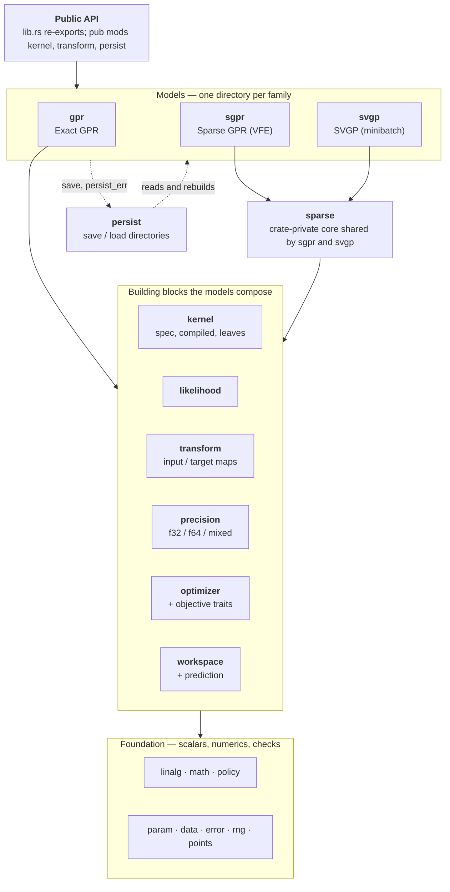

English | [日本語](README.ja.md)

# gprx

Exact Gaussian process regression in Rust. `Gpr` is the unfitted trainer. `Gpr::fit` consumes it, runs argmin L-BFGS on the negative log marginal likelihood, and returns `FittedGpr`. The same blocks build `Sgpr` and `Svgp`, including online updates and directory save/load.

`X` is column-major: `n` points by `d` features, feature 0 for every row, then feature 1. `fit` consumes the trainer. Observation noise lives in `GaussianLikelihood`. **0.1.0** is the default-feature public API. The MSRV is 1.85. A 0.x minor may break that API. `internals` (`bench-internals` and `insert-stages`) is outside that contract.

```toml
[dependencies]
gprx = "0.1"
```

## Example

```rust
use gprx::kernel::{KernelSpec, RbfKernel};
use gprx::{GaussianLikelihood, Gpr};

fn main() -> Result<(), gprx::GprError> {
    let kernel = KernelSpec::from(RbfKernel::new(1.0)?);
    let likelihood = GaussianLikelihood::new(0.1)?;
    let gpr = Gpr::new(kernel, likelihood);
    let fitted = gpr.fit(&[0.0, 1.0], 2, 1, &[0.0, 1.0])?;
    let pred = fitted.predict(&[0.5], 1, 1)?;
    println!("mean = {}, variance = {}", pred.mean[0], pred.variance[0]);
    Ok(())
}
```

Same program: `cargo run --example fit_predict`.

## Usage

`fit` and `factor` return `Result<Fitted, (Trainer, GprError)>`. `?` drops the trainer (`From<(Trainer, GprError)> for GprError`). `.map_err(|(_, e)| e)` keeps the error. Match `Err((trainer, err))` to retry with the same trainer.

`X` and inducing inputs `Z` are column-major `f64`: feature 0 for every row, then feature 1. `n_rows` is the point count, `n_cols` the feature count. `y` has length `n_rows`. Empty input, a length that is not `n_rows * n_cols`, or `NaN` / `Inf` is `GprError`.

There is no `n_jobs` setter. Distance fills use the process-wide Rayon pool. Set `RAYON_NUM_THREADS` before the process starts, or call `rayon::ThreadPoolBuilder::new().num_threads(n).build_global()` before the first fit or predict. The pool can be initialized only once. One worker is sequential.

`gprx::internals` (`bench-internals`, `insert-stages`) is outside semantic versioning. Do not depend on it.

### Exact: `Gpr`, `FittedGpr`, `OnlineGpr`

`Gpr::new(kernel, likelihood)` is `Gpr<Lbfgs, DoublePrecision>`. `fit(x, n_rows, n_cols, y)` consumes it, runs the optimizer on the negative log marginal likelihood, and returns `FittedGpr`.

```rust
use gprx::kernel::{KernelSpec, RbfKernel};
use gprx::{Fixed, GaussianLikelihood, Gpr, PredictOptions, Prediction, VarianceKind};

fn main() -> Result<(), gprx::GprError> {
    let fitted = Gpr::new(
        KernelSpec::from(RbfKernel::new(1.0)?),
        GaussianLikelihood::new(0.1)?,
    )
    .fit(&[0.0, 1.0], 2, 1, &[0.0, 1.0])?;

    let pred = fitted.predict(&[0.5], 1, 1)?;
    let latent = fitted.predict_with(
        &[0.5],
        1,
        1,
        PredictOptions {
            variance_kind: VarianceKind::Latent,
        },
    )?;
    let _ = (pred.mean[0], pred.variance[0], latent.variance_kind);

    let mut fitted = fitted;
    let mut reused = Prediction::default();
    fitted.predict_into(&[0.5], 1, 1, &mut reused)?;

    let frozen = fitted
        .into_trainer()
        .with_optimizer(Fixed)
        .factor(&[0.0, 1.0], 2, 1, &[0.0, 1.0])?;
    let _ = frozen.n();
    Ok(())
}
```

`predict` variance is observation (`latent + σn²`) on the original `y` scale. `predict_with` takes `PredictOptions`. `predict` allocates. `predict_into` and `predict_with_into` write into a `Prediction` and reuse `mean` / `variance` when the query length matches.

`predict_covariance` returns `PredictiveCovariance`. `covariance` is column-major `m × m` (`col * m + row`). The diagonal matches `predict` for the same query and options. `predict_covariance_with` takes `PredictOptions`.

`sample(xs, n_rows, n_cols, n_draws, seed)` draws `μ + Lz` from that covariance. The result is column-major `m × n_draws`. `seed` starts gprx's Xoshiro256++ (the same sequence on every platform). `sample_with` takes `PredictOptions`.

`loo_predict` is the GPML leave-one-out mean and variance at every training point, not a query at a new `x`. `loo_predict_with` takes `PredictOptions`.

`neg_log_marginal_likelihood` is the objective at the current `θ`. `num_params`, `get_params`, and `set_params` are the flat log-`θ` vector: kernel parameters, then the likelihood parameter. `value_and_gradient_into` and `hessian_into` evaluate that objective. `set_params` updates `θ` and the factorization.

`n`, `d`, `kernel`, `likelihood`, `x`, `y`, and `alpha` read the fitted model. `distance_cache_policy`, `cholesky_buffer`, `math`, and `jitter_policy` read the policies.

`into_trainer` returns the unfitted `Gpr` with the current `θ`. `with_optimizer` on a fitted model only changes a later `refit`. `refit` on `FittedGpr<O: Optimizer>` searches again from the current `θ` on the stored data. `refit` on `FittedGpr<Fixed>` rebuilds `L` and `α` and does not search. Transforms are not fit again.

`into_online` returns `OnlineGpr`. `insert(x_new, y_new)` appends one point and returns a `PointId`. `delete(id)` removes that point. The last remaining point cannot be deleted (`GprError::InsufficientData`, `min` 2). `PointId` has no public constructor. `into_online` assigns `0 .. n-1`. Later inserts increase and are never reused. `point_ids` is the current list. `InvalidPointId` means the id is not in the model. `into_trainer` on the online model returns `Gpr`. `refit` on `OnlineGpr` follows the same split: an `Optimizer` searches, and `Fixed` rebuilds the factor.

`save(dir)` writes `config.json` and `model.safetensors` without the factor. `save_with_factor` also writes column-major `L` and `α`.

Before `fit`, on `Gpr`:

| Method | Effect |
| --- | --- |
| `with_optimizer(solver)` | Replaces `Lbfgs`. `Fixed` removes `fit` and adds `factor`. |
| `with_precision::<P>()` | `DoublePrecision` (default), `SinglePrecision`, or `MixedPrecision`. |
| `with_math(KernelExp::FastApprox)` | Polynomial kernel `exp`. Default is `KernelExp::Accurate`. |
| `with_input_transform(map)` | Default is identity. |
| `with_target_transform(map)` | Default is identity. Use `StandardizeTarget::new()` when the mean is zero. |
| `with_jitter_policy(policy)` | Default is `JitterPolicy::fixed(0.0)`. |
| `with_distance_cache_policy` | `DistanceCachePolicy::Cached` (default) or `Uncached`. |
| `with_cholesky_buffer` | `CholeskyBuffer::Retain` (default) or `Reuse`. |
| `with_prefer_speed` | `Cached` and `Retain`. |
| `with_prefer_memory` | `Uncached` and `Reuse`. |

`with_prefer_speed` and `with_prefer_memory` exist on `Gpr`. `Sgpr` and `Svgp` take `with_math` and `with_jitter_policy`. They do not take the distance-cache or Cholesky-buffer setters.

### Sparse: `Sgpr`, `FittedSgpr`, `OnlineSgpr`

`Sgpr::new` is `Sgpr<Lbfgs, FixedInducing, DoublePrecision>`. Inducing points stay where you put them. `with_inducing(FreeInducing)` also searches `Z`.

```rust
use gprx::kernel::{KernelSpec, RbfKernel};
use gprx::{Fixed, FreeInducing, GaussianLikelihood, Sgpr};

fn main() -> Result<(), gprx::GprError> {
    let x = &[0.0, 1.0, 2.0, 3.0];
    let y = &[0.0, 1.0, 0.5, 0.25];
    let z = &[0.5, 2.5];
    let kernel = KernelSpec::from(RbfKernel::new(1.0)?);
    let likelihood = GaussianLikelihood::new(0.1)?;

    let fitted = Sgpr::new(kernel.clone(), likelihood.clone()).fit(x, 4, 1, y, z, 2)?;
    let _moved = Sgpr::new(kernel.clone(), likelihood.clone())
        .with_inducing(FreeInducing)
        .fit(x, 4, 1, y, z, 2)?;
    let frozen = Sgpr::new(kernel, likelihood)
        .with_optimizer(Fixed)
        .factor(x, 4, 1, y, z, 2)?;
    assert_eq!(fitted.neg_log_marginal_likelihood()?.is_finite(), true);
    let _ = frozen.m();
    Ok(())
}
```

`fit` and `factor` take `(x, n_rows, n_cols, y, z, n_inducing)`. `z` is column-major with `n_inducing` points and the same `n_cols`. `factor` does not move `θ` or `Z`. Free inducing appends column-major `Z` after kernel `θ` and likelihood `θ`. Each coordinate is limited to the training box, opened by 10% of that feature's range and at least `0.1`. Matérn `ν = 1/2` has no coordinate derivative for free `Z` (`GprError::CoordGradientUnsupported`).

`FittedSgpr` has the same predict, covariance, sample, and leave-one-out methods as `FittedGpr`, plus `m` for the inducing count. `into_online` returns `OnlineSgpr`. `insert` / `delete` use `PointId`. `insert_inducing` / `delete_inducing` use `InducingId` (no public constructor, never reused). `inducing_ids` lists them. `InvalidInducingId` means the id is absent. `into_fitted` returns `FittedSgpr<_, FixedInducing, _>`. `save` writes the directory. There is no `save_with_factor` on the sparse models.

### Minibatch: `Svgp`, `FittedSvgp`

`Svgp::new` is `Svgp<Fixed>`. `factor` builds a whitened variational posterior `q` at the current `θ` and does not search. `with_optimizer(Adam::new()).fit(...)` runs mini-batch Adam on `θ` and `q`. `Adam` does not implement `Optimizer`. `Gpr` and `Sgpr` cannot take it.

```rust
use gprx::kernel::{KernelSpec, RbfKernel};
use gprx::{Adam, GaussianLikelihood, Svgp};

fn main() -> Result<(), gprx::GprError> {
    let kernel = KernelSpec::from(RbfKernel::new(1.0)?);
    let likelihood = GaussianLikelihood::new(0.1)?;
    let x = &[0.0, 1.0, 2.0, 3.0];
    let y = &[0.0, 1.0, 0.5, 0.25];
    let z = &[0.5, 2.5];
    let factored = Svgp::new(kernel.clone(), likelihood.clone()).factor(x, 4, 1, y, z, 2)?;
    let trained = Svgp::new(kernel, likelihood)
        .with_optimizer(Adam::new())
        .fit(x, 4, 1, y, z, 2)?;
    let _ = (factored.neg_elbo()?, trained.n());
    Ok(())
}
```

`FittedSvgp::neg_elbo` is the evidence lower bound. `value_and_gradient_into` is the full-data sum. The Adam loop scales the data term by `n / batch` and leaves the KL whole. Predict, covariance, sample, and `predict_into` match the other families. There is no leave-one-out and no online type. `save` writes the directory.

`Adam::new` is learning rate `1e-3`, `β1 = 0.9`, `β2 = 0.999`, `ε = 1e-8`, batch 32, 100 epochs, seed 0. Setters: `with_learning_rate`, `with_beta1`, `with_beta2`, `with_epsilon`, `with_batch_size` (`NonZeroUsize`), `with_epochs` (`NonZeroU64`), `with_seed`. The rate, betas, and epsilon return `Result`.

### Kernels

Build a `KernelSpec` with `KernelSpec::from(leaf)` or `KernelSpec::custom(term)`. `+` is a sum. `*` is a product. `*` binds tighter than `+`, so `c * k + k2` is a scaled kernel plus another kernel. `num_params`, `get_params`, and `set_params` are the flattened log-`θ` in depth-first leaf order. `parameter_bindings` maps each flat index to `(index, leaf_id, local_index)`. `compile` makes a `CompiledKernel<f64>`. `compile_as::<T>()` picks the storage scalar (`KernelScalar`, implemented for `f32` and `f64`).

```rust
use gprx::kernel::{ConstantKernel, KernelSpec, RbfKernel};

fn main() -> Result<(), gprx::GprError> {
    let scaled = KernelSpec::from(ConstantKernel::new(1.5)?)
        * KernelSpec::from(RbfKernel::new(1.0)?);
    let kernel = scaled + KernelSpec::from(RbfKernel::new(2.0)?);
    assert_eq!(kernel.num_params(), 3);
    Ok(())
}
```

Each built-in leaf stores positive parameters as `log`. `new` takes user units (`ℓ`, variance, period, `α`). `from_log_*` takes the optimizer coordinate. `bounds` / `with_bounds` use an open `Interval` (default `(1e-5, 1e5)`, `Interval::DEFAULT_POSITIVE`). `with_bounds` returns `IntervalError` when the current value is outside.

| Leaf | Construct | Parameters |
| --- | --- | --- |
| `RbfKernel` | `new(ℓ)` | isotropic lengthscale |
| `RbfArdKernel` | `new(&[ℓ_d])` | one lengthscale per feature (`ArdLengthscales`) |
| `MaternKernel` | `new(ℓ, MaternNu)` | `MaternNu::Half`, `ThreeHalves`, `FiveHalves` (`value` is 0.5, 1.5, 2.5). `ν` is not optimized |
| `MaternArdKernel` | `new(&[ℓ_d], nu)` | ARD lengthscales, fixed `ν` |
| `PeriodicKernel` | `new(ℓ, period)` | lengthscale and period |
| `RationalQuadraticKernel` | `new(ℓ, alpha)` | lengthscale and `α` |
| `RationalQuadraticArdKernel` | `new(&[ℓ_d], alpha)` | ARD lengthscales, then `α` |
| `ConstantKernel` | `new(c)` | signal variance. Multiply by an RBF for `c * k` |
| `LinearKernel` | `new(variance)` | `σ² xᵀ x'` |
| `WhiteKernel` | `new(variance)` | diagonal nugget |

Observation noise belongs in `GaussianLikelihood`. `WhiteKernel` is an extra kernel term. A large likelihood and a large white term count the noise twice.

`lengthscale(dim)` on an ARD leaf returns one `ℓ_d`. `log_lengthscales` is the stored vector.

A leaf and a `CompiledKernel` evaluate with `apply`, `apply_cross`, `fill_diag`, `grad`, and `hess`. Some leaves also have `apply_points`, `grad_points`, `hess_points`, and `grad_wrt_coord_dim`. `Triangle::Lower` (Cholesky), `Upper`, or `Full` selects which entries are written. `apply` takes a `KernelMath`: `Accurate` (libm / SIMD `exp`) or `FastApprox` (degree-7 polynomial). `FastApprox` on `f64` stays within a relative `2^{-23}` of `f64::exp`. Hyperparameter `exp(θ)` does not use this choice.

`KernelTerm` is the trait for a distance leaf: `num_params`, `get_params`, `set_params`, `bounds_into`, `apply`, and the derivative methods a sparse model needs (`grad_cross` / `hess_cross`, and `grad_wrt_sq_dist*` / `hess_wrt_sq_dist` for `FreeInducing`). `CustomKernel::new(term)` boxes it. `KernelSpec::custom` inserts it. A custom leaf that omits a derivative a sparse model needs returns `CoordGradientUnsupported`.

### Likelihood

`GaussianLikelihood::new(noise_variance)` stores `σn²` as a log parameter. `from_log_noise_variance`, `noise_variance`, `log_noise_variance`, `bounds`, `with_bounds`, `num_params`, `get_params`, `set_params`. `add_noise_diag` adds `σn²` to a kernel diagonal. `noise_grad_diag` is the derivative of that diagonal with respect to one parameter. `InvalidNoiseVariance` is a noise value outside its domain.

### Transforms (`gprx::transform`)

Pass an unfitted map to `with_input_transform` or `with_target_transform` before `fit`. The model fits the map on the training data. Defaults are `IdentityInput` and `IdentityTarget`.

| Type | Role |
| --- | --- |
| `IdentityInput`, `IdentityTarget` | no change. `fit` returns the same map |
| `StandardizeInput` | per-feature mean and standard deviation. `FittedStandardizeInput::mean` and `std` |
| `StandardizeTarget` | one mean and standard deviation for `y`. `FittedStandardizeTarget::mean` and `std` |
| `MinMaxInput` | per-feature map into a range. `new` is `[0, 1]`. `with_feature_range(lo, hi)`. Fitted: `min`, `max`, `feature_range` |
| `MinMaxTarget` | the same for `y` |
| `Pipeline` | `Pipeline::new().then(step)`. `len`, `is_empty`. Fits to `FittedPipeline` |
| `TargetPipeline` | the same for `y`, fits to `FittedTargetPipeline` |
| `ColumnwiseInput` | `new().then(map)` assigns the next feature. Fits to `FittedColumnwiseInput` |

`UnfittedTransform::fit` and `UnfittedTarget::fit` consume the map. `Transform` and `TargetTransform` are the fitted traits (apply and invert). A caller-defined map implements the unfitted trait, `clone_box`, `as_any`, and a `persist_id` when it should be saved.

### Optimizers

One optimizer is the type parameter. `Gpr::new` is `Lbfgs`. `with_optimizer` replaces it.

| Type | Search | Setters |
| --- | --- | --- |
| `Lbfgs` | argmin L-BFGS, More–Thuente line search. Needs `Differentiable` | `new`: 100 iterations, tolerance `sqrt(ε)`, history 10. `with_max_iterations`, `with_tolerance`, `with_history_size` (`NonZeroUsize`), `with_restarts(n, seed)` |
| `NelderMead` | derivative-free. Needs `Objective` | `with_max_iterations`, `with_tolerance`, `with_restarts` |
| `TrustRegion` | uses the Hessian. Needs `TwiceDifferentiable` | `with_max_iterations`, `with_tolerance`, `with_restarts`, `with_radii(initial, max)` |
| `FastSimulatedAnnealing` | Cauchy proposals, Metropolis, Ingber cooling. Needs `Objective` | `with_max_iterations`, `with_restarts`, `with_initial_temperature`, `with_cooling_rate`, `with_seed`, `with_boundary` |
| `Fixed` | no search. `factor` only. Does not implement `Optimizer` | unit struct |
| `Adam` | mini-batch, `Svgp` only | see above |

`with_restarts(n, seed)` adds `n` extra log-uniform starts (`NonZeroU32`) and keeps the lowest value. The first start is the model's `θ`. `BoundaryPolicy::Clamp` (default) projects a proposal just inside the open interval. `BoundaryPolicy::Periodic` wraps to the other side.

`Optimizer::minimize` returns `OptResult { params, value, iterations }`. `USES_CHANGE_INDICES` is `true` when the solver reports which coordinates changed. With `CholeskyBuffer::Retain`, a fit then rebuilds only the touched kernel leaves. Implement `Optimizer<P>` for a solver of your own. `P` is `Objective`, `Differentiable`, or `TwiceDifferentiable`. `IncrementalObjective::value_with_changes` rebuilds only the leaves those indices touch. Empty, duplicate, or out-of-range indices are `GprError`.

`Objective::value` is the scalar. `value_at_changes` lists every coordinate that differs from the previous evaluation on that objective. `fill_intervals` writes each parameter's open interval in user units. The built-in solvers stay inside those intervals. `Differentiable::value_and_gradient_into` and `TwiceDifferentiable` (Hessian) extend it.

### Precision, math, jitter

`DoublePrecision` stores and solves in `f64` (`PrecisionPolicy::Storage` and `Refine`). `SinglePrecision` uses `f32` and keeps that factorization. `MixedPrecision` defaults to `MixedPrecision<PromoteStorage>`. It factors in `f32` and refines the predict weights in `f64`. `MixedPrecision<ReevaluateKernel>` is the other `ResidualFormula`. `GpScalar` is the scalar bound used on the model type parameter. Select with `with_precision::<SinglePrecision>()`.

`KernelExp::Accurate` and `FastApprox` are the runtime switch (`with_math`). `Accurate` and `FastApprox` in `gprx` are the corresponding `KernelMath` types for a direct `apply`.

`JitterPolicy::fixed(j)` retries a failed Cholesky once with `j ≥ 0` on the diagonal (`FixedJitter`). `adaptive(initial, multiplier, max_retries, max_jitter)` grows the offset after the unregularized factor fails (`AdaptiveJitter`): `initial > 0`, `multiplier > 1`, `max_retries ≥ 1`, `max_jitter ≥ initial`. Exact models default to `fixed(0.0)`. Read the stored numbers with `jitter`, or `initial`, `multiplier`, `max_retries`, and `max_jitter`.

### Parameters

`Interval::new(lo, hi)` is a finite open interval, `lo < hi`. `lo`, `hi`, `contains`. `IntervalError::InvalidBounds` and `OutOfRange`. `GprError::InvalidInterval` wraps that error. `BoundedParam::new(value, interval)` stores a user-unit value strictly inside the interval. `value` reads it. Leaves and `GaussianLikelihood` hold a `BoundedParam` internally. Callers usually go through `with_bounds`.

### Save and load (`gprx::persist`)

`FORMAT_VERSION` is `1`. `RESERVED_PREFIX` is `"gprx."`. A caller `persist_id` must not use that prefix.

`LoadedGpr::load(dir, registry)`, `LoadedSgpr::load`, and `LoadedSvgp::load` read the directory. `PersistRegistry::new` is empty. Built-ins need no registration. Register a custom kernel or transform before load:

- `register_kernel`
- `register_unfitted_input`, `register_fitted_input`
- `register_unfitted_target`, `register_fitted_target`

The restore function types are `KernelRestore`, `UnfittedInputRestore`, `FittedInputRestore`, `UnfittedTargetRestore`, and `FittedTargetRestore`.

`predict` and `predict_with` on a loaded model return `f64`, including when the file was `f32`. `n`, `d`, and (sparse) `m`. `is_online` is true for an `ldlt` exact or SGPR file. Match the variant for the typed model:

| Enum | Variants |
| --- | --- |
| `LoadedGpr` | `Double`, `Single`, `Mixed`, `Reevaluate`, `OnlineDouble`, `OnlineSingle`, `OnlineMixed`, `OnlineReevaluate` |
| `LoadedSgpr` | the same eight names. `Double` is `FittedSgpr<Fixed>`. Online variants are `OnlineSgpr<Fixed, _>` |
| `LoadedSvgp` | `Double`, `Single`, `Mixed`, `Reevaluate`. No online variant |

A loaded exact model is `Fixed` and `CholeskyBuffer::Retain`. The file does not store a solver. Call `with_optimizer` on the matched model, then `refit`, to search again. A file written with `save` and no factor is factored on load. `save_with_factor` keeps `L` memory-mapped.

### Errors

`GprError` is non-exhaustive. Display text is English.

| Variant | When |
| --- | --- |
| `DimensionMismatch { x_dim, expected_dim }` | query features differ from training |
| `InsufficientData { n, min }` | too few points |
| `EmptyInput` | a dimension is zero |
| `NonFiniteInput` | `NaN` or `Inf` in caller data |
| `NonFiniteKernelValue` | a kernel evaluation was not finite |
| `CholeskyFailed { jitter, matrix_size, stage }` | factorization failed after jitter |
| `NonPositiveDefiniteMatrix` | a matrix that must be a covariance is not |
| `CoordGradientUnsupported` | the kernel has no derivative the sparse model needs |
| `OptimizationNotConverged { iterations }` | the solver stopped short of its test |
| `InvalidHyperparameter { reason }` | a kernel parameter is outside its domain |
| `ShapeMismatch { reason }` | a matrix has the wrong shape |
| `LengthMismatch { reason }` | a slice has the wrong length |
| `IndexOutOfRange { reason }` | a parameter, leaf, or dimension index |
| `InvalidConfig { reason }` | an optimizer, jitter, or transform setting |
| `SizeOverflow` | `n_rows * n_cols` does not fit in `usize` |
| `InvalidInterval` | `Interval` or `BoundedParam` could not be built |
| `InvalidNoiseVariance { reason }` | observation noise is outside its domain |
| `UnsupportedKernelOperation { reason }` | that leaf does not implement the operation |
| `WorkspaceTooSmall` | a buffer is shorter than the problem |
| `InvalidPointId` | `PointId` is not in the model |
| `InvalidInducingId` | `InducingId` is not in the model |
| `PersistFailed { kind, reason }` | save or load failed |
| `UnsupportedPersistVersion { found, supported }` | `format_version` is not `FORMAT_VERSION` |

`CholeskyStage` is `Fit`, `Predict`, `OnlineInsert`, `OnlineDelete`. `PersistErrorKind` is `Io`, `Config`, `Tensor`, `InvalidPersistId`, `NotPersistable`, `UnregisteredId`, `WrongModel`. Branch on `kind`. `reason` is for a person to read.

## Architecture and the saved format

Three model families (`Gpr`, `Sgpr`, `Svgp`) are built from the same blocks and never import one another. The map below is the whole crate; each box is a module under `src/`.



- [`docs/architecture.md`](https://github.com/YUKIKEDA/gprx/blob/main/docs/architecture.md): every module, what it is responsible for, which way its imports point, the public types by family, and where to change what.
- [`docs/persist-format.md`](https://github.com/YUKIKEDA/gprx/blob/main/docs/persist-format.md): what `save` writes. The keys of `config.json`, the tensors of `model.safetensors` (names, shapes, dtypes, column-major layout), the JSON form of kernels and transforms, `Custom` restore, versions, and errors.

## Comparison

Accuracy, training time, and memory against other libraries: [comparison](https://github.com/YUKIKEDA/gprx/blob/main/docs/comparison.md) | [日本語](https://github.com/YUKIKEDA/gprx/blob/main/docs/comparison.ja.md).

## License

Licensed under either of

- Apache License, Version 2.0 ([LICENSE-APACHE](LICENSE-APACHE))
- MIT license ([LICENSE-MIT](LICENSE-MIT))

at your option.
