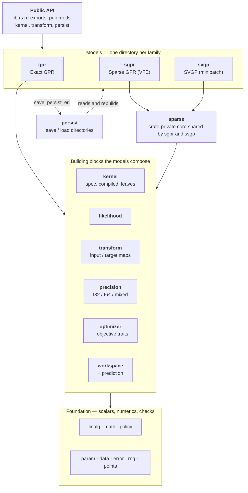

English | [日本語](README.ja.md)

# gprx

Exact Gaussian process regression in Rust. `Gpr` is the unfitted trainer. `Gpr::fit` consumes it, runs argmin L-BFGS on the negative log marginal likelihood, and returns `FittedGpr`. The same blocks build `Sgpr` and `Svgp`, including online updates and directory save/load. The crate is **not** published to crates.io (`publish = false` in `Cargo.toml`).

## Status

**0.1.0** is the default-feature public API. The next section names every type an external crate can call, and how to call it. The MSRV is 1.85 (`rust-version` in `Cargo.toml`). A 0.x minor may break the public API. `internals` (`bench-internals` and `insert-stages`) is outside semantic versioning and is not part of that section. Depend on git or a path, not crates.io.

Design: [`docs/design.md`](https://github.com/YUKIKEDA/gprx/blob/main/docs/design.md). Architecture: [`docs/architecture.md`](https://github.com/YUKIKEDA/gprx/blob/main/docs/architecture.md). Saved format: [`docs/persist-format.md`](https://github.com/YUKIKEDA/gprx/blob/main/docs/persist-format.md). Tasks: [`docs/roadmap.md`](https://github.com/YUKIKEDA/gprx/blob/main/docs/roadmap.md). Agent rules: [`AGENTS.md`](https://github.com/YUKIKEDA/gprx/blob/main/AGENTS.md). Cross-library wall time and peak RSS: [`compare/perf/`](https://github.com/YUKIKEDA/gprx/blob/main/compare/perf/) (P2B-16 Exact `just perf`; P4-12 Sparse `just perf-sparse`; P4-14 Sparse online `just perf-sparse-online`; not criterion).

## Example

`X` is column-major (`n` points × `d` features: all rows of feature 0, then feature 1, …).

```rust
use gprx::kernel::{KernelSpec, RbfKernel};
use gprx::{GaussianLikelihood, Gpr};

fn main() -> Result<(), gprx::GprError> {
    let kernel = KernelSpec::from(RbfKernel::new(1.0)?);
    let likelihood = GaussianLikelihood::new(0.1)?;
    let gpr = Gpr::new(kernel, likelihood);
    let fitted = gpr.fit(&[0.0, 1.0], 2, 1, &[0.0, 1.0])?;
    let pred = fitted.predict(&[0.5], 1, 1)?;
    println!("mean = {}, variance = {}", pred.mean[0], pred.variance[0]);
    Ok(())
}
```

Same program: `cargo run --example fit_predict`.

## Usage

`fit` and `factor` return `Result<Fitted, (Trainer, GprError)>`. `?` drops the trainer (`From<(Trainer, GprError)> for GprError`). `.map_err(|(_, e)| e)` keeps the error. Match `Err((trainer, err))` to retry with the same trainer.

`X` and inducing inputs `Z` are column-major `f64`: feature 0 for every row, then feature 1. `n_rows` is the point count, `n_cols` the feature count. `y` has length `n_rows`. Empty input, a length that is not `n_rows * n_cols`, or `NaN` / `Inf` is `GprError`.

There is no `n_jobs` setter. Distance fills use the process-wide Rayon pool. Set `RAYON_NUM_THREADS` before the process starts, or call `rayon::ThreadPoolBuilder::new().num_threads(n).build_global()` before the first fit or predict. The pool can be initialized only once. One worker is sequential.

`gprx::internals` (`bench-internals`, `insert-stages`) is outside semantic versioning. Do not depend on it.

### Exact: `Gpr`, `FittedGpr`, `OnlineGpr`

`Gpr::new(kernel, likelihood)` is `Gpr<Lbfgs, DoublePrecision>`. `fit(x, n_rows, n_cols, y)` consumes it, runs the optimizer on the negative log marginal likelihood, and returns `FittedGpr`.

```rust
use gprx::kernel::{KernelSpec, RbfKernel};
use gprx::{Fixed, GaussianLikelihood, Gpr, PredictOptions, Prediction, VarianceKind};

fn main() -> Result<(), gprx::GprError> {
    let fitted = Gpr::new(
        KernelSpec::from(RbfKernel::new(1.0)?),
        GaussianLikelihood::new(0.1)?,
    )
    .fit(&[0.0, 1.0], 2, 1, &[0.0, 1.0])?;

    let pred = fitted.predict(&[0.5], 1, 1)?;
    let latent = fitted.predict_with(
        &[0.5],
        1,
        1,
        PredictOptions {
            variance_kind: VarianceKind::Latent,
        },
    )?;
    let _ = (pred.mean[0], pred.variance[0], latent.variance_kind);

    let mut fitted = fitted;
    let mut reused = Prediction::default();
    fitted.predict_into(&[0.5], 1, 1, &mut reused)?;

    let frozen = fitted
        .into_trainer()
        .with_optimizer(Fixed)
        .factor(&[0.0, 1.0], 2, 1, &[0.0, 1.0])?;
    let _ = frozen.n();
    Ok(())
}
```

`predict` variance is observation (`latent + σn²`) on the original `y` scale. `predict_with` takes `PredictOptions`. `predict` allocates. `predict_into` and `predict_with_into` write into a `Prediction` and reuse `mean` / `variance` when the query length matches.

`predict_covariance` returns `PredictiveCovariance`. `covariance` is column-major `m × m` (`col * m + row`). The diagonal matches `predict` for the same query and options. `predict_covariance_with` takes `PredictOptions`.

`sample(xs, n_rows, n_cols, n_draws, seed)` draws `μ + Lz` from that covariance. The result is column-major `m × n_draws`. `seed` starts gprx's Xoshiro256++ (the same sequence on every platform). `sample_with` takes `PredictOptions`.

`loo_predict` is the GPML leave-one-out mean and variance at every training point, not a query at a new `x`. `loo_predict_with` takes `PredictOptions`.

`neg_log_marginal_likelihood` is the objective at the current `θ`. `num_params`, `get_params`, and `set_params` are the flat log-`θ` vector: kernel parameters, then the likelihood parameter. `value_and_gradient_into` and `hessian_into` evaluate that objective. `set_params` updates `θ` and the factorization.

`n`, `d`, `kernel`, `likelihood`, `x`, `y`, and `alpha` read the fitted model. `distance_cache_policy`, `cholesky_buffer`, `math`, and `jitter_policy` read the policies.

`into_trainer` returns the unfitted `Gpr` with the current `θ`. `with_optimizer` on a fitted model only changes a later `refit`. `refit` on `FittedGpr<O: Optimizer>` searches again from the current `θ` on the stored data. `refit` on `FittedGpr<Fixed>` rebuilds `L` and `α` and does not search. Transforms are not fit again.

`into_online` returns `OnlineGpr`. `insert(x_new, y_new)` appends one point and returns a `PointId`. `delete(id)` removes that point. The last remaining point cannot be deleted (`GprError::InsufficientData`, `min` 2). `PointId` has no public constructor. `into_online` assigns `0 .. n-1`. Later inserts increase and are never reused. `point_ids` is the current list. `InvalidPointId` means the id is not in the model. `into_trainer` on the online model returns `Gpr`. `refit` on `OnlineGpr` follows the same split: an `Optimizer` searches, and `Fixed` rebuilds the factor.

`save(dir)` writes `config.json` and `model.safetensors` without the factor. `save_with_factor` also writes column-major `L` and `α`.

Before `fit`, on `Gpr`:

| Method | Effect |
| --- | --- |
| `with_optimizer(solver)` | Replaces `Lbfgs`. `Fixed` removes `fit` and adds `factor`. |
| `with_precision::<P>()` | `DoublePrecision` (default), `SinglePrecision`, or `MixedPrecision`. |
| `with_math(KernelExp::FastApprox)` | Polynomial kernel `exp`. Default is `KernelExp::Accurate`. |
| `with_input_transform(map)` | Default is identity. |
| `with_target_transform(map)` | Default is identity. Use `StandardizeTarget::new()` when the mean is zero. |
| `with_jitter_policy(policy)` | Default is `JitterPolicy::fixed(0.0)`. |
| `with_distance_cache_policy` | `DistanceCachePolicy::Cached` (default) or `Uncached`. |
| `with_cholesky_buffer` | `CholeskyBuffer::Retain` (default) or `Reuse`. |
| `with_prefer_speed` | `Cached` and `Retain`. |
| `with_prefer_memory` | `Uncached` and `Reuse`. |

`with_prefer_speed` and `with_prefer_memory` exist on `Gpr`. `Sgpr` and `Svgp` take `with_math` and `with_jitter_policy`. They do not take the distance-cache or Cholesky-buffer setters.

### Sparse: `Sgpr`, `FittedSgpr`, `OnlineSgpr`

`Sgpr::new` is `Sgpr<Lbfgs, FixedInducing, DoublePrecision>`. Inducing points stay where you put them. `with_inducing(FreeInducing)` also searches `Z`.

```rust
use gprx::kernel::{KernelSpec, RbfKernel};
use gprx::{Fixed, FreeInducing, GaussianLikelihood, Sgpr};

fn main() -> Result<(), gprx::GprError> {
    let x = &[0.0, 1.0, 2.0, 3.0];
    let y = &[0.0, 1.0, 0.5, 0.25];
    let z = &[0.5, 2.5];
    let kernel = KernelSpec::from(RbfKernel::new(1.0)?);
    let likelihood = GaussianLikelihood::new(0.1)?;

    let fitted = Sgpr::new(kernel.clone(), likelihood.clone()).fit(x, 4, 1, y, z, 2)?;
    let _moved = Sgpr::new(kernel.clone(), likelihood.clone())
        .with_inducing(FreeInducing)
        .fit(x, 4, 1, y, z, 2)?;
    let frozen = Sgpr::new(kernel, likelihood)
        .with_optimizer(Fixed)
        .factor(x, 4, 1, y, z, 2)?;
    assert_eq!(fitted.neg_log_marginal_likelihood()?.is_finite(), true);
    let _ = frozen.m();
    Ok(())
}
```

`fit` and `factor` take `(x, n_rows, n_cols, y, z, n_inducing)`. `z` is column-major with `n_inducing` points and the same `n_cols`. `factor` does not move `θ` or `Z`. Free inducing appends column-major `Z` after kernel `θ` and likelihood `θ`. Each coordinate is limited to the training box, opened by 10% of that feature's range and at least `0.1`. Matérn `ν = 1/2` has no coordinate derivative for free `Z` (`GprError::CoordGradientUnsupported`).

`FittedSgpr` has the same predict, covariance, sample, and leave-one-out methods as `FittedGpr`, plus `m` for the inducing count. `into_online` returns `OnlineSgpr`. `insert` / `delete` use `PointId`. `insert_inducing` / `delete_inducing` use `InducingId` (no public constructor, never reused). `inducing_ids` lists them. `InvalidInducingId` means the id is absent. `into_fitted` returns `FittedSgpr<_, FixedInducing, _>`. `save` writes the directory. There is no `save_with_factor` on the sparse models.

### Minibatch: `Svgp`, `FittedSvgp`

`Svgp::new` is `Svgp<Fixed>`. `factor` builds a whitened variational posterior `q` at the current `θ` and does not search. `with_optimizer(Adam::new()).fit(...)` runs mini-batch Adam on `θ` and `q`. `Adam` does not implement `Optimizer`. `Gpr` and `Sgpr` cannot take it.

```rust
use gprx::kernel::{KernelSpec, RbfKernel};
use gprx::{Adam, GaussianLikelihood, Svgp};

fn main() -> Result<(), gprx::GprError> {
    let kernel = KernelSpec::from(RbfKernel::new(1.0)?);
    let likelihood = GaussianLikelihood::new(0.1)?;
    let x = &[0.0, 1.0, 2.0, 3.0];
    let y = &[0.0, 1.0, 0.5, 0.25];
    let z = &[0.5, 2.5];
    let factored = Svgp::new(kernel.clone(), likelihood.clone()).factor(x, 4, 1, y, z, 2)?;
    let trained = Svgp::new(kernel, likelihood)
        .with_optimizer(Adam::new())
        .fit(x, 4, 1, y, z, 2)?;
    let _ = (factored.neg_elbo()?, trained.n());
    Ok(())
}
```

`FittedSvgp::neg_elbo` is the evidence lower bound. `value_and_gradient_into` is the full-data sum. The Adam loop scales the data term by `n / batch` and leaves the KL whole. Predict, covariance, sample, and `predict_into` match the other families. There is no leave-one-out and no online type. `save` writes the directory.

`Adam::new` is learning rate `1e-3`, `β1 = 0.9`, `β2 = 0.999`, `ε = 1e-8`, batch 32, 100 epochs, seed 0. Setters: `with_learning_rate`, `with_beta1`, `with_beta2`, `with_epsilon`, `with_batch_size` (`NonZeroUsize`), `with_epochs` (`NonZeroU64`), `with_seed`. The rate, betas, and epsilon return `Result`.

### Kernels

Build a `KernelSpec` with `KernelSpec::from(leaf)` or `KernelSpec::custom(term)`. `+` is a sum. `*` is a product. `*` binds tighter than `+`, so `c * k + k2` is a scaled kernel plus another kernel. `num_params`, `get_params`, and `set_params` are the flattened log-`θ` in depth-first leaf order. `parameter_bindings` maps each flat index to `(index, leaf_id, local_index)`. `compile` makes a `CompiledKernel<f64>`. `compile_as::<T>()` picks the storage scalar (`KernelScalar`, implemented for `f32` and `f64`).

```rust
use gprx::kernel::{ConstantKernel, KernelSpec, RbfKernel};

fn main() -> Result<(), gprx::GprError> {
    let scaled = KernelSpec::from(ConstantKernel::new(1.5)?)
        * KernelSpec::from(RbfKernel::new(1.0)?);
    let kernel = scaled + KernelSpec::from(RbfKernel::new(2.0)?);
    assert_eq!(kernel.num_params(), 3);
    Ok(())
}
```

Each built-in leaf stores positive parameters as `log`. `new` takes user units (`ℓ`, variance, period, `α`). `from_log_*` takes the optimizer coordinate. `bounds` / `with_bounds` use an open `Interval` (default `(1e-5, 1e5)`, `Interval::DEFAULT_POSITIVE`). `with_bounds` returns `IntervalError` when the current value is outside.

| Leaf | Construct | Parameters |
| --- | --- | --- |
| `RbfKernel` | `new(ℓ)` | isotropic lengthscale |
| `RbfArdKernel` | `new(&[ℓ_d])` | one lengthscale per feature (`ArdLengthscales`) |
| `MaternKernel` | `new(ℓ, MaternNu)` | `MaternNu::Half`, `ThreeHalves`, `FiveHalves` (`value` is 0.5, 1.5, 2.5). `ν` is not optimized |
| `MaternArdKernel` | `new(&[ℓ_d], nu)` | ARD lengthscales, fixed `ν` |
| `PeriodicKernel` | `new(ℓ, period)` | lengthscale and period |
| `RationalQuadraticKernel` | `new(ℓ, alpha)` | lengthscale and `α` |
| `RationalQuadraticArdKernel` | `new(&[ℓ_d], alpha)` | ARD lengthscales, then `α` |
| `ConstantKernel` | `new(c)` | signal variance. Multiply by an RBF for `c * k` |
| `LinearKernel` | `new(variance)` | `σ² xᵀ x'` |
| `WhiteKernel` | `new(variance)` | diagonal nugget |

Observation noise belongs in `GaussianLikelihood`. `WhiteKernel` is an extra kernel term. A large likelihood and a large white term count the noise twice.

`lengthscale(dim)` on an ARD leaf returns one `ℓ_d`. `log_lengthscales` is the stored vector.

A leaf and a `CompiledKernel` evaluate with `apply`, `apply_cross`, `fill_diag`, `grad`, and `hess`. Some leaves also have `apply_points`, `grad_points`, `hess_points`, and `grad_wrt_coord_dim`. `Triangle::Lower` (Cholesky), `Upper`, or `Full` selects which entries are written. `apply` takes a `KernelMath`: `Accurate` (libm / SIMD `exp`) or `FastApprox` (degree-7 polynomial). `FastApprox` on `f64` stays within a relative `2^{-23}` of `f64::exp`. Hyperparameter `exp(θ)` does not use this choice.

`KernelTerm` is the trait for a distance leaf: `num_params`, `get_params`, `set_params`, `bounds_into`, `apply`, and the derivative methods a sparse model needs (`grad_cross` / `hess_cross`, and `grad_wrt_sq_dist*` / `hess_wrt_sq_dist` for `FreeInducing`). `CustomKernel::new(term)` boxes it. `KernelSpec::custom` inserts it. A custom leaf that omits a derivative a sparse model needs returns `CoordGradientUnsupported`.

### Likelihood

`GaussianLikelihood::new(noise_variance)` stores `σn²` as a log parameter. `from_log_noise_variance`, `noise_variance`, `log_noise_variance`, `bounds`, `with_bounds`, `num_params`, `get_params`, `set_params`. `add_noise_diag` adds `σn²` to a kernel diagonal. `noise_grad_diag` is the derivative of that diagonal with respect to one parameter. `InvalidNoiseVariance` is a noise value outside its domain.

### Transforms (`gprx::transform`)

Pass an unfitted map to `with_input_transform` or `with_target_transform` before `fit`. The model fits the map on the training data. Defaults are `IdentityInput` and `IdentityTarget`.

| Type | Role |
| --- | --- |
| `IdentityInput`, `IdentityTarget` | no change. `fit` returns the same map |
| `StandardizeInput` | per-feature mean and standard deviation. `FittedStandardizeInput::mean` and `std` |
| `StandardizeTarget` | one mean and standard deviation for `y`. `FittedStandardizeTarget::mean` and `std` |
| `MinMaxInput` | per-feature map into a range. `new` is `[0, 1]`. `with_feature_range(lo, hi)`. Fitted: `min`, `max`, `feature_range` |
| `MinMaxTarget` | the same for `y` |
| `Pipeline` | `Pipeline::new().then(step)`. `len`, `is_empty`. Fits to `FittedPipeline` |
| `TargetPipeline` | the same for `y`, fits to `FittedTargetPipeline` |
| `ColumnwiseInput` | `new().then(map)` assigns the next feature. Fits to `FittedColumnwiseInput` |

`UnfittedTransform::fit` and `UnfittedTarget::fit` consume the map. `Transform` and `TargetTransform` are the fitted traits (apply and invert). A caller-defined map implements the unfitted trait, `clone_box`, `as_any`, and a `persist_id` when it should be saved.

### Optimizers

One optimizer is the type parameter. `Gpr::new` is `Lbfgs`. `with_optimizer` replaces it.

| Type | Search | Setters |
| --- | --- | --- |
| `Lbfgs` | argmin L-BFGS, More–Thuente line search. Needs `Differentiable` | `new`: 100 iterations, tolerance `sqrt(ε)`, history 10. `with_max_iterations`, `with_tolerance`, `with_history_size` (`NonZeroUsize`), `with_restarts(n, seed)` |
| `NelderMead` | derivative-free. Needs `Objective` | `with_max_iterations`, `with_tolerance`, `with_restarts` |
| `TrustRegion` | uses the Hessian. Needs `TwiceDifferentiable` | `with_max_iterations`, `with_tolerance`, `with_restarts`, `with_radii(initial, max)` |
| `FastSimulatedAnnealing` | Cauchy proposals, Metropolis, Ingber cooling. Needs `Objective` | `with_max_iterations`, `with_restarts`, `with_initial_temperature`, `with_cooling_rate`, `with_seed`, `with_boundary` |
| `Fixed` | no search. `factor` only. Does not implement `Optimizer` | unit struct |
| `Adam` | mini-batch, `Svgp` only | see above |

`with_restarts(n, seed)` adds `n` extra log-uniform starts (`NonZeroU32`) and keeps the lowest value. The first start is the model's `θ`. `BoundaryPolicy::Clamp` (default) projects a proposal just inside the open interval. `BoundaryPolicy::Periodic` wraps to the other side.

`Optimizer::minimize` returns `OptResult { params, value, iterations }`. `USES_CHANGE_INDICES` is `true` when the solver reports which coordinates changed. With `CholeskyBuffer::Retain`, a fit then rebuilds only the touched kernel leaves. Implement `Optimizer<P>` for a solver of your own. `P` is `Objective`, `Differentiable`, or `TwiceDifferentiable`. `IncrementalObjective::value_with_changes` rebuilds only the leaves those indices touch. Empty, duplicate, or out-of-range indices are `GprError`.

`Objective::value` is the scalar. `value_at_changes` lists every coordinate that differs from the previous evaluation on that objective. `fill_intervals` writes each parameter's open interval in user units. The built-in solvers stay inside those intervals. `Differentiable::value_and_gradient_into` and `TwiceDifferentiable` (Hessian) extend it.

### Precision, math, jitter

`DoublePrecision` stores and solves in `f64` (`PrecisionPolicy::Storage` and `Refine`). `SinglePrecision` uses `f32` and keeps that factorization. `MixedPrecision` defaults to `MixedPrecision<PromoteStorage>`. It factors in `f32` and refines the predict weights in `f64`. `MixedPrecision<ReevaluateKernel>` is the other `ResidualFormula`. `GpScalar` is the scalar bound used on the model type parameter. Select with `with_precision::<SinglePrecision>()`.

`KernelExp::Accurate` and `FastApprox` are the runtime switch (`with_math`). `Accurate` and `FastApprox` in `gprx` are the corresponding `KernelMath` types for a direct `apply`.

`JitterPolicy::fixed(j)` retries a failed Cholesky once with `j ≥ 0` on the diagonal (`FixedJitter`). `adaptive(initial, multiplier, max_retries, max_jitter)` grows the offset after the unregularized factor fails (`AdaptiveJitter`): `initial > 0`, `multiplier > 1`, `max_retries ≥ 1`, `max_jitter ≥ initial`. Exact models default to `fixed(0.0)`. Read the stored numbers with `jitter`, or `initial`, `multiplier`, `max_retries`, and `max_jitter`.

### Parameters

`Interval::new(lo, hi)` is a finite open interval, `lo < hi`. `lo`, `hi`, `contains`. `IntervalError::InvalidBounds` and `OutOfRange`. `GprError::InvalidInterval` wraps that error. `BoundedParam::new(value, interval)` stores a user-unit value strictly inside the interval. `value` reads it. Leaves and `GaussianLikelihood` hold a `BoundedParam` internally. Callers usually go through `with_bounds`.

### Save and load (`gprx::persist`)

`FORMAT_VERSION` is `1`. `RESERVED_PREFIX` is `"gprx."`. A caller `persist_id` must not use that prefix.

`LoadedGpr::load(dir, registry)`, `LoadedSgpr::load`, and `LoadedSvgp::load` read the directory. `PersistRegistry::new` is empty. Built-ins need no registration. Register a custom kernel or transform before load:

- `register_kernel`
- `register_unfitted_input`, `register_fitted_input`
- `register_unfitted_target`, `register_fitted_target`

The restore function types are `KernelRestore`, `UnfittedInputRestore`, `FittedInputRestore`, `UnfittedTargetRestore`, and `FittedTargetRestore`.

`predict` and `predict_with` on a loaded model return `f64`, including when the file was `f32`. `n`, `d`, and (sparse) `m`. `is_online` is true for an `ldlt` exact or SGPR file. Match the variant for the typed model:

| Enum | Variants |
| --- | --- |
| `LoadedGpr` | `Double`, `Single`, `Mixed`, `Reevaluate`, `OnlineDouble`, `OnlineSingle`, `OnlineMixed`, `OnlineReevaluate` |
| `LoadedSgpr` | the same eight names. `Double` is `FittedSgpr<Fixed>`. Online variants are `OnlineSgpr<Fixed, _>` |
| `LoadedSvgp` | `Double`, `Single`, `Mixed`, `Reevaluate`. No online variant |

A loaded exact model is `Fixed` and `CholeskyBuffer::Retain`. The file does not store a solver. Call `with_optimizer` on the matched model, then `refit`, to search again. A file written with `save` and no factor is factored on load. `save_with_factor` keeps `L` memory-mapped.

### Errors

`GprError` is non-exhaustive. Display text is English.

| Variant | When |
| --- | --- |
| `DimensionMismatch { x_dim, expected_dim }` | query features differ from training |
| `InsufficientData { n, min }` | too few points |
| `EmptyInput` | a dimension is zero |
| `NonFiniteInput` | `NaN` or `Inf` in caller data |
| `NonFiniteKernelValue` | a kernel evaluation was not finite |
| `CholeskyFailed { jitter, matrix_size, stage }` | factorization failed after jitter |
| `NonPositiveDefiniteMatrix` | a matrix that must be a covariance is not |
| `CoordGradientUnsupported` | the kernel has no derivative the sparse model needs |
| `OptimizationNotConverged { iterations }` | the solver stopped short of its test |
| `InvalidHyperparameter { reason }` | a kernel parameter is outside its domain |
| `ShapeMismatch { reason }` | a matrix has the wrong shape |
| `LengthMismatch { reason }` | a slice has the wrong length |
| `IndexOutOfRange { reason }` | a parameter, leaf, or dimension index |
| `InvalidConfig { reason }` | an optimizer, jitter, or transform setting |
| `SizeOverflow` | `n_rows * n_cols` does not fit in `usize` |
| `InvalidInterval` | `Interval` or `BoundedParam` could not be built |
| `InvalidNoiseVariance { reason }` | observation noise is outside its domain |
| `UnsupportedKernelOperation { reason }` | that leaf does not implement the operation |
| `WorkspaceTooSmall` | a buffer is shorter than the problem |
| `InvalidPointId` | `PointId` is not in the model |
| `InvalidInducingId` | `InducingId` is not in the model |
| `PersistFailed { kind, reason }` | save or load failed |
| `UnsupportedPersistVersion { found, supported }` | `format_version` is not `FORMAT_VERSION` |

`CholeskyStage` is `Fit`, `Predict`, `OnlineInsert`, `OnlineDelete`. `PersistErrorKind` is `Io`, `Config`, `Tensor`, `InvalidPersistId`, `NotPersistable`, `UnregisteredId`, `WrongModel`. Branch on `kind`. `reason` is for a person to read.

## Architecture and the saved format

Three model families (`Gpr`, `Sgpr`, `Svgp`) are built from the same blocks and never import one another. The map below is the whole crate; each box is a module under `src/`.



- [`docs/architecture.md`](https://github.com/YUKIKEDA/gprx/blob/main/docs/architecture.md): every module, what it is responsible for, which way its imports point, the public types by family, and where to change what.
- [`docs/persist-format.md`](https://github.com/YUKIKEDA/gprx/blob/main/docs/persist-format.md): what `save` writes. The keys of `config.json`, the tensors of `model.safetensors` (names, shapes, dtypes, column-major layout), the JSON form of kernels and transforms, `Custom` restore, versions, and errors.

## Comparison with other libraries

gprx is compared with scikit-learn, GPyTorch, GPy, libgp, and friedrich on the regression problems used in Gaussian-process papers ([#298](https://github.com/YUKIKEDA/gprx/issues/298)). The order is whether the arithmetic agrees, whether the predictions are good, and whether the model runs on large data. This is a report, not a pass/fail test. A row where another library is better stays in the table.

| tier | data | what it shows | gprx model |
| --- | --- | --- | --- |
| T0 | Snelson 1-D (200 points), Mauna Loa CO₂ | the fit, by eye | `Gpr` |
| T1 | UCI, Hernández-Lobato & Adams splits (20 each; Boston left out): yacht, energy, concrete, wine (red), power plant, kin8nm, naval | accuracy and calibrated uncertainty | `Gpr` |
| T2 | Kin40k, Protein (5 splits) | mid-size scale | `Gpr` where `K` fits in memory, `Sgpr` / `Svgp` |
| T3 | 3DRoad, Song, Buzz, HouseElectric (`treforevans/uci_datasets`, 10 splits of 90 / 10) | large scale | `Sgpr` / `Svgp` |

Every model uses an RBF kernel with one length per input dimension, and Gaussian noise. Inputs and targets are shifted and scaled with the training mean and variance, and the start is the same (length 1, signal variance 1, noise variance 0.1).

There are three scores. RMSE is the prediction error. NLPD is the log loss of the predictive distribution. The third is the fraction of test points that fall inside the 95% predictive interval. Units are the original units of `y`, written as the mean and standard error over the data splits.

Before the comparison, every library is evaluated at one fixed set of hyperparameters, with no training (`just perf-real-check`). The negative log marginal likelihood, RMSE, and NLPD agree to 1e-6. A difference after training is a difference in the optimizer, not in the objective. The same check on the inducing-point model (`just perf-real-check yacht 0 sgpr`) finds the lower bound of the marginal likelihood equal in gprx, GPyTorch, and GPy. GPyTorch alone computes the test variance with its own low-rank formula, so at the same parameters and inducing points its RMSE and NLPD differ from the other two by less than one percent.

### Optimizers matter

Training time depends on the optimizer as much as on the matrix arithmetic. Each row records which setup trained the model, and how many times the likelihood and the gradient were computed together.

There are two setups.

- The library default. Each library trains with the settings it ships with.
- A shared setup. Each library keeps its own objective and gradient. The iteration limit is 100, the gradient tolerance is √ε, and the history length is 10. The programs are not the same. gprx uses argmin's L-BFGS with a More–Thuente line search, and those limits are already its default. scikit-learn, GPyTorch, and GPy pass the same limits to scipy's L-BFGS-B. libgp has only Rprop, which cannot take a gradient tolerance. The minibatch model has no default Adam setting that finishes on hundreds of thousands of points, so every library uses learning rate 0.01, batch size 1024, and three passes over the data.

A difference in fit time is not a difference in speed when the evaluation counts differ. Peak memory is the high point of the resident set of the whole process. Memory over time is in the figures in the results.

### Interface

The same regression in each library: ARD RBF, learn the hyperparameters, predict the mean and the observation variance, score the NLPD. Runnable files: [`compare/perf/real/snippets/`](https://github.com/YUKIKEDA/gprx/blob/main/compare/perf/real/snippets/).

<!-- snippets:begin -->
<details><summary>gprx</summary>

```rust
let kernel = KernelSpec::from(ConstantKernel::new(1.0)?)
    * KernelSpec::from(RbfArdKernel::new(&vec![1.0; d])?);
let fitted = Gpr::new(kernel, GaussianLikelihood::new(0.1)?)
    .fit(&x, n, d, &y) // L-BFGS on the negative log marginal likelihood
    .map_err(|(_, e)| e)?;
let pred = fitted.predict(&xs, m, d)?; // variance includes the noise
let nlpd = (0..m)
    .map(|i| {
        let (v, e) = (pred.variance[i], ys[i] - pred.mean[i]);
        0.5 * (2.0 * std::f64::consts::PI * v).ln() + 0.5 * e * e / v
    })
    .sum::<f64>()
    / m as f64;
```

</details>

<details><summary>scikit-learn</summary>

```python
kernel = ConstantKernel(1.0) * RBF([1.0] * d) + WhiteKernel(0.1)
gp = GaussianProcessRegressor(kernel).fit(x, y)
mean, std = gp.predict(xs, return_std=True)  # std includes the noise
nlpd = np.mean(0.5 * np.log(2 * np.pi * std**2) + 0.5 * (ys - mean) ** 2 / std**2)
```

</details>

<details><summary>GPyTorch</summary>

```python
class ExactGP(gpytorch.models.ExactGP):
    def __init__(self, x, y, likelihood):
        super().__init__(x, y, likelihood)
        self.mean_module = gpytorch.means.ZeroMean()
        self.covar_module = gpytorch.kernels.ScaleKernel(gpytorch.kernels.RBFKernel(ard_num_dims=d))

    def forward(self, x):
        return gpytorch.distributions.MultivariateNormal(self.mean_module(x), self.covar_module(x))


likelihood = gpytorch.likelihoods.GaussianLikelihood().double()
model = ExactGP(x, y, likelihood).double()
model.train(); likelihood.train()
mll = gpytorch.mlls.ExactMarginalLogLikelihood(likelihood, model)
optimizer = torch.optim.Adam(model.parameters(), lr=0.1)  # there is no default optimizer
for _ in range(50):
    optimizer.zero_grad()
    loss = -mll(model(x), y)
    loss.backward()
    optimizer.step()
model.eval(); likelihood.eval()
with torch.no_grad():
    pred = likelihood(model(xs))  # the observation distribution
    mean, var = pred.mean, pred.variance
nlpd = torch.mean(0.5 * torch.log(2 * torch.pi * var) + 0.5 * (ys - mean) ** 2 / var)
```

</details>

<details><summary>GPy</summary>

```python
kernel = GPy.kern.RBF(d, variance=1.0, lengthscale=[1.0] * d, ARD=True)
model = GPy.models.GPRegression(x, y[:, None], kernel)
model.Gaussian_noise.variance = 0.1
model.optimize()
mean, var = model.predict(xs)  # includes the noise
nlpd = np.mean(0.5 * np.log(2 * np.pi * var) + 0.5 * (ys[:, None] - mean) ** 2 / var)
```

</details>

<details><summary>libgp</summary>

```cpp
libgp::GaussianProcess gp(d, "CovSum ( CovSEard, CovNoise)");
Eigen::VectorXd loghyper(d + 2);  // log ell (d of them), log sf, log sn
loghyper << 0.0, 0.0, 0.0, 0.0, std::log(std::sqrt(0.1));
gp.covf().set_loghyper(loghyper);
for (int i = 0; i < n; ++i) {  // add_patterns(x, y) would read strided rows
    std::vector<double> row(d);
    for (int j = 0; j < d; ++j) row[j] = x(i, j);
    gp.add_pattern(row.data(), y(i));
}
libgp::RProp rprop;  // libgp's optimizer: resilient backpropagation
rprop.init();
rprop.maximize(&gp, 100, false);
const Eigen::MatrixXd pred = gp.predict(xs, true);  // mean, latent variance
const double noise = std::exp(2.0 * gp.covf().get_loghyper()(d + 1));
double nlpd = 0.0;
for (int i = 0; i < m; ++i) {
    const double v = pred(i, 1) + noise, e = ys(i) - pred(i, 0);
    nlpd += 0.5 * std::log(2.0 * M_PI * v) + 0.5 * e * e / v;
}
nlpd /= m;
```

</details>
<!-- snippets:end -->

libgp has two behaviors the comparison code avoids. The variance from `predict` leaves out the noise. The bulk `add_patterns(x, y)` reads a column-major matrix as rows, which is correct only when the dimension is 1.

### Features

`✓` means found in the listed version's source or documentation; `—` means not found there (it says nothing about extensions). Versions: scikit-learn 1.6.1, GPyTorch 1.15.2, GPy 1.14.2, libgp `f4a2fb7`, friedrich 0.6.0.

| | gprx | scikit-learn | GPyTorch | GPy | libgp | friedrich |
| --- | --- | --- | --- | --- | --- | --- |
| language | Rust | Python | Python (PyTorch) | Python | C++ (Eigen) | Rust |
| ARD RBF kernel | ✓ | ✓ | ✓ | ✓ | ✓ | — |
| kernel sum / product | ✓ | ✓ | ✓ | ✓ | ✓ | ✓ |
| sparse GP with inducing points | ✓ `Sgpr` | — | ✓ `InducingPointKernel` | ✓ `SparseGPRegression` | — | — |
| SVGP with minibatches | ✓ `Svgp` (Adam) | — | ✓ | class only, no minibatch loop | — | — |
| add training points without a full refit | ✓ `OnlineGpr` | — | ✓ `get_fantasy_model` | — | ✓ `add_pattern` | ✓ `add_samples` |
| delete training points | ✓ `OnlineGpr` | — | — | — | — | — |
| posterior samples | ✓ `sample` | ✓ `sample_y` | ✓ | ✓ `posterior_samples` | — | ✓ `sample_at` |
| f32 / mixed precision | ✓ | — | ✓ | — | — | — |
| save and load a fitted model | ✓ | ✓ pickle / joblib | ✓ `state_dict` | ✓ `save_model` | ✓ `write` | ✓ serde |
| swap the optimizer | ✓ `Optimizer` | ✓ callable | ✓ any torch optimizer | ✓ `optimizer=` | ✓ `RProp` / `CG` | — |

### Results

The numbers in this section are one comparison, on one PC, with the same training setup in every library.

Exact GP and SGPR (512 inducing points) use L-BFGS for at most 100 iterations. The minibatch model uses Adam, learning rate 0.01, 1024 points at a time, and three passes over the data. None of the libraries is trained with the optimizer settings it ships with.

Exact GP is Snelson, Mauna Loa, yacht, and energy. SGPR is wine, power plant, and naval (20 splits), kin40k (5 splits), and 3droad and song (1 split). The minibatch model is kin40k, 3droad, song, and HouseElectric (1 split each).

RMSE is the prediction error and NLPD is the log loss of the predictive distribution; lower is better. The 95% column is the fraction of test points inside that interval. Fit seconds are the timed training. Evaluations count a combined likelihood-and-gradient call. The iteration column is the optimizer's own count, and the gprx rows are blank. Milliseconds per evaluation are the median of fit time divided by the evaluation count. NLML is the negative log marginal likelihood at the end of training. Memory is the high point of the whole process tree's resident set.

Treat a gap in fit seconds as a difference in speed only where the evaluation counts match.

On song with inducing points, gprx's NLPD differs from GPyTorch and GPy. On power plant, GPy's predictions broke on some splits, so its RMSE and NLPD averages are not a measure of fit.

The figures follow the tables. The sentence above each figure says what it shows.

<!-- bench:begin -->
Measured on Intel64 Family 6 Model 191 Stepping 2, GenuineIntel (16 logical CPUs, 47.8 GiB, Windows-11-10.0.26200-SP0). scikit-learn 1.6.1, gpytorch 1.15.2, GPy 1.14.2, torch 2.14.0, scipy 1.18.1, argmin 0.11.0; libgp f4a2fb7d.

| library | default optimizer | shared optimizer | search space | bounds |
| --- | --- | --- | --- | --- |
| gprx | argmin 0.11 LBFGS + MoreThuente line search; history 10, max 100 iterations, gradient-norm tolerance sqrt(eps) | same call: the gprx default already equals the shared setting | logit of log θ inside each interval, so the search is unconstrained | (1e-5, 1e5) on ℓ, signal variance and noise variance |
| sklearn | scipy minimize L-BFGS-B via optimizer='fmin_l_bfgs_b' with scipy defaults (maxiter 15000, ftol 2.2e-9, gtol 1e-5, maxcor 10, maxls 20) | scipy L-BFGS-B, maxiter 100, gtol sqrt(eps), ftol 0, maxcor 10; the library's own objective and gradient | log θ | (1e-5, 1e5) on ℓ, constant value and noise level (kernel defaults) |
| gpytorch | torch.optim.Adam, lr 0.1, 50 steps (the exact-GP tutorial setting; GPyTorch has no default optimizer) | scipy L-BFGS-B, maxiter 100, gtol sqrt(eps), ftol 0, maxcor 10; the library's own objective and gradient; gradient by autograd on -mll × n | raw parameters behind softplus | noise ≥ 1e-5 (set here; GPyTorch's default is 1e-4); ℓ and outputscale positive only |
| gpy | model.optimize(): paramz opt_lbfgsb = scipy fmin_l_bfgs_b with maxfun = maxiter = 1000, factr 1e7, pgtol 1e-5 | scipy L-BFGS-B, maxiter 100, gtol sqrt(eps), ftol 0, maxcor 10; the library's own objective and gradient | softplus (Logexp) of each parameter | positive only, no upper bound |
| libgp | RProp (resilient backpropagation), 100 iterations, eps_stop 0, Delta0 0.1, Deltamin 1e-6, Deltamax 50, eta- 0.5, eta+ 1.2; keeps the best likelihood seen | N/A: libgp offers RProp and CG only, and RProp has no gradient tolerance | log ℓ, log sf, log sn (amplitude and std, not variances) | none |
| friedrich | N/A: no ARD kernel | N/A: no ARD kernel | - | - |

#### Exact GP

| dataset | library | splits | RMSE | NLPD | 95% interval | fit [s] | evaluations | iterations | ms / evaluation | NLML | memory [MiB] |
| --- | --- | --- | --- | --- | --- | --- | --- | --- | --- | --- | --- |
| energy | gprx | 20/20 | 0.4796 ± 0.014 | 0.6993 ± 0.033 | 0.923 ± 0.0067 | 1.283 ± 0.013 | 116 ± 0.58 | N/A | 10.94 | -1013 ± 2.5 | 47.3 |
| energy | sklearn | 20/20 | 0.4773 ± 0.013 | 0.692 ± 0.029 | 0.924 ± 0.0077 | 10.26 ± 0.79 | 94.3 ± 7.1 | 53 ± 5.6 | 108.1 | -973.3 ± 6.1 | 225.1 |
| energy | gpytorch | 20/20 | 0.4773 ± 0.012 | 0.6894 ± 0.031 | 0.921 ± 0.0082 | 1.614 ± 0.036 | 111 ± 1.8 | 96.8 ± 1.6 | 14.2 | -968.5 ± 7.4 | 316.2 |
| energy | gpy | 20/20 | 0.4756 ± 0.013 | 0.6859 ± 0.031 | 0.923 ± 0.0075 | 10.24 ± 0.23 | 119 ± 2.7 | 99.2 ± 0.8 | 85.45 | -972 ± 7.6 | 245.9 |
| maunaloa | gprx | 1/1 | 8.749 | 4.838 | 0.358 | 1.484 | 130 | N/A | 11.41 | -1479 | 70.6 |
| maunaloa | sklearn | 1/1 | 8.495 | 4.856 | 0.369 | 16.54 | 120 | 100 | 137.8 | -1479 | 176.5 |
| maunaloa | gpytorch | 1/1 | 8.649 | 4.98 | 0.339 | 2.733 | 118 | 100 | 23.16 | -1479 | 522.9 |
| maunaloa | gpy | 1/1 | 8.717 | 5.072 | 0.332 | 17.98 | 116 | 100 | 155 | -1479 | 408.0 |
| snelson | gprx | 1/1 | N/A | N/A | N/A | 0.02802 | 23 | N/A | 1.218 | 89.81 | 11.5 |
| snelson | sklearn | 1/1 | N/A | N/A | N/A | 0.3259 | 126 | 18 | 2.587 | 89.81 | 109.8 |
| snelson | gpytorch | 1/1 | N/A | N/A | N/A | 0.1444 | 55 | 20 | 2.626 | 89.81 | 282.3 |
| snelson | gpy | 1/1 | N/A | N/A | N/A | 0.3382 | 50 | 19 | 6.765 | 89.81 | 142.4 |
| yacht | gprx | 20/20 | 0.7522 ± 0.081 | 1.01 ± 0.14 | 0.927 ± 0.009 | 0.8274 ± 0.11 | 327 ± 51 | N/A | 2.655 | -338.2 ± 20 | 13.9 |
| yacht | sklearn | 20/20 | 0.936 ± 0.074 | 1.411 ± 0.059 | 0.945 ± 0.0094 | 1.093 ± 0.079 | 89 ± 5.3 | 44.5 ± 1.6 | 11.58 | -270.2 ± 1.7 | 124.4 |
| yacht | gpytorch | 20/20 | 0.4157 ± 0.056 | 0.2 ± 0.099 | 0.916 ± 0.013 | 0.4499 ± 0.03 | 108 ± 6.5 | 68 ± 5.9 | 3.835 | -451.2 ± 27 | 287.3 |
| yacht | gpy | 20/20 | 0.3931 ± 0.055 | 0.1971 ± 0.1 | 0.91 ± 0.014 | 2.575 ± 0.14 | 120 ± 6 | 78.1 ± 4.7 | 21.12 | -460.6 ± 27 | 151.4 |

#### SGPR, 512 inducing points

| dataset | library | splits | RMSE | NLPD | 95% interval | fit [s] | evaluations | iterations | ms / evaluation | NLML | memory [MiB] |
| --- | --- | --- | --- | --- | --- | --- | --- | --- | --- | --- | --- |
| 3droad | gprx | 1/1 | 8.823 | 3.597 | N/A | 5230 | 788 | N/A | 6637 | N/A | N/A |
| 3droad | gpytorch | 1/1 | 8.823 | 3.597 | N/A | 1694 | 129 | N/A | 1.314e+04 | N/A | N/A |
| 3droad | gpy | 1/1 | 8.823 | 3.597 | N/A | 3970 | 135 | N/A | 2.941e+04 | N/A | N/A |
| kin40k | gprx | 5/5 | 0.2863 ± 0.0029 | 0.1634 ± 0.0083 | 0.964 ± 0.0028 | 273.4 ± 96 | 394 ± 1.3e+02 | N/A | 681.8 | 1.039e+04 ± 59 | 890.7 |
| kin40k | gpytorch | 5/5 | 0.2865 ± 0.0028 | 0.1634 ± 0.0079 | 0.964 ± 0.0028 | 73.99 ± 4.9 | 86.4 ± 5.6 | 43 ± 2.3 | 854.9 | 1.039e+04 ± 59 | 1746.8 |
| kin40k | gpy | 5/5 | 0.2863 ± 0.0029 | 0.1634 ± 0.0083 | 0.964 ± 0.0028 | 231.8 ± 42 | 88 ± 16 | 42.4 ± 2.8 | 2643 | 1.039e+04 ± 59 | 1820.1 |
| naval | gprx | 20/20 | 1.582e-05 ± 1.1e-07 | -8.994 ± 0.00076 | 1 | 56.39 ± 8.8 | 252 ± 38 | N/A | 220.7 | -5.084e+04 ± 1.4 | 288.1 |
| naval | gpytorch | 20/20 | 1.707e-05 ± 4.4e-07 | 3784 ± 5.9e+02 | 0.419 ± 0.052 | 22.54 ± 1.3 | 82.8 ± 5 | 37.9 ± 3.8 | 272.7 | -5.075e+04 ± 20 | 745.1 |
| naval | gpy | 20/20 | 1.571e-05 ± 6e-07 | -9.681 ± 0.0095 | 0.94 ± 0.0036 | 72.17 ± 5.3 | 71.5 ± 5.3 | 7.65 ± 0.99 | 1021 | -5.624e+04 ± 63 | 675.9 |
| power_plant | gprx | 20/20 | 3.775 ± 0.039 | 2.752 ± 0.01 | 0.957 ± 0.0016 | 55.88 ± 8.6 | 309 ± 46 | N/A | 178 | -377 ± 11 | 232.3 |
| power_plant | gpytorch | 20/20 | 3.777 ± 0.04 | 2.753 ± 0.011 | 0.957 ± 0.0016 | 18.94 ± 1.4 | 82.8 ± 5 | 33.5 ± 0.87 | 222.3 | -377 ± 11 | 652.0 |
| power_plant | gpy | 20/20 | 3.097e+13 ± 3.1e+13 | 3.312e+40 ± 3.3e+40 | 0.958 ± 0.0026 | 54.58 ± 2.5 | 79.8 ± 3.5 | 33.6 ± 1.3 | 666.6 | -7.044e+45 ± 7e+45 | 570.0 |
| song | gprx | 1/1 | 0.5741 | 6.122 | N/A | 31.96 | 26 | N/A | 1229 | N/A | N/A |
| song | gpytorch | 1/1 | 0.5741 | 0.8639 | N/A | 579.9 | 47 | N/A | 1.234e+04 | N/A | N/A |
| song | gpy | 1/1 | 0.5741 | 0.8639 | N/A | 6355 | 47 | N/A | 1.352e+05 | N/A | N/A |
| wine_red | gprx | 20/20 | 0.6279 ± 0.0082 | 0.951 ± 0.014 | 0.939 ± 0.0048 | 10.78 ± 2.9 | 226 ± 56 | N/A | 45.09 | 1687 ± 2 | 63.5 |
| wine_red | gpytorch | 20/20 | 0.6276 ± 0.0082 | 0.9506 ± 0.014 | 0.939 ± 0.0047 | 6.03 ± 0.13 | 114 ± 0.82 | 100 | 51.29 | 1688 ± 2 | 376.5 |
| wine_red | gpy | 20/20 | 0.6275 ± 0.0082 | 0.9504 ± 0.014 | 0.94 ± 0.0048 | 22.8 ± 1 | 112 ± 3.1 | 97.3 ± 2.7 | 196.3 | 1688 ± 2 | 299.8 |

#### SVGP

| dataset | library | splits | RMSE | NLPD | 95% interval | fit [s] | evaluations | iterations | ms / evaluation | NLML | memory [MiB] |
| --- | --- | --- | --- | --- | --- | --- | --- | --- | --- | --- | --- |
| 3droad | gprx | 1/1 | 11.18 | 3.834 | 0.948 | 34.49 | 1.15e+03 | N/A | 30.02 | N/A | 6236.7 |
| 3droad | gpytorch | 1/1 | 11.16 | 3.832 | 0.944 | 42.93 | 1.15e+03 | 1.15e+03 | 37.36 | N/A | 1284.3 |
| houseelectric | gprx | 1/1 | 0.05622 | -1.457 | 0.946 | 176.5 | 5.41e+03 | N/A | 32.65 | N/A | 29590.8 |
| houseelectric | gpytorch | 1/1 | 0.05872 | -1.419 | 0.945 | 203 | 5.41e+03 | 5.41e+03 | 37.55 | N/A | 5508.9 |
| kin40k | gprx | 1/1 | 0.6087 | 0.9093 | 0.921 | 3.181 | 108 | N/A | 29.45 | N/A | 638.8 |
| kin40k | gpytorch | 1/1 | 0.5975 | 0.8712 | 0.939 | 4.912 | 108 | 108 | 45.48 | N/A | 457.7 |
| song | gprx | 1/1 | 0.4669 | 0.6575 | 0.947 | 57.79 | 1.36e+03 | N/A | 42.53 | N/A | 8650.4 |
| song | gpytorch | 1/1 | 0.4709 | 0.666 | 0.954 | 55.96 | 1.36e+03 | 1.36e+03 | 41.17 | N/A | 3769.8 |

The marker is the same library in every figure: a blue circle is gprx, an orange square is scikit-learn, a green triangle is GPyTorch, and a yellow diamond is GPy.

**Prediction error, Exact GP**

Each column is a dataset. Top is RMSE, bottom is NLPD; lower is better. A marker is a library and the bar is the standard error across splits. Snelson has no test points, so that column is empty.


**Training time, Exact GP**

Top is the seconds spent training, bottom is how many times the library evaluated the likelihood and its gradient together. Both axes are logarithmic. Compare the seconds only where the counts match.


**Prediction error, SGPR**

Same reading as the Exact GP error figure. 512 inducing points. RMSE on top, NLPD below.


**Training time, SGPR**

Same reading as the Exact GP time figure. Seconds on top, likelihood-and-gradient counts below.


**Prediction error, SVGP**

Adam, learning rate 0.01, batch 1024, three passes over the data, in both libraries. GPy has no minibatch trainer, so it is absent. RMSE on top, NLPD below.


**Training time, SVGP**

Seconds on top, Adam updates below. The update count matches, so the seconds are the speed.


**Memory over time, energy**

The line is the resident memory of the whole process. The horizontal axis is seconds since the process started. A dotted line, in that library's color, is when training or prediction starts. Split 0.


**Memory over time, kin40k**

Same reading as the energy memory figure. SGPR with 512 inducing points, split 0.


**Mauna Loa predictions**

One panel per library. The line is the predictive mean, the band is the 95% interval, filled points are training data, and hollow points are held out.


**Snelson predictions**

One panel per library. The line is the predictive mean and the band is the 95% interval. The points are the training data. Nothing is held out.


<!-- bench:end -->

### Reproduce

```text
just perf-real-full                                            # the comparison above, then this section
```

`--timeline` records the resident memory of the whole process every 10 ms. The raw output stays in `compare/perf/out/real/` and is not committed. `docs/bench/summary.json` holds the table numbers, the machine, the library versions, and the optimizer settings. Details: [`compare/perf/README.md`](https://github.com/YUKIKEDA/gprx/blob/main/compare/perf/README.md).

## License

Licensed under either of

- Apache License, Version 2.0 ([LICENSE-APACHE](LICENSE-APACHE))
- MIT license ([LICENSE-MIT](LICENSE-MIT))

at your option.
