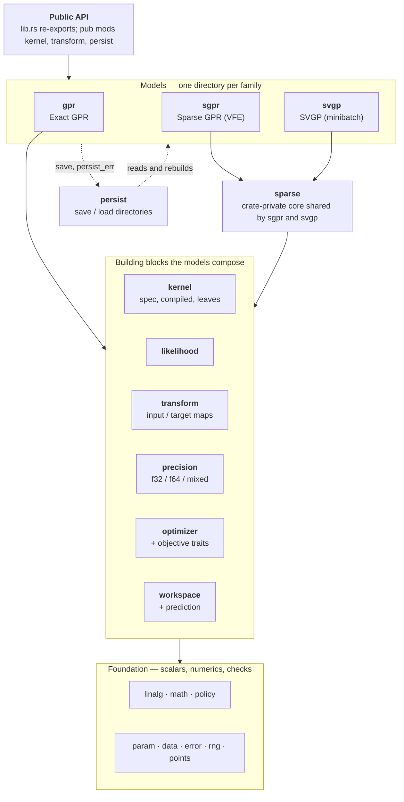

English | [日本語](README.ja.md)

# gprx

Exact Gaussian process regression in Rust. `Gpr` is the unfitted trainer. `Gpr::fit` consumes it, runs argmin L-BFGS on the negative log marginal likelihood, and returns `FittedGpr`. The crate is **not** published to crates.io (`publish = false` in `Cargo.toml`).

## Status

Local **0.1.0** quality: `Gpr` / `FittedGpr`, kernels, `fit` / `predict` / `predict_into` / leave-one-out, English rustdoc, and `examples/`. Depend on git or a path, not crates.io.

Design: [`docs/design.md`](docs/design.md). Architecture: [`docs/architecture.md`](docs/architecture.md). Saved format: [`docs/persist-format.md`](docs/persist-format.md). Tasks: [`docs/roadmap.md`](docs/roadmap.md). Agent rules: [`AGENTS.md`](AGENTS.md). Cross-library wall time and peak RSS: [`compare/perf/`](compare/perf/) (P2B-16 Exact `just perf`; P4-12 Sparse `just perf-sparse`; P4-14 Sparse online `just perf-sparse-online`; not criterion).

## Example

`X` is column-major (`n` points × `d` features: all rows of feature 0, then feature 1, …).

```rust
use gprx::kernel::{KernelSpec, RbfKernel};
use gprx::{GaussianLikelihood, Gpr};

fn main() -> Result<(), gprx::GprError> {
    let kernel = KernelSpec::from(RbfKernel::new(1.0)?);
    let likelihood = GaussianLikelihood::new(0.1)?;
    let gpr = Gpr::new(kernel, likelihood);
    let fitted = gpr.fit(&[0.0, 1.0], 2, 1, &[0.0, 1.0])?;
    let pred = fitted.predict(&[0.5], 1, 1)?;
    println!("mean = {}, variance = {}", pred.mean[0], pred.variance[0]);
    Ok(())
}
```

Same program: `cargo run --example fit_predict`. `?` on `fit` drops the trainer (`From<(Gpr, GprError)> for GprError`). Use `.map_err(|(_, e)| e)` when you want only the error, or match `Err((gpr, err))` to retry with the same trainer.

Default `predict` variance is observation (`latent + σn²`). Use `predict_with` and `VarianceKind::Latent` for the latent function. After fit, `loo_predict` is the GPML leave-one-out at every training point. `predict` allocates query buffers; `predict_into` reuses them after a warmup call. `FittedGpr::refit` re-factors or re-optimizes on the stored training data.

Transforms default to identity. Call `with_target_transform(StandardizeTarget::new())` before `fit` when the mean function is zero. Features can use `MinMaxInput` (default `[0, 1]`). Observation noise lives in `GaussianLikelihood`. `WhiteKernel` is opt-in composition; using both at large values double-counts noise.

`Gpr<Fixed>::factor` (after `with_optimizer(Fixed)`) factors at the kernel and likelihood `θ` already on the trainer. L-BFGS knobs live on `Lbfgs` (`with_max_iterations`, `with_tolerance`, `with_history_size`, `with_restarts`). Nelder–Mead has `with_max_iterations`, `with_tolerance`, and `with_restarts` (`NelderMead`). The Hessian solver is `TrustRegion` (`with_max_iterations`, `with_tolerance`, `with_restarts`, `with_radii`). Homemade Fast Simulated Annealing is `FastSimulatedAnnealing` (`with_max_iterations`, `with_restarts`, `with_initial_temperature`, `with_cooling_rate`, `with_seed`, `with_boundary`).

## Architecture and the saved format

Three model families (`Gpr`, `Sgpr`, `Svgp`) are built from the same blocks and never import one another. The map below is the whole crate; each box is a module under `src/`.



- [`docs/architecture.md`](docs/architecture.md): every module, what it is responsible for, which way its imports point, the public types by family, and where to change what.
- [`docs/persist-format.md`](docs/persist-format.md): what `save` writes. The keys of `config.json`, the tensors of `model.safetensors` (names, shapes, dtypes, column-major layout), the JSON form of kernels and transforms, `Custom` restore, versions, and errors.

## Comparison with other libraries

gprx against scikit-learn, GPyTorch, GPy, libgp and friedrich on the regression benchmarks Gaussian-process papers use (row B1-1, [#298](https://github.com/YUKIKEDA/gprx/issues/298)). Correctness first, then accuracy, then scale. This is a report, not a gate: a cell where another library wins stays in the table.

| tier | data | what it shows | gprx model |
| --- | --- | --- | --- |
| T0 | Snelson 1-D (200 points), Mauna Loa CO₂ | the fit, by eye | `Gpr` |
| T1 | UCI, Hernández-Lobato & Adams splits (20 each; Boston left out): yacht, energy, concrete, wine (red), power plant, kin8nm, naval | accuracy and calibrated uncertainty | `Gpr` |
| T2 | Kin40k, Protein (5 splits) | mid-size scale | `Gpr` where `K` fits in memory, `Sgpr` / `Svgp` |
| T3 | 3DRoad, Song, Buzz, HouseElectric (`treforevans/uci_datasets`, 10 splits of 90 / 10) | large scale | `Sgpr` / `Svgp` |

Every model is an ARD RBF kernel with a Gaussian likelihood, inputs and targets standardized with the training statistics, and the same start (ℓ = 1, signal variance 1, noise variance 0.1). Metrics are RMSE, NLPD and the 95% interval coverage, in the original units of `y`, as mean ± standard error over the splits. Before any comparison, `just perf-real-check` fits nothing and evaluates every library at one fixed θ: NLML, RMSE and NLPD agree to 1e-6, so a difference in a fitted result is a difference in the optimizer, not in the objective. The same check for the sparse model (`just perf-real-check yacht 0 sgpr`) finds the collapsed bound equal in gprx, GPyTorch and GPy; GPyTorch predicts with its own low-rank test covariance, so its RMSE and NLPD differ by a fraction of a percent from the other two at the same θ and Z.

### Optimizers matter

Run time depends on the optimizer as much as on the library, so every cell says which one ran and how many joint likelihood-and-gradient evaluations it used. Two protocols:

- **native**: each library's own default optimizer, as shipped.
- **matched**: the same scipy L-BFGS-B settings (100 iterations, gradient tolerance √ε, history 10) around each library's own objective and gradient; gprx's argmin L-BFGS already has these defaults. It is the same *algorithm*, not the same *implementation* (gprx runs argmin's L-BFGS with a More–Thuente line search). libgp offers only Rprop, so its matched cell is N/A. SVGP has no default Adam setting that suits n in the hundreds of thousands, so it runs one shared setting (Adam, learning rate 0.01, batch 1024, 3 epochs) in every library.

A wall-time difference between cells with different evaluation counts is not a speed difference. Peak RSS is the peak of the process tree; the time line of the resident set is in the figure below.

### Interface

The same regression in each library: ARD RBF, learn the hyperparameters, predict the mean and the observation variance, score the NLPD. Runnable files: [`compare/perf/real/snippets/`](compare/perf/real/snippets/).

<!-- snippets:begin -->
<details><summary>gprx</summary>

```rust
let kernel = KernelSpec::from(ConstantKernel::new(1.0)?)
    * KernelSpec::from(RbfArdKernel::new(&vec![1.0; d])?);
let fitted = Gpr::new(kernel, GaussianLikelihood::new(0.1)?)
    .fit(&x, n, d, &y) // L-BFGS on the negative log marginal likelihood
    .map_err(|(_, e)| e)?;
let pred = fitted.predict(&xs, m, d)?; // variance includes the noise
let nlpd = (0..m)
    .map(|i| {
        let (v, e) = (pred.variance[i], ys[i] - pred.mean[i]);
        0.5 * (2.0 * std::f64::consts::PI * v).ln() + 0.5 * e * e / v
    })
    .sum::<f64>()
    / m as f64;
```

</details>

<details><summary>scikit-learn</summary>

```python
kernel = ConstantKernel(1.0) * RBF([1.0] * d) + WhiteKernel(0.1)
gp = GaussianProcessRegressor(kernel).fit(x, y)
mean, std = gp.predict(xs, return_std=True)  # std includes the noise
nlpd = np.mean(0.5 * np.log(2 * np.pi * std**2) + 0.5 * (ys - mean) ** 2 / std**2)
```

</details>

<details><summary>GPyTorch</summary>

```python
class ExactGP(gpytorch.models.ExactGP):
    def __init__(self, x, y, likelihood):
        super().__init__(x, y, likelihood)
        self.mean_module = gpytorch.means.ZeroMean()
        self.covar_module = gpytorch.kernels.ScaleKernel(gpytorch.kernels.RBFKernel(ard_num_dims=d))

    def forward(self, x):
        return gpytorch.distributions.MultivariateNormal(self.mean_module(x), self.covar_module(x))


likelihood = gpytorch.likelihoods.GaussianLikelihood().double()
model = ExactGP(x, y, likelihood).double()
model.train(); likelihood.train()
mll = gpytorch.mlls.ExactMarginalLogLikelihood(likelihood, model)
optimizer = torch.optim.Adam(model.parameters(), lr=0.1)  # there is no default optimizer
for _ in range(50):
    optimizer.zero_grad()
    loss = -mll(model(x), y)
    loss.backward()
    optimizer.step()
model.eval(); likelihood.eval()
with torch.no_grad():
    pred = likelihood(model(xs))  # the observation distribution
    mean, var = pred.mean, pred.variance
nlpd = torch.mean(0.5 * torch.log(2 * torch.pi * var) + 0.5 * (ys - mean) ** 2 / var)
```

</details>

<details><summary>GPy</summary>

```python
kernel = GPy.kern.RBF(d, variance=1.0, lengthscale=[1.0] * d, ARD=True)
model = GPy.models.GPRegression(x, y[:, None], kernel)
model.Gaussian_noise.variance = 0.1
model.optimize()
mean, var = model.predict(xs)  # includes the noise
nlpd = np.mean(0.5 * np.log(2 * np.pi * var) + 0.5 * (ys[:, None] - mean) ** 2 / var)
```

</details>

<details><summary>libgp</summary>

```cpp
libgp::GaussianProcess gp(d, "CovSum ( CovSEard, CovNoise)");
Eigen::VectorXd loghyper(d + 2);  // log ell (d of them), log sf, log sn
loghyper << 0.0, 0.0, 0.0, 0.0, std::log(std::sqrt(0.1));
gp.covf().set_loghyper(loghyper);
for (int i = 0; i < n; ++i) {  // add_patterns(x, y) would read strided rows
    std::vector<double> row(d);
    for (int j = 0; j < d; ++j) row[j] = x(i, j);
    gp.add_pattern(row.data(), y(i));
}
libgp::RProp rprop;  // libgp's optimizer: resilient backpropagation
rprop.init();
rprop.maximize(&gp, 100, false);
const Eigen::MatrixXd pred = gp.predict(xs, true);  // mean, latent variance
const double noise = std::exp(2.0 * gp.covf().get_loghyper()(d + 1));
double nlpd = 0.0;
for (int i = 0; i < m; ++i) {
    const double v = pred(i, 1) + noise, e = ys(i) - pred(i, 0);
    nlpd += 0.5 * std::log(2.0 * M_PI * v) + 0.5 * e * e / v;
}
nlpd /= m;
```

</details>
<!-- snippets:end -->

Two library details the harness had to work around: libgp's `predict` variance leaves out the noise, and its bulk `add_patterns(x, y)` reads rows of a column-major matrix with a stride, which is only correct when d = 1.

### Features

`✓` means found in the listed version's source or documentation; `—` means not found there (it says nothing about extensions). Versions: scikit-learn 1.6.1, GPyTorch 1.15.2, GPy 1.14.2, libgp `f4a2fb7`, friedrich 0.6.0.

| | gprx | scikit-learn | GPyTorch | GPy | libgp | friedrich |
| --- | --- | --- | --- | --- | --- | --- |
| language | Rust | Python | Python (PyTorch) | Python | C++ (Eigen) | Rust |
| ARD RBF kernel | ✓ | ✓ | ✓ | ✓ | ✓ | — |
| kernel sum / product | ✓ | ✓ | ✓ | ✓ | ✓ | ✓ |
| sparse GP with inducing points | ✓ `Sgpr` | — | ✓ `InducingPointKernel` | ✓ `SparseGPRegression` | — | — |
| SVGP with minibatches | ✓ `Svgp` (Adam) | — | ✓ | class only, no minibatch loop | — | — |
| add training points without a full refit | ✓ `OnlineGpr` | — | ✓ `get_fantasy_model` | — | ✓ `add_pattern` | ✓ `add_samples` |
| delete training points | ✓ `OnlineGpr` | — | — | — | — | — |
| posterior samples | ✓ `sample` | ✓ `sample_y` | ✓ | ✓ `posterior_samples` | — | ✓ `sample_at` |
| f32 / mixed precision | ✓ | — | ✓ | — | — | — |
| save and load a fitted model | ✓ | ✓ pickle / joblib | ✓ `state_dict` | ✓ `save_model` | ✓ `write` | ✓ serde |
| swap the optimizer | ✓ `Optimizer` | ✓ callable | ✓ any torch optimizer | ✓ `optimizer=` | ✓ `RProp` / `CG` | — |

### Results

<!-- bench:begin -->
Not measured yet on the reference machine: the tables and figures below are generated by `just perf-real-report` from one measurement run and written between these markers.
<!-- bench:end -->

### Reproduce

```text
just perf-real-data                                            # fetch the data, pin the checksums
just perf-real-check                                           # fixed-θ agreement of every library
just perf-real --datasets yacht,energy,concrete --protocol native
just perf-real --datasets yacht,energy,concrete --protocol matched
just perf-real --datasets kin40k --model sgpr --protocol matched
just perf-real-report                                          # summary.json, figures, and this section
```

`--timeline` also records the resident set of the process tree every 10 ms. The raw output stays in `compare/perf/out/real/` (not committed); `docs/bench/summary.json` keeps the per-cell statistics, the machine, the library versions and the optimizer settings. Details: [`compare/perf/README.md`](compare/perf/README.md).

## License

Licensed under either of

- Apache License, Version 2.0 ([LICENSE-APACHE](LICENSE-APACHE))
- MIT license ([LICENSE-MIT](LICENSE-MIT))

at your option.
