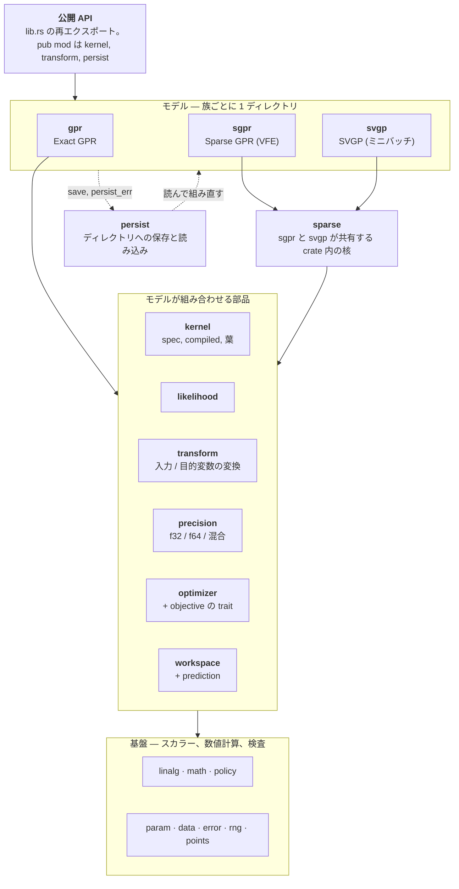
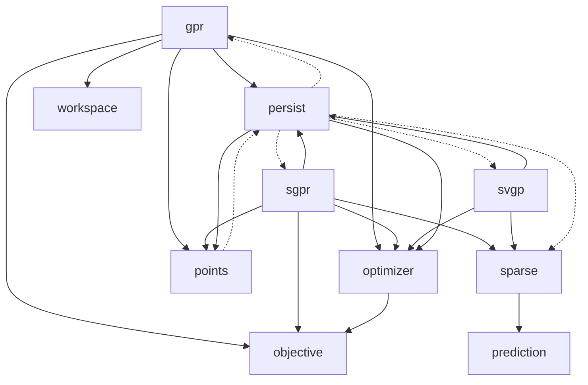
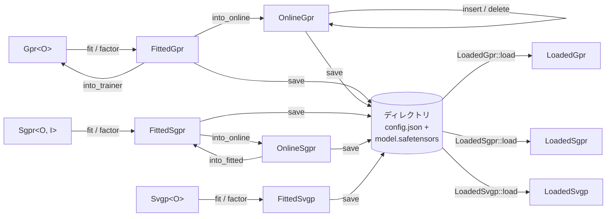

[English](architecture.md) | 日本語

# gprx のアーキテクチャ

クレートの地図。どのモジュール（ドメイン）があり、それぞれが何に責任を持ち、依存がどちら向きかを示す。各部品の意味と挙動は [design.ja.md](design.ja.md)。ファイルの置き場所は [conventions.md](conventions.md)。決定の理由は [adr/](adr/)。保存フォーマットは [persist-format.ja.md](persist-format.ja.md)。

以下の import の矢印は、`src/` の `use crate::…`（`#[cfg(test)]` のコードを除く）から取り、この文書とスクリプトで突き合わせている（Issue [#310](https://github.com/YUKIKEDA/gprx/issues/310)）。モジュールの import が増減したら、この文書も一緒に直す。

## 1. 全体像

3 つのモデル族が、共通の部品の集まりを使う。各族には、学習前（trainer）、学習後（fitted）、あるものにはオンライン版がある。モデル同士は import しない。共有するものは、その下の層に置く。

実線は、層の向きに沿った import。破線は、層を両方向にまたぐ唯一の箇所で、`persist` がモデルを作り、モデルが保存のために `persist` を呼ぶ。何がまたぐかは 4 節に書く。

## 2. モジュールと責務

「公開」は `src/lib.rs` が出すもの（`pub mod` または `pub use`）。「crate」は crate 内だけ。「Imports」は、テスト以外で使う、ほかのトップレベルのモジュール。

### 基盤

| Module | 責務 | 公開 / 主な型 | Imports |
| --- | --- | --- | --- |
| `error` | 唯一のエラー型と、Cholesky の段の印 | 公開: `GprError`, `CholeskyStage` | `param` |
| `param` | 区間つきの正のパラメータと、平らな `θ` の書き込み補助 | 公開: `Interval`, `BoundedParam`, `IntervalError` | `data`, `error`, `kernel`, `likelihood` |
| `data` | 呼び出し側のデータの境界検査（形、有限、個数）と列優先の詰め込み | crate | `error`, `kernel` |
| `rng` | サンプリングと焼きなましのための、種つきの小さな乱数 | crate: `SmallRng` | none |
| `math` | カーネルの `exp` の実装（厳密 / 高速近似）。`KernelExp` の方針で選ぶ | 公開: `Accurate`, `FastApprox`, `KernelMath` | `kernel` |
| `linalg` | Cholesky、LDLT、三角解、密行列の補助、faer のワーカー数の上限。モデルは自前で持たない | crate | `error`, `kernel` |
| `policy` | 実行時の方針: 距離キャッシュ、Cholesky のバッファ、カーネルの `exp`、ジッター | 公開: `DistanceCachePolicy`, `CholeskyBuffer`, `KernelExp`, `JitterPolicy`, `FixedJitter`, `AdaptiveJitter` | `error`, `math` |
| `points` | 追加・削除される点の安定した id | 公開: `PointId`。crate: `IdRegistry` | `error`, `persist` |

### 部品

| Module | 責務 | 公開 / 主な型 | Imports |
| --- | --- | --- | --- |
| `kernel` | カーネルの言語: 組み込みの葉と `Custom` の木 `KernelSpec` を、静的ディスパッチの `CompiledKernel<T>` に平らにする。値、勾配、Hessian、座標微分。スカラーの trait `KernelScalar` | pub mod。`KernelSpec`, `CompiledKernel`, 葉（`RbfKernel`, `MaternKernel`, `PeriodicKernel`, …）, `KernelTerm`, `CustomKernel`, `KernelScalar` | `data`, `error`, `linalg`, `math`, `param` |
| `likelihood` | ガウスの観測ノイズ `σn²`。ジッターとは別の、独立したパラメータ | 公開: `GaussianLikelihood` | `data`, `error`, `param` |
| `transform` | 入力の変換（identity、standardize、min-max、列ごと、pipeline）と目的変数の変換。それぞれ学習前と学習後の型を持つ。予測で平均と分散を戻す | pub mod: `Transform`, `UnfittedTransform`, `TargetTransform`, `UnfittedTarget`, `MinMaxInput`, `StandardizeTarget`, `Pipeline`, … | `data`, `error` |
| `precision` | 格納と予測のスカラーを 1 つの方針にまとめる。混合精度の反復改善 | 公開: `PrecisionPolicy`, `DoublePrecision`, `SinglePrecision`, `MixedPrecision`, `PromoteStorage`, `ReevaluateKernel` | `error`, `kernel`, `linalg`, `math`, `policy`, `transform` |
| `workspace` | 使い回すバッファ: Gram、`W`、距離キャッシュ、`exp` のバッファ、faer の scratch。クエリごとのバッファ | crate: `WorkspaceCore`, `FitBuffers`, `QueryWorkspace` | `error`, `kernel`, `linalg`, `policy`, `precision` |
| `prediction` | 予測が返すものと、共分散からの事後標本の生成 | 公開: `Prediction`, `PredictiveCovariance`, `PredictOptions`, `VarianceKind` | `error`, `kernel`, `linalg`, `policy`, `rng` |
| `objective` | モデルの学習の目的関数が実装する trait。ソルバーがモデルを知らなくて済む | 公開: `Objective`, `Differentiable`, `TwiceDifferentiable`, `IncrementalObjective` | `error`, `param` |
| `optimizer` | その trait の上のソルバー: argmin のアダプタ、自前の焼きなまし、`Fixed` の印。SVGP 用の Adam（`Optimizer` ではない） | 公開: `Optimizer`, `Lbfgs`, `NelderMead`, `TrustRegion`, `FastSimulatedAnnealing`, `Fixed`, `Adam`, `OptResult`, `BoundaryPolicy` | `error`, `objective`, `param`, `rng` |

### モデル

| Module | 責務 | 公開 / 主な型 | Imports |
| --- | --- | --- | --- |
| `gpr` | Exact GPR: `K + σn²I` の分解、fit / refit のための NLML とその微分、予測、共分散、標本、leave-one-out、LDLT の因子の上のオンライン insert / delete | 公開: `Gpr`, `FittedGpr`, `OnlineGpr` | `data`, `error`, `kernel`, `likelihood`, `linalg`, `math`, `objective`, `optimizer`, `param`, `persist`, `points`, `policy`, `precision`, `transform`, `workspace` |
| `sparse` | `sgpr` と `svgp` が共有するもの: trainer の設定、学習データ、`Z`、カーネルと尤度にまたがる `θ` | crate: `SparseSpec`, `SparseCore` | `data`, `error`, `kernel`, `likelihood`, `linalg`, `math`, `param`, `policy`, `precision`, `prediction`, `transform` |
| `sgpr` | collapsed VFE の下界を使う Sparse GPR: 固定または自由な誘導点 `Z`、rank-1 のオンライン更新、点と誘導点の insert / delete、予測、共分散、標本、leave-one-out | 公開: `Sgpr`, `FittedSgpr`, `OnlineSgpr`, `FixedInducing`, `FreeInducing`, `InducingId` | `data`, `error`, `kernel`, `likelihood`, `linalg`, `math`, `objective`, `optimizer`, `param`, `persist`, `points`, `policy`, `precision`, `sparse`, `transform` |
| `svgp` | SVGP: whitened な `q(u)`、ELBO、1 ステップの費用が `n` に依らないミニバッチ Adam、予測、共分散、標本 | 公開: `Svgp`, `FittedSvgp` | `data`, `error`, `kernel`, `likelihood`, `linalg`, `math`, `optimizer`, `param`, `persist`, `policy`, `precision`, `rng`, `sparse`, `transform` |
| `persist` | モデル 1 つにつき 1 ディレクトリ: `config.json` と `model.safetensors`。`Custom` のカーネルと呼び出し側の変換の復元表 | pub mod: `LoadedGpr`, `LoadedSgpr`, `LoadedSvgp`, `PersistRegistry`, `FORMAT_VERSION` | `error`, `gpr`, `kernel`, `optimizer`, `param`, `points`, `policy`, `precision`, `sgpr`, `sparse`, `svgp`, `transform` |
| `internals` | ベンチマークと `compare/perf` のためのフック。`bench-internals` または `insert-stages` の feature のときだけ | pub mod、feature つき | `gpr`, `kernel`, `objective` |

## 3. 部品とモデルの間の依存

どのモジュールも基盤（`error`, `param`, `data`, `linalg`, `math`, `policy`, `rng`）を使い、多くは 4 つの部品 `kernel`, `likelihood`, `transform`, `precision` も使う。これらの矢印は図全体を横切るので、図からは外し、図の下の表に書いた。各モジュールのすべての import は 2 節にある。破線は、層をまたぐ呼び出しで、4 節で説明する。

広く使われる 4 つの部品を、import するモジュール（図から外した矢印）:

| 部品 | import するモジュール |
| --- | --- |
| `kernel` | `data`, `gpr`, `internals`, `linalg`, `math`, `param`, `persist`, `precision`, `prediction`, `sgpr`, `sparse`, `svgp`, `workspace` |
| `likelihood` | `gpr`, `param`, `sgpr`, `sparse`, `svgp` |
| `transform` | `gpr`, `persist`, `precision`, `sgpr`, `sparse`, `svgp` |
| `precision` | `gpr`, `persist`, `sgpr`, `sparse`, `svgp`, `workspace` |

図から読めること:

- **`optimizer` と `objective` はモデルを知らない。** ソルバーは `Objective` / `Differentiable` / `TwiceDifferentiable` の上に書かれ、各モデルが自分のアダプタ（`GprObjective`, `SgprObjective`）でそれを実装する。利用者の `Optimizer` も同じ枠に入る。
- **`sgpr` と `svgp` は `sparse` でだけ出会う。** `gpr` は `sparse` を使わない。
- **`precision` と `transform` はモデルを知らない。** モデルは、`f64` の参照値をクロージャで precision のコードに渡す。
- **`kernel` が最も幅の広い部品。** 全モデルと `workspace` が使い、`persist` がその木を符号化する。

## 4. 境界と、その例外

この commit で守られているもの（`#[cfg(test)]` 以外の `use crate::…`）:

1. **モデル同士は import しない。** `gpr`, `sgpr`, `svgp` の間に import は無い。共有するコードは 1 つ下の層に置く（2 つの Sparse 族には `sparse`、3 族すべてには部品）。
2. **モデルを import するのは `persist` だけ。** `persist/mod.rs`（Exact）と `persist/sparse.rs`（Sparse、SVGP）にある。具体的なモデルの型をすべて名指しする唯一の場所で、だから `LoadedGpr` / `LoadedSgpr` / `LoadedSvgp` が精度ごとに 1 つの variant を持てる。
3. **逆向きにまたぐものは少ない。** モデルは `persist::save_*` を呼び、`gpr` はさらに `PersistedModel`（読み込んだ Exact モデルを組み直す部品）と `MappedTensors`（メモリマップした `L`）を使う。`gpr`、`sgpr`、`points` は、エラーを作るのに `persist_err` を使う。`persist` のそれ以外を、モデルは使わない。
4. **`optimizer`、`objective`、`precision`、`transform` はモデルを import しない。** `optimizer` の単体テストは `Gpr` を作るが、テストのコードだけ。
5. **`Workspace`、`QueryWorkspace`、`LltStore`、`LdltStore`、faer の型は crate 内だけ**（[layout の規則](../.cursor/rules/layout.mdc)）。

きれいな層になっていないところ。そのままにしている:

- **基盤は互いを輪のように参照している。** `kernel/scalar.rs` が `f32` / `f64` のスカラー trait `KernelScalar` を定義し、`data`、`math`、`linalg` はそれについてジェネリックで、`kernel` はその 3 つを使う。`param` は `KernelSpec` と `GaussianLikelihood` の平らな `θ` を書くので両方を import し、`likelihood` は範囲のために `param` を import し返す。`error` は `param` の `IntervalError` を包む。これらは型と補助関数の参照で、実行時の呼び出しの循環ではない。
- **`persist` とモデルは互いを参照している**（上の 2 と 3）。

## 5. 族ごとの公開型

3 族は同じ typestate に従う。trainer、`fit`（または `factor`）、fitted の値。fitted の値は、最適化器の状態も `W` も持たない。学習と推論は別の型（[design §6](design.ja.md#6-gpmodel抽象化厳密疎の差し替え)）。

| 族 | Trainer | Fitted | Online | ディスクから読んだもの |
| --- | --- | --- | --- | --- |
| Exact | `Gpr<O, P>` | `FittedGpr<O, P>` | `OnlineGpr<O, P>`（`insert`, `delete`） | `LoadedGpr`（8 variant） |
| Sparse (VFE) | `Sgpr<O, I, P>` | `FittedSgpr<O, I, P>` | `OnlineSgpr<O, P>`（`insert`, `delete`, `insert_inducing`, `delete_inducing`） | `LoadedSgpr`（8 variant） |
| SVGP | `Svgp<O, P>` | `FittedSvgp
` | なし | `LoadedSvgp`（4 variant） |

型パラメータ:

| パラメータ | 意味 | 値 |
| --- | --- | --- |
| `O` | 最適化器の枠 | `Lbfgs`（Exact と Sparse の既定）, `NelderMead`, `TrustRegion`, `FastSimulatedAnnealing`, 利用者の `Optimizer`。`factor` だけなら `Fixed`。`Svgp::fit` は `Adam`（`Svgp` の既定は `Fixed`） |
| `P` | 精度。コンパイル時の選択 | `DoublePrecision`（既定）, `SinglePrecision`, `MixedPrecision`（残差は `PromoteStorage` か `ReevaluateKernel`） |
| `I` | 誘導点 `Z` の置き場 | `FixedInducing`（既定。`Z` はパラメータに入らない）, `FreeInducing`（`Z` を `θ` と一緒に最適化する） |

## 6. モデルの状態の移り方

読み込んだモデルは予測できる状態で、`Fixed` を持つので、探索は保存しない。もう一度学習するには、型のついたモデルで `with_optimizer` を呼んでから `refit` する。各 `save` が書くものは [persist-format.ja.md](persist-format.ja.md)。

1 回の呼び出しの中の順序は決まっている: 入力の変換 → 目的変数の変換 → `θ` でのカーネルと尤度 → 分解 → `α` → 予測。学習済みのモデルは、渡された `X` と `y`（変換前）を、学習済みの変換と一緒に持ち、クエリのたびにその変換をかけ直す（[design §2](design.ja.md#2-全体アーキテクチャ概要)、[§5.5](design.ja.md#55-前処理パイプライン)）。

## 7. 何を変えるとき、どこを見るか

| 変えたいもの | 見る場所 | 一緒に触るもの |
| --- | --- | --- |
| カーネルの葉 | `kernel/<leaf>.rs` と `kernel/compiled/` | `kernel/spec.rs`、`persist/kernel.rs`（新しい JSON のタグ）、design §5 |
| 全モデルの最適化器 | `optimizer/` | モデルには触らない。新しい能力の trait が要るときだけ `objective.rs` |
| Exact だけがすること（オンライン LDLT、`Gpr` の LOO） | `gpr/` | 因子は `linalg/ldlt.rs` |
| 2 つの Sparse 族が共通にすること | `sparse/` | `sgpr/` と `svgp/` が呼ぶ |
| 精度の規則 | `precision/` | クロージャを渡すモデルの `factor/` |
| 保存の配置 | `persist/` | [persist-format.ja.md](persist-format.ja.md)。古いファイルを読み誤りうるなら `FORMAT_VERSION` |
| 新しいモデル族 | `gpr/` の隣の新しいディレクトリ | `persist/` に `Loaded*` を 1 つ。ほかのモデルを import してはいけない |
