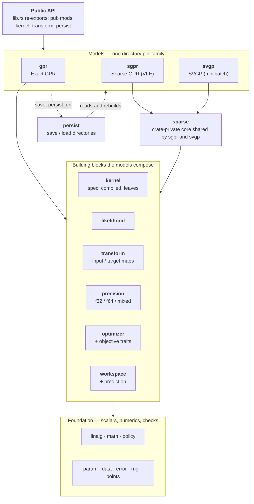
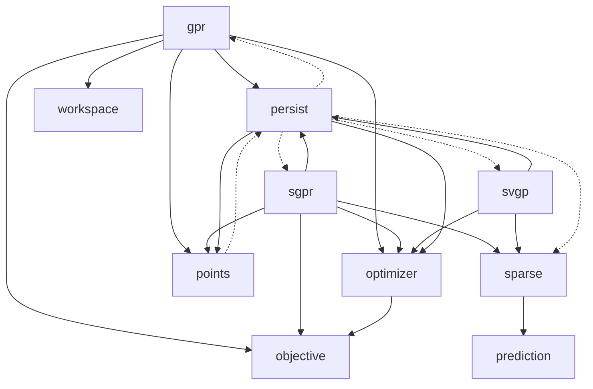
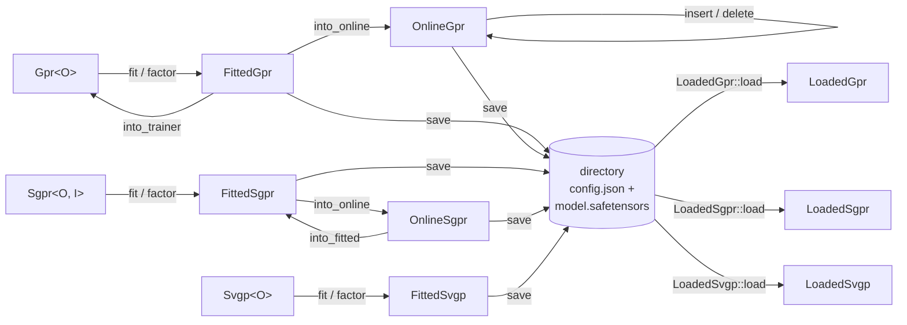

English | [日本語](architecture.ja.md)

# gprx architecture

The map of the crate: which modules (domains) exist, what each one is responsible for, and which way the dependencies point. Meaning and behavior of each piece is in [design.md](design.md). Where files live is in [conventions.md](conventions.md). Why a decision was made is in [adr/](adr/). The on-disk format is in [persist-format.md](persist-format.md).

The import arrows below are read from `use crate::…` in `src/`, outside `#[cfg(test)]` code, and are checked by script against this file (Issue [#310](https://github.com/YUKIKEDA/gprx/issues/310)). When a module gains or loses an import, this file changes with it.

## 1. At a glance

Three model families share one set of building blocks. Each family has a trainer (unfitted), a fitted type, and, where it exists, an online type. The models never import one another. Everything they share lives in the layers below them.

Solid arrows are imports that follow the layering. Dashed arrows are the one place it is crossed both ways: `persist` builds models, and models call `persist` to save. Section 4 says exactly what crosses.

## 2. Modules and their responsibilities

"Public" is what `src/lib.rs` exports (a `pub mod`, or a `pub use`). "Crate" is crate-private. "Imports" lists the other top-level modules a module uses outside tests.

### Foundation

| Module | Responsibility | Visibility / main types | Imports |
| --- | --- | --- | --- |
| `error` | The one error type and the Cholesky stage tag | Public: `GprError`, `CholeskyStage` | `param` |
| `param` | A positive parameter with an interval; the flat `θ` write helper | Public: `Interval`, `BoundedParam`, `IntervalError` | `data`, `error`, `kernel`, `likelihood` |
| `data` | Boundary checks (shape, finite, counts) and column-major packing for caller data | Crate | `error`, `kernel` |
| `rng` | A small seeded generator for sampling and annealing | Crate: `SeededRng` (Xoshiro256++) | none |
| `math` | Kernel `exp` implementations (accurate or fast approximate), selected by the `KernelExp` policy | Public: `Accurate`, `FastApprox`, `KernelMath` | `kernel` |
| `linalg` | Cholesky, LDLT, triangular solves, dense helpers, faer worker caps. Models do not define these | Crate | `error`, `kernel` |
| `policy` | Runtime policies: distance cache, Cholesky buffer, kernel `exp`, jitter | Public: `DistanceCachePolicy`, `CholeskyBuffer`, `KernelExp`, `JitterPolicy`, `FixedJitter`, `AdaptiveJitter` | `error`, `math` |
| `points` | Stable ids for inserted and deleted points | Public: `PointId`. Crate: `IdRegistry` | `error`, `persist` |

### Building blocks

| Module | Responsibility | Visibility / main types | Imports |
| --- | --- | --- | --- |
| `kernel` | The kernel language: a `KernelSpec` tree of built-in leaves and `Custom`, flattened into a `CompiledKernel<T>` with static dispatch; value, gradient, Hessian, and coordinate derivatives; the scalar trait `KernelScalar` | Public mod. `KernelSpec`, `CompiledKernel`, the leaves (`RbfKernel`, `MaternKernel`, `PeriodicKernel`, …), `KernelTerm`, `CustomKernel`, `KernelScalar` | `data`, `error`, `linalg`, `math`, `param` |
| `likelihood` | Gaussian observation noise `σn²` as a parameter of its own (not jitter) | Public: `GaussianLikelihood` | `data`, `error`, `param` |
| `transform` | Input maps (identity, standardize, min-max, per column, pipeline) and target maps, each as an unfitted and a fitted type; inverts mean and variance at predict | Public mod: `Transform`, `UnfittedTransform`, `TargetTransform`, `UnfittedTarget`, `MinMaxInput`, `StandardizeTarget`, `Pipeline`, … | `data`, `error` |
| `precision` | Storage and predict scalars as one policy; mixed-precision refinement | Public: `PrecisionPolicy`, `DoublePrecision`, `SinglePrecision`, `MixedPrecision`, `PromoteStorage`, `ReevaluateKernel` | `error`, `kernel`, `linalg`, `math`, `policy`, `transform` |
| `workspace` | Reusable buffers: Gram, `W`, distance cache, `exp` buffer, faer scratch; the per-query buffers | Crate: `WorkspaceCore`, `FitBuffers`, `QueryWorkspace` | `error`, `kernel`, `linalg`, `policy`, `precision` |
| `prediction` | What a predict call returns, and drawing posterior samples from a covariance | Public: `Prediction`, `PredictiveCovariance`, `PredictOptions`, `VarianceKind` | `error`, `kernel`, `linalg`, `policy`, `rng` |
| `objective` | The traits a model's fit objective implements, so a solver needs no model | Public: `Objective`, `Differentiable`, `TwiceDifferentiable`, `IncrementalObjective` | `error`, `param` |
| `optimizer` | Solvers over those traits: argmin adapters, the homemade annealing, and the `Fixed` marker; Adam for SVGP (not an `Optimizer`) | Public: `Optimizer`, `Lbfgs`, `NelderMead`, `TrustRegion`, `FastSimulatedAnnealing`, `Fixed`, `Adam`, `OptResult`, `BoundaryPolicy` | `error`, `objective`, `param`, `rng` |

### Models

| Module | Responsibility | Visibility / main types | Imports |
| --- | --- | --- | --- |
| `gpr` | Exact GPR: factor `K + σn²I`, the NLML and its derivatives for fit / refit, predict, covariance, samples, leave-one-out, and online insert / delete on an LDLT factor | Public: `Gpr`, `FittedGpr`, `OnlineGpr` | `data`, `error`, `kernel`, `likelihood`, `linalg`, `math`, `objective`, `optimizer`, `param`, `persist`, `points`, `policy`, `precision`, `transform`, `workspace` |
| `sparse` | What `sgpr` and `svgp` share: the trainer settings, the training data, `Z`, and `θ` over kernel and likelihood | Crate: `SparseSpec`, `SparseCore` | `data`, `error`, `kernel`, `likelihood`, `linalg`, `math`, `param`, `policy`, `precision`, `prediction`, `transform` |
| `sgpr` | Sparse GPR with the collapsed VFE bound: fixed or free inducing points `Z`, rank-1 online updates, insert / delete of points and of inducing points, predict, covariance, samples, leave-one-out | Public: `Sgpr`, `FittedSgpr`, `OnlineSgpr`, `FixedInducing`, `FreeInducing`, `InducingId` | `data`, `error`, `kernel`, `likelihood`, `linalg`, `math`, `objective`, `optimizer`, `param`, `persist`, `points`, `policy`, `precision`, `sparse`, `transform` |
| `svgp` | SVGP: whitened `q(u)`, the ELBO, minibatch Adam whose step cost does not grow with `n`, predict, covariance, samples | Public: `Svgp`, `FittedSvgp` | `data`, `error`, `kernel`, `likelihood`, `linalg`, `math`, `optimizer`, `param`, `persist`, `policy`, `precision`, `rng`, `sparse`, `transform` |
| `persist` | One directory per model: `config.json` and `model.safetensors`; the restore table for `Custom` kernels and caller transforms | Public mod: `LoadedGpr`, `LoadedSgpr`, `LoadedSvgp`, `PersistRegistry`, `FORMAT_VERSION` | `error`, `gpr`, `kernel`, `optimizer`, `param`, `points`, `policy`, `precision`, `sgpr`, `sparse`, `svgp`, `transform` |
| `internals` | Hooks for benchmarks and `compare/perf`. Exists only with the `bench-internals` or `insert-stages` feature | Public mod, feature-gated | `gpr`, `kernel`, `objective` |

## 3. Dependencies among the building blocks and models

Every module also uses the foundation (`error`, `param`, `data`, `linalg`, `math`, `policy`, `rng`), and most use four of the building blocks: `kernel`, `likelihood`, `transform`, `precision`. Those arrows would cross the whole picture, so they are left out of it and listed in the table below the picture. Section 2 lists every import of every module. A dashed arrow is a call across the layering, explained in section 4.

Who imports the four widely used blocks (the arrows left out of the picture):

| Block | Imported by |
| --- | --- |
| `kernel` | `data`, `gpr`, `internals`, `linalg`, `math`, `param`, `persist`, `precision`, `prediction`, `sgpr`, `sparse`, `svgp`, `workspace` |
| `likelihood` | `gpr`, `param`, `sgpr`, `sparse`, `svgp` |
| `transform` | `gpr`, `persist`, `precision`, `sgpr`, `sparse`, `svgp` |
| `precision` | `gpr`, `persist`, `sgpr`, `sparse`, `svgp`, `workspace` |

What the picture shows:

- **`optimizer` and `objective` know no model.** A solver is written over `Objective` / `Differentiable` / `TwiceDifferentiable`; each model has its own adapter (`GprObjective`, `SgprObjective`) that implements them. A user `Optimizer` uses the same slot.
- **`sgpr` and `svgp` meet only in `sparse`.** `gpr` does not use `sparse`.
- **`precision` and `transform` know no model.** A model passes its `f64` reference to precision code as a closure.
- **`kernel` is the widest block.** Every model and `workspace` use it, and `persist` encodes its tree.

## 4. Boundaries and their exceptions

Held at this commit (`use crate::…` outside `#[cfg(test)]`):

1. **Models do not import one another.** `gpr`, `sgpr`, and `svgp` have no import among them. Shared code goes down a layer (`sparse` for the two sparse families; the building blocks for all three).
2. **`persist` is the one module that imports models**, in `persist/mod.rs` (Exact) and `persist/sparse.rs` (Sparse, SVGP). It is the only place that names all the concrete model types, so `LoadedGpr` / `LoadedSgpr` / `LoadedSvgp` can hold one variant per precision.
3. **The crossing is narrow the other way.** Models call `persist::save_*`, and `gpr` also uses `PersistedModel` (the parts a loaded Exact model is rebuilt from) and `MappedTensors` (the memory-mapped `L`). `gpr`, `sgpr`, and `points` use `persist_err` to build the error. Nothing else of `persist` is used by a model.
4. **`optimizer`, `objective`, `precision`, and `transform` do not import a model.** The unit tests of `optimizer` build a `Gpr`; that is test code only.
5. **`Workspace`, `QueryWorkspace`, `LltStore`, `LdltStore`, and faer types are crate-private** ([layout rule](../.cursor/rules/layout.mdc)).

Not a clean layering, and left as it is:

- **The foundation refers to itself in a ring.** `kernel/scalar.rs` defines `KernelScalar`, the scalar trait for `f32` / `f64`, and `data`, `math`, and `linalg` are generic over it while `kernel` uses all three. `param` writes the flat `θ` for a `KernelSpec` and a `GaussianLikelihood`, so it imports both, and `likelihood` imports `param` back for its bounds. `error` wraps `IntervalError` from `param`. These are references between types and helpers, not calls at run time.
- **`persist` and the models refer to each other**, as in points 2 and 3.

## 5. Public types by family

The three families follow the same typestate: a trainer, `fit` (or `factor`), a fitted value. A fitted value has no optimizer state and no `W`. Training and inference are different types ([design §6](design.md#6-gp-model-swapping-exact-and-sparse)).

| Family | Trainer | Fitted | Online | Loaded from disk |
| --- | --- | --- | --- | --- |
| Exact | `Gpr<O, P>` | `FittedGpr<O, P>` | `OnlineGpr<O, P>` (`insert`, `delete`) | `LoadedGpr` (8 variants) |
| Sparse (VFE) | `Sgpr<O, I, P>` | `FittedSgpr<O, I, P>` | `OnlineSgpr<O, P>` (`insert`, `delete`, `insert_inducing`, `delete_inducing`) | `LoadedSgpr` (8 variants) |
| SVGP | `Svgp<O, P>` | `FittedSvgp
` | none | `LoadedSvgp` (4 variants) |

The type parameters:

| Parameter | Meaning | Values |
| --- | --- | --- |
| `O` | The optimizer slot | `Lbfgs` (default for Exact and Sparse), `NelderMead`, `TrustRegion`, `FastSimulatedAnnealing`, a user `Optimizer`; `Fixed` for `factor` only; `Adam` for `Svgp::fit` (`Svgp` defaults to `Fixed`) |
| `P` | Precision, a compile-time choice | `DoublePrecision` (default), `SinglePrecision`, `MixedPrecision` (residual `PromoteStorage` or `ReevaluateKernel`) |
| `I` | Where the inducing points `Z` live | `FixedInducing` (default; `Z` is not in the parameters), `FreeInducing` (`Z` is optimized with `θ`) |

## 6. How a model moves between states

A loaded model is prediction-ready and carries `Fixed`, so it does not store a search. To train it again, call `with_optimizer` and then `refit` on the typed model. What each `save` writes is in [persist-format.md](persist-format.md).

Inside one call, the order is fixed: input map → target map → kernel and likelihood at `θ` → factor → `α` → predict. A fitted model keeps the `X` and `y` you passed, untransformed, together with the fitted transforms, and applies the transforms again to each query ([design §2](design.md#2-architecture), [§5.5](design.md#55-preprocessing-pipeline)).

## 7. Where to change what

| To change… | Look in | Also touch |
| --- | --- | --- |
| A kernel leaf | `kernel/<leaf>.rs` and `kernel/compiled/` | `kernel/spec.rs`, `persist/kernel.rs` (a new JSON tag), design §5; the checklist below |
| The optimizer for all models | `optimizer/` | nothing in a model, unless a new capability trait is needed in `objective.rs` |
| Something only Exact does (online LDLT, LOO of `Gpr`) | `gpr/` | `linalg/ldlt.rs` for the factor |
| Something both sparse families do | `sparse/` | `sgpr/` and `svgp/` call it |
| A precision rule | `precision/` | the model's `factor/` that passes a closure |
| The saved layout | `persist/` | [persist-format.md](persist-format.md), and `FORMAT_VERSION` if a reader could misread an old file |
| A new model family | a new directory beside `gpr/` | one `Loaded*` type in `persist/`; it must not import another model |

### Adding a built-in kernel leaf

Leaves are dispatched statically: every operation on `KernelSpec` and `CompiledKernel` is a `match` with one arm per leaf, about forty in all, so a call is a direct call the compiler can inline and vectorize (§5 of the design). The cost is that a new leaf touches each of them. Those matches name every leaf and have no wildcard where the answer depends on the leaf, so the compiler lists each place still missing an arm. Where a wildcard remains, it is a fallback that is right for any leaf (a leaf computed from coordinates when there is no faster path) or the leaf-versus-composite split. To add a leaf:

1. `kernel/<leaf>.rs`: the parameters (`θ` and their `Interval`s), and the value, `∂K/∂θ`, and `∂²K/∂θ∂θ` from distances or coordinates, square and rectangular, and the diagonal. The coordinate derivatives (`grad_wrt_coord_dim` and the mixed Hessians) if `FreeInducing` should move it; otherwise it returns `CoordGradientUnsupported`.
2. `kernel/spec.rs`: the `KernelSpec` variant, its `From`, and the arms the compiler asks for.
3. `kernel/compiled/`: the `CompiledKernel` variant and the arms the compiler asks for, including `coord_mode`, `needs_ard_sq_diff`, and `needs_grad_scratch`, which name every leaf.
4. `persist/kernel.rs`: its JSON tag; a saved file from an older version must still read (persist-format.md).
5. `kernel/compiled/leaf_table.rs`: its index in `leaf_index` (the compiler asks for it) and an instance in the table. The table test then runs it through the parameters, the Gram from coordinates and from distances, the cross block, the diagonal, `∂K/∂θ` and `∂²K/∂θ∂θ` against central differences, the coordinate derivative, and a save and load.
6. design §5 and the public re-exports in `kernel/mod.rs` and `lib.rs`.
